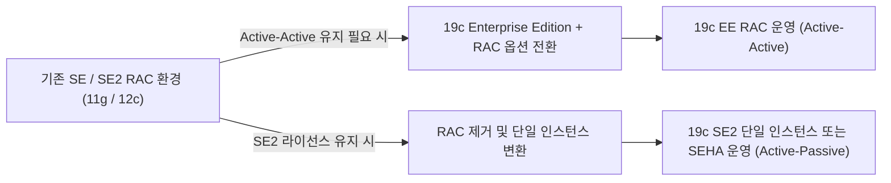
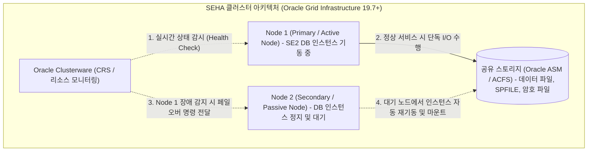
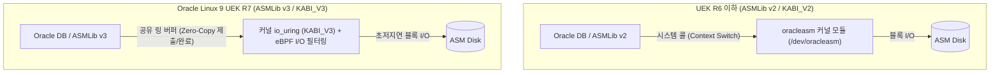

<!-- 
[조판 및 폰트 지정 규격 (Typography Specification)]
- 책 본문 (Body Text): Noto Sans KR
- 장/절 제목 (Headings): Noto Sans KR Bold
- 표 (Table): Noto Sans KR
- 캡션 (Caption): Noto Sans KR
- 영문 기술 용어 (Technical Terms): Noto Sans KR
- 코드 및 SQL 블록 (Code & SQL Blocks): DejaVu Sans Mono
-->

# CHAPTER 01. Oracle Database 19c SE2 및 Oracle Linux 9 UEK R7 아키텍처

Oracle Database 19c는 Oracle Database 12c Release 2(12.2) 제품군의 최종 장기 지원(Long-Term Support, LTS) 릴리스로, 엔터프라이즈 데이터베이스 환경에서 가장 높은 수준의 안정성과 기술 검증을 제공합니다[1, 2]. 미션 크리티컬한 데이터베이스 인프라를 성공적으로 구축하려면 운영체제 커널인 **Oracle Linux 9(Unbreakable Enterprise Kernel Release 7, 이하 UEK R7)**와 **Oracle Database 19c Standard Edition 2(이하 SE2)**의 아키텍처 특성 및 라이선스 정책을 정확히 이해하고 초기 설계에 반영해야 합니다.

이 장에서는 Oracle Database 19c SE2의 핵심 라이선스 제약과 고가용성 구현 아키텍처, Oracle Linux 9 UEK R7 커널의 비동기 입출력(I/O) 처리 메커니즘, 그리고 Headless(Non-GUI) 기반 무인 자동화 구축 환경이 제공하는 기술적 이점을 상세히 살펴봅니다.

---

## 1.1 Oracle Database 19c SE2 핵심 제약과 고가용성 구축 전략

### 1.1.1 SE2 라이선스 및 하드웨어/아키텍처 제약 사항

Oracle Database 19c Standard Edition 2(SE2)는 중소 규모 시스템과 부서 단위의 엔터프라이즈 워크로드에 높은 비용 효율성을 제공하는 에디션입니다[3]. 그러나 시스템 아키텍처를 설계할 때는 오라클 공식 라이선스 규정(*Oracle Database Licensing Information User Manual 19c*)이 강제하는 하드웨어 용량 제한과 엔진 내부의 리소스 제어 메커니즘을 반드시 준수해야 합니다[3].

1. **최대 물리 소켓 용량 제한(Maximum Capacity of 2 Sockets)**:
   SE2는 메인보드 및 서버 하드웨어 설계상 **장착 가능한 최대 물리 프로세서 소켓 용량(Maximum Socket Capacity)이 2소켓 이하인 서버**에만 설치하고 라이선스를 부여할 수 있습니다[3]. 이때 소켓 제한의 기준은 현재 장착된(Occupied) CPU 개수가 아니라 서버 섀시가 지원하는 최대 장착 가능 슬롯 수입니다. 예를 들어 4소켓을 지원하는 서버 보드에 물리 CPU를 2개만 장착하여 운영하는 구성은 SE2 라이선스 규정에 위배됩니다. 블레이드 서버(Blade Server) 환경에서는 개별 블레이드를 독립 서버로 산정하며, 하나의 패키지에 여러 개의 실리콘 다이(Die/Chiplet)가 탑재된 다중 칩 모듈(Multi-Chip Module, MCM) 프로세서는 내부의 개별 칩 각각을 1개의 물리 소켓으로 산정합니다. 또한 Named User Plus(NUP) 방식으로 라이선스를 산정할 때는 서버당 최소 10 NUP 이상을 확보해야 합니다[3].

2. **인스턴스당 최대 16 CPU 스레드 제한(16 CPU Threads Limit)**:
   SE2 데이터베이스 인스턴스는 호스트 서버의 전체 물리 코어 및 하이퍼스레딩(Hyper-Threading) 논리 프로세서 수와 관계없이, 데이터베이스 엔진 내부의 리소스 제어에 의해 **동시 실행 가능한 최대 CPU 스레드 수가 인스턴스당 16개(16 CPU Threads)**로 강제 제한(Hard Limit)됩니다[3]. 즉, 2소켓 서버에 총 64스레드가 장착되어 있더라도 SE2 인스턴스는 어느 시점에나 최대 16스레드 분량의 연산 자원만 사용합니다.

3. **멀티테넌트(Multitenant) 아키텍처 및 최대 3개 PDB 기본 지원**:
   전통적인 Non-CDB 아키텍처는 Oracle Database 12c Release 1에서 지원 중단 예고(Deprecated)되었으며, Oracle Database 19c에서는 컨테이너 데이터베이스(CDB) 기반의 멀티테넌트 아키텍처가 표준으로 권장됩니다[1, 2]. 특히 19c부터는 별도의 유상 멀티테넌트 옵션(Oracle Multitenant Option) 라이선스를 구매하지 않더라도, SE2를 포함한 모든 에디션에서 하나의 CDB 내부에(`PDB$SEED`를 제외한) **사용자 생성 플러그형 데이터베이스(User-Created PDB)를 최대 3개까지** 기본 생성하여 운영할 수 있습니다[3].

4. **Oracle RAC 지원 중단(Desupported) 및 업그레이드 제약**:
   Oracle Database 19c부터는 SE2 에디션에서 **Oracle Real Application Clusters(Oracle RAC)** 기능이 완전히 지원 중단(Desupported)되었습니다[2, 3]. 따라서 Oracle 11g 또는 12c 환경에서 SE/SE2 RAC를 운영하던 시스템은 클러스터 구성을 유지한 채 19c SE2로 직접 업그레이드할 수 없으며, 다음 두 가지 경로 중 하나를 선택해야 합니다[2].
   * **Enterprise Edition(EE) 전환**: 다중 인스턴스 Active-Active 아키텍처가 필수적인 경우, Enterprise Edition 및 Oracle RAC 옵션 라이선스로 전환한 후 19c RAC로 업그레이드합니다.
   * **단일 인스턴스 변환 및 SEHA 구성**: 기존 RAC 데이터베이스를 단일 인스턴스(Single Instance)로 변환한 뒤 19c SE2로 업그레이드하고, 고가용성이 필요한 경우 **Standard Edition High Availability(SEHA)** 아키텍처를 적용합니다.


*그림 1-1. 기존 SE/SE2 RAC 환경의 Oracle Database 19c 마이그레이션 및 업그레이드 경로*

> 💡 **노트(Note)**: **SE2 멀티테넌트 환경의 라이선스 위반 방지 설정**
> Oracle Database 19c SE2 환경에서 멀티테넌트(CDB/PDB) 구조를 운영할 때는 실수로 사용자 생성 PDB가 3개를 초과하여 생성되지 않도록 초기화 파라미터 `MAX_PDBS`를 명시적으로 `3`으로 설정하는 것이 안전합니다[3, 4].
> ```sql
> ALTER SYSTEM SET MAX_PDBS = 3 SCOPE = BOTH;
> ```

---

### 1.1.2 Standard Edition High Availability(SEHA)를 통한 고가용성 구현

Oracle Database 19c Release Update(RU) 19.7부터는 SE2 단일 인스턴스 데이터베이스의 노드 장애에 대비하기 위해 **Standard Edition High Availability(SEHA)** 기능이 공식 도입되었습니다[3, 5]. SEHA는 별도의 Enterprise Edition 전환 없이도 오라클 순정 클러스터웨어 기반의 **Active-Passive(능동-수동) 자동 페일오버(Failover)** 아키텍처를 구현할 수 있는 공식 고가용성 솔루션입니다[5, 6].

* **클러스터웨어 기반 인프라**: 최소 2개 이상의 노드에 **Oracle Grid Infrastructure 19c(RU 19.7 이상)**를 클러스터 구성(**Oracle Standalone Cluster**)으로 배포하여 노드 간 상태 감시(Health Check)와 리소스 제어를 수행합니다[5, 6].
* **공유 스토리지 아키텍처(Oracle ASM 및 ACFS)**: 데이터베이스의 데이터 파일, 제어 파일, 온라인 리두 로그 파일, 서버 파라미터 파일(`SPFILE`), 암호 파일(Password File)은 모든 클러스터 노드가 공유하는 **Oracle Automatic Storage Management(ASM)** 또는 **Oracle ASM Cluster File System(ACFS)** 상에 배치해야 합니다[5, 6]. 데이터베이스 엔진 바이너리(Oracle Home)는 각 노드의 로컬 디스크에 개별 설치하거나 공유 ACFS 볼륨에 배치할 수 있습니다[6].
* **장애 복구(Failover) 메커니즘**: 평상시에는 주 노드(Active Node)에서만 단일 DB 인스턴스가 기동되어 서비스를 처리합니다. 주 노드에 하드웨어 장애나 OS 패닉이 발생하면, Oracle Clusterware가 이를 즉시 감지하고 공유 스토리지(ASM/ACFS)가 마운트되어 있는 대기 노드(Passive Failover Node)에서 데이터베이스 인스턴스를 **자동으로 재기동(Restart/Relocate)**하여 서비스를 재개합니다[5].
* **대기 노드 라이선스 정책(10-Day Failover Rule)**: 오라클의 클러스터 페일오버 라이선스 정책에 따라, 평상시 데이터베이스 인스턴스가 기동되지 않는 미사용 대기 노드(Unlicensed Spare Node)는 연간(Calendar Year) 누적 최대 10일까지 추가 DB 라이선스 없이 페일오버 노드로 활용할 수 있습니다(단, 공유 스토리지 구성을 필수 전제로 합니다).

*표 1-1. Oracle RAC와 Standard Edition High Availability(SEHA) 아키텍처 비교*

| 비교 항목 | Oracle Real Application Clusters (RAC) | Standard Edition High Availability (SEHA) |
| :--- | :--- | :--- |
| **지원 에디션** | Enterprise Edition 전용 (19c SE2 미지원) | Standard Edition 2 (19c RU 19.7 이상) |
| **운영 아키텍처** | Active-Active (다중 인스턴스 동시 오픈 및 접속) | Active-Passive (단일 인스턴스 기동, 대기 노드 스탠바이) |
| **장애 복구 방식** | 생존 노드의 활성 인스턴스로 세션 즉시 이관 | 장애 감지 시 대기 노드에서 DB 인스턴스 자동 재기동(Restart) |
| **기반 클러스터웨어** | Oracle Grid Infrastructure for a Cluster | Oracle Grid Infrastructure for a Cluster (Standalone Cluster) |
| **공유 스토리지** | 필수 (Oracle ASM / Oracle ACFS) | 필수 (Oracle ASM / Oracle ACFS) |


*그림 1-2. Standard Edition High Availability(SEHA) 구성 및 장애 복구 흐름도*

> ⚠️ **주의(Caution)**: **SEHA 환경에서 Oracle ACFS 사용 시 필수 준수 사항**
> SEHA 환경에서 데이터베이스 파일을 Oracle ACFS에 저장할 때는 해당 ACFS 파일시스템을 반드시 **Oracle Clusterware 리소스로 등록(`srvctl add filesystem`)**해야 하며, 볼륨 마운트 소유자(Mount Owner)가 Oracle Database 소프트웨어 소유자(예: `oracle` 계정)와 일치해야 합니다[5, 6]. 일반 로컬 마운트 방식으로 구성하면 노드 장애 시 클러스터웨어가 스토리지 의존성을 제어하지 못해 자동 페일오버가 실패할 수 있습니다.

---

## 1.2 Oracle Linux 9 UEK Release 7 커널 특징과 비동기 I/O 아키텍처

> ⚠️ **주의(Caution)**: **Oracle Linux 9 환경의 Oracle Database 19c 최소 패치 요구사항(RU 19.19 이상)**
> Oracle Database 19c를 **Oracle Linux 9**에 구축할 때는 반드시 **Release Update(RU) 19.19 이상**을 적용해야 공식 인증(Certification) 및 기술 지원을 받을 수 있습니다[6]. 커널 버전 또한 **UEK R7(`5.15.0-1.43.4.2.el9uek.x86_64` 이상)** 또는 **RHCK(`5.14.0-70.22.1.0.2.el9_0.x86_64` 이상)**가 요구됩니다[6, 7]. 따라서 19.3 기본 설치 미디어(Base Release)를 사용할 때는 설치 실행 단계에서 `-applyRU` 옵션을 사용하여 19.19 이상의 RU 패치를 동시에 적용해야 합니다.

### 1.2.1 UEK R7 커널과 `io_uring` 기반 ASMLib v3(`KABI_V3`) 서브시스템

Oracle Linux 9의 기본 커널인 **Unbreakable Enterprise Kernel Release 7(UEK R7, Linux 커널 5.15 기반)**은 오라클 데이터베이스의 스토리지 입출력 아키텍처에 근본적인 혁신을 도입했습니다[7, 8].

과거 UEK R6 이하 환경에서 Oracle ASMLib(v2, `KABI_V2`)를 사용하려면 별도의 커널 드라이버 모듈인 `kmod-oracleasm`(`oracleasm` 모듈)을 커널에 직접 적재하고 `/dev/oracleasm` 파일시스템을 마운트해야 했습니다. 반면 **Oracle Linux 9 및 UEK R7** 환경에서는 레거시 `oracleasm` 커널 모듈 드라이버가 제거되었으며, 리눅스 커널 내장 고성능 비동기 I/O 인터페이스인 **`io_uring`**을 기반으로 작동하는 **ASMLib v3(`oracleasmlib` 3.0/3.1 및 `oracleasm-support` 3.0/3.1, 인터페이스 규격 `KABI_V3`)**가 도입되었습니다[7, 8].

* **별도 커널 모듈 불필요**: ASMLib v3는 커널 내부의 표준 `io_uring` 인터페이스를 직접 호출하므로 별도의 `oracleasm` 커널 모듈을 로드할 필요가 없습니다[8]. 덕분에 커널 업그레이드 시 드라이버 호환성 문제나 모듈 재컴파일 부담이 완전히 사라졌습니다.
* **컨텍스트 스위칭 최소화 및 고성능 I/O 구현**: `io_uring`은 사용자 공간(User Space)과 커널 공간(Kernel Space) 사이에 공유 링 버퍼(Submission Queue / Completion Queue)를 구성하여, 대량의 I/O 요청을 처리할 때 발생하는 시스템 콜(System Call) 및 컨텍스트 스위칭(Context Switching) 오버헤드를 극적으로 줄입니다[7, 8]. 이는 최신 NVMe SSD 및 올플래시 어레이(All-Flash Array) 스토리지 환경에서 IOPS와 처리량(Throughput)을 극대화합니다.
* **eBPF 기반 I/O 필터링(I/O Filtering)**: ASMLib v3는 커널의 eBPF(Extended Berkeley Packet Filter) 인프라를 활용한 I/O 필터링 기능을 기본 제공합니다[8]. 이를 통해 비인가 프로세스나 관리자의 실수(예: `dd` 명령어 실행 등)로 인해 ASM 디스크 헤더가 덮어써지는 치명적인 데이터 손실 사고를 커널 수준에서 차단합니다.


*그림 1-3. 레거시 `oracleasm` 커널 모듈 방식(`KABI_V2`)과 UEK R7 `io_uring` 방식(`KABI_V3`)의 I/O 경로 비교*

---

### 1.2.2 커널 비동기 I/O(AIO) 파라미터 및 `io_uring` 보안 권한 구성

Oracle Database는 데이터 파일, 제어 파일, 로그 파일에 대한 디스크 입출력 병목을 방지하기 위해 비동기 I/O(Asynchronous I/O)와 운영체제 파일시스템 캐시를 우회하는 Direct I/O를 사용합니다[4]. 데이터베이스 구축 방식(일반 파일시스템 vs. Oracle ASM)에 따라 관련된 오라클 초기화 파라미터의 동작 특성이 다르므로 이를 정확히 구분하여 설정해야 합니다[4].

* **`DISK_ASYNCH_IO = TRUE`** (기본값: `TRUE`): 데이터 파일, 제어 파일, 로그 파일에 대한 비동기 입출력을 활성화합니다. 운영체제 수준에서 비동기 I/O를 지원하는 모든 환경에서 기본값 `TRUE`를 유지해야 합니다[4].
* **`FILESYSTEMIO_OPTIONS = SETALL`** (Linux 기본값: `none`): 일반 OS 파일시스템(XFS, EXT4 등) 또는 NFS 위에 데이터베이스 파일을 배치할 때 비동기 I/O(`ASYNCH`)와 Direct I/O(`DIRECTIO`)를 동시에 활성화하는 파라미터입니다[4]. Linux 환경에서는 기본값이 `none`으로 설정되어 있으므로 파일시스템 기반 DB 구축 시 반드시 `SETALL`로 변경해야 이중 캐싱(Double Buffering)에 의한 메모리 낭비와 I/O 병목을 막을 수 있습니다. 반면 **Oracle ASM**을 사용할 때는 ASM이 파일시스템 계층을 거치지 않고 Raw 디스크 블록에 직접 I/O를 수행하므로 `FILESYSTEMIO_OPTIONS` 설정값과 무관하게 `DISK_ASYNCH_IO = TRUE` 설정에 따라 비동기 Direct I/O가 작동합니다.

파일시스템 기반 데이터베이스에서 `FILESYSTEMIO_OPTIONS`를 `SETALL`로 설정하고 실제 데이터 파일에 비동기 I/O가 정상 적용되었는지 확인하는 SQL 구문은 다음과 같습니다[4].

```sql
-- 1. SPFILE에 FILESYSTEMIO_OPTIONS = SETALL 설정 반영 (인스턴스 재기동 필요)
ALTER SYSTEM SET FILESYSTEMIO_OPTIONS = SETALL SCOPE = SPFILE;

-- 2. 재기동 후 데이터 파일별 비동기 I/O(ASYNCH_IO) 활성화 상태 검증
SELECT f.file#,
       SUBSTR(f.name, 1, 50) AS file_name,
       i.filetype_name,
       i.asynch_io
  FROM v$datafile f
  JOIN v$iostat_file i
    ON f.file# = i.file_no
 WHERE i.filetype_name = 'Data File';
```

한편, Oracle Linux 9 및 UEK R7에서는 시스템 보안을 강화하기 위해 커널 파라미터 `kernel.io_uring_disabled`를 통해 `io_uring` 인터페이스의 접근 범위를 제어합니다[8].

* `kernel.io_uring_disabled = 0`: 시스템의 모든 사용자 및 프로세스에 `io_uring` 사용을 허용합니다.
* `kernel.io_uring_disabled = 1`: `CAP_SYS_ADMIN` 권한을 가진 프로세스 또는 **`kernel.io_uring_group`에 지정된 GID(그룹 ID)**에 속한 사용자에게만 `io_uring` 생성을 허용합니다(엔터프라이즈 보안 권장 설정)[8].
* `kernel.io_uring_disabled = 2`: 시스템 전체에서 `io_uring` 사용을 완전히 비활성화합니다.

#### `io_uring` 보안 그룹 제한 구성 절차 (`/etc/sysctl.d/io_uring.conf`)

엔터프라이즈 보안 표준에 따라 일반 사용자의 무분별한 `io_uring` 접근은 차단하고, ASM 및 데이터베이스 운영 계정(`grid`, `oracle`)이 속한 그룹(예: `oinstall` 또는 `asmadmin`/`dba`, GID `54321`)에만 `io_uring` 접근 권한을 부여하도록 설정합니다[8].

```ini
# /etc/sysctl.d/io_uring.conf
kernel.io_uring_disabled = 1
kernel.io_uring_group = 54321
```

설정 파일을 작성한 후 `sysctl -p` 명령어로 커널에 즉시 반영하고, `oracleasm status` 명령어를 실행하여 `io_uring (KABI_V3)` 인터페이스 활성화 상태 및 DB 사용자 접근 가능 여부를 검증합니다[8].

```bash
$ sudo sysctl -p /etc/sysctl.d/io_uring.conf
kernel.io_uring_disabled = 1
kernel.io_uring_group = 54321

$ sudo oracleasm status
Checking if the oracleasm kernel module is loaded: no (Not required with kernel 5.15.0)
Checking if /dev/oracleasm is mounted: no (Not required with kernel 5.15.0)
Checking which I/O Interface is in use: io_uring (KABI_V3)
Checking if io_uring is enabled: yes
Checking if io_uring is accessible to the configured DB user: yes
```

---

## 1.3 Headless(Non-GUI) 구축 환경의 기술적 이점

### 1.3.1 X11 그래픽 패키지 배제를 통한 OS 경량화 및 보안 강화

엔터프라이즈 데이터센터와 클라우드 인프라에서는 데이터베이스 서버 OS를 설치할 때 그래픽 데스크톱 환경(GUI, GNOME, X Window System)을 완전히 배제한 **Minimal Install(Headless)** 모드로 구축하는 것이 표준 모범 사례(Best Practice)입니다[6].

1. **보안 공격 표면(Attack Surface) 최소화**: 데이터베이스 운영과 무관한 X11 디스플레이 서버 및 수백 개의 그래픽 라이브러리 패키지를 원천 배제함으로써, OS 보안 취약점 발생 가능성과 정기 보안 패치 대상을 대폭 줄입니다.
2. **시스템 자원(CPU/RAM) 집중**: 그래픽 서브시스템 데몬이 상주하며 소비하는 메모리와 CPU 스케줄링 자원을 제거하여, 가용 물리 메모리를 오라클 데이터베이스의 **SGA(System Global Area)** 및 **PGA(Program Global Area)** 영역에 최대한 할당할 수 있습니다.
3. **네트워크 방화벽 정책 단순화**: 원격 X11 포워딩(X11 Forwarding)을 위한 추가 포트 개방이나 별도의 서드파티 X 서버 프로그램 설치 없이 표준 SSH 터미널 연결만으로 모든 구축과 운영 작업을 안전하게 수행할 수 있습니다.

---

### 1.3.2 Command-Line 및 Silent Mode 기반 무인 구축 자동화

Headless 환경에서는 그래픽 설치 마법사(OUI GUI)를 호출할 수 없으므로, 오라클 소프트웨어 설치부터 네트워크 리스너 구성, 데이터베이스 생성에 이르는 전 과정을 **Silent Mode(비대화형 무인 설치 모드)**와 사전 정의된 **응답 파일(Response File, `.rsp`)** 또는 명령줄 옵션으로 수행합니다[6].

* **`runInstaller -silent`**: 오라클 데이터베이스 19c 골드 이미지 압축 해제 후, 응답 파일(`db_install.rsp`)을 참조하여 대화창 없이 엔진 바이너리를 설치합니다. 특히 Oracle Linux 9 환경에서는 설치 시점에 `-applyRU` 플래그를 함께 지정하여 RU 19.19 이상의 패치를 원스톱으로 결합 설치합니다[6].
* **`netca -silent`**: Oracle Net Configuration Assistant를 Silent 모드로 실행하여 기본 리스너(`LISTENER`) 및 네트워크 설정 파일(`listener.ora`, `sqlnet.ora`)을 자동 구성합니다[6].
* **`dbca -silent`**: Database Configuration Assistant에 명령줄 매개변수 또는 응답 파일을 전달하여 컨테이너 데이터베이스(CDB)와 플러그형 데이터베이스(PDB)를 일관된 규격으로 자동 생성합니다[6].

```bash
# 1. Oracle 19c 엔진 Silent 설치 및 Release Update(RU 19.19+) 동시 적용 예시
$ cd $ORACLE_HOME
$ ./runInstaller -silent \
  -applyRU /u01/stage/patches/35042068 \
  -responseFile /u01/stage/response/db_install_se2.rsp \
  -waitforcompletion

# 2. Oracle Net Listener Silent 구성 예시
$ $ORACLE_HOME/bin/netca -silent \
  -responseFile $ORACLE_HOME/assistants/netca/netca.rsp

# 3. DBCA Silent 모드를 통한 CDB 및 초기 PDB(1개) 자동 생성 예시
$ $ORACLE_HOME/bin/dbca -silent -createDatabase \
  -templateName General_Purpose.dbc \
  -gdbname ORCL -sid ORCL \
  -createAsContainerDatabase true \
  -numberOfPDBs 1 \
  -pdbName ORCLPDB1 \
  -characterSet AL32UTF8 \
  -totalMemory 8192
```

Silent Mode 기반의 구축 체계는 모든 설정 파라미터가 코드(Infrastructure as Code)와 응답 파일로 명확히 기록되므로, 다수의 데이터베이스 서버를 배포할 때 작업자의 입력 실수(Human Error)를 원천 차단하고 동일한 품질의 표준 데이터베이스 환경을 신속하게 재현할 수 있습니다[6].

> 💡 **노트(Note)**: **Silent 설치 진행 중 실시간 로그 모니터링**
> GUI 진행률 표시줄이 없는 CLI 전용 환경에서는 별도의 SSH 터미널 세션을 열어 `tail -f` 명령어로 오라클 인벤토리(`oraInventory`) 설치 로그와 DBCA 작업 로그를 실시간으로 추적하며 정상 진행 여부를 검증할 수 있습니다[6].
> ```bash
> # 엔진 설치 로그 실시간 모니터링
> $ tail -f $ORACLE_BASE/oraInventory/logs/installActions*.log
>
> # DBCA 데이터베이스 생성 로그 실시간 모니터링
> $ tail -f $ORACLE_BASE/cfgtoollogs/dbca/ORCL/trace.log_*
> ```

---

## 1.4 장 요약 (Chapter Summary)

이 장에서는 엔터프라이즈 환경에서 **Oracle Database 19c SE2**와 **Oracle Linux 9(UEK R7)**를 결합하여 구축할 때 반드시 숙지해야 할 핵심 아키텍처와 라이선스 기준을 살펴보았습니다.

* **Oracle 19c SE2 라이선스 및 고가용성**: SE2는 최대 2소켓 용량의 서버 및 인스턴스당 최대 16 CPU 스레드로 제한되며, 최대 3개의 사용자 생성 PDB를 추가 라이선스 없이 지원합니다. 19c부터 SE2에서 제외된 Oracle RAC를 대체하기 위해 RU 19.7부터 도입된 **SEHA(Standard Edition High Availability)**를 활용하면 Oracle Grid Infrastructure와 공유 스토리지(ASM/ACFS) 기반의 안정적인 Active-Passive 자동 페일오버 환경을 구현할 수 있습니다.
* **Oracle Linux 9 UEK R7과 `io_uring`**: Oracle Linux 9에 19c를 설치하려면 최소 RU 19.19 이상이 필수입니다. UEK R7 커널은 레거시 `oracleasm` 커널 드라이버 대신 커널 내장 **`io_uring` 인터페이스(`KABI_V3`)**와 eBPF I/O 필터링을 사용하는 ASMLib v3를 통해 입출력 오버헤드를 줄이고 디스크 무결성을 보장합니다.
* **Headless 무인 구축 표준화**: X11 그래픽 패키지를 배제한 Minimal OS 환경에서 `runInstaller`, `netca`, `dbca`의 **Silent Mode**를 활용하면 보안 취약점을 최소화하고 일관된 엔터프라이즈 데이터베이스 배포 표준을 확립할 수 있습니다.

다음 **CHAPTER 02**에서는 실제 서버 하드웨어 입고 시점의 CPU·메모리 사이징 기준, 물리 메모리 용량별 Swap 공간 산정 공식, LVM 볼륨 구성 및 스토리지 마운트 최적화 설계를 단계별로 다룹니다.

---

# References

[1] Oracle. 2024. *Oracle Database Concepts 19c (E96138)*. Oracle America, Inc. Retrieved September 30, 2026 from https://docs.oracle.com/en/database/oracle/oracle-database/19/cncpt/
[2] Oracle. 2024. *Oracle Database Upgrade Guide 19c (E96341)*. Oracle America, Inc. Retrieved September 30, 2026 from https://docs.oracle.com/en/database/oracle/oracle-database/19/upgrd/
[3] Oracle. 2026. *Oracle Database Licensing Information User Manual 19c (E94254-71)*. Oracle America, Inc. Retrieved September 30, 2026 from https://docs.oracle.com/en/database/oracle/oracle-database/19/dblic/
[4] Oracle. 2024. *Oracle Database Reference 19c (E96200)*. Oracle America, Inc. Retrieved September 30, 2026 from https://docs.oracle.com/en/database/oracle/oracle-database/19/refrn/
[5] Oracle. 2024. *Oracle Clusterware Administration and Deployment Guide 19c (E96264)*. Oracle America, Inc. Retrieved September 30, 2026 from https://docs.oracle.com/en/database/oracle/oracle-database/19/cwadd/
[6] Oracle. 2024. *Oracle Database Installation Guide 19c for Linux (E96272)*. Oracle America, Inc. Retrieved September 30, 2026 from https://docs.oracle.com/en/database/oracle/oracle-database/19/ladbi/
[7] Oracle. 2024. *Oracle Linux: Unbreakable Enterprise Kernel Release 7 Release Notes (F52668)*. Oracle America, Inc. Retrieved September 30, 2026 from https://docs.oracle.com/en/operating-systems/uek/r7/relnotes7.0/
[8] Oracle. 2024. *Oracle Linux 9: Managing Storage Devices and ASMLib v3 (io_uring KABI_V3) Documentation*. Oracle America, Inc. Retrieved September 30, 2026 from https://docs.oracle.com/en/operating-systems/oracle-linux/9/
