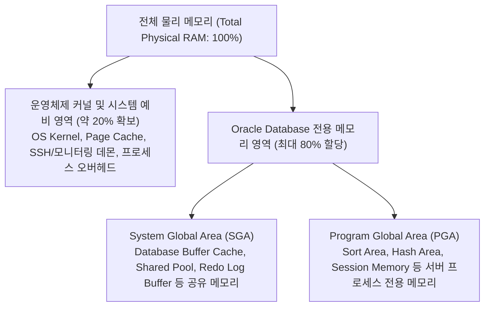
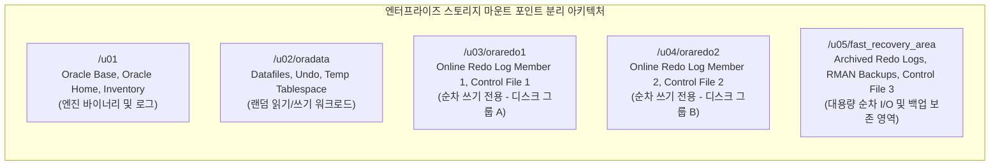

<!-- 
[조판 및 폰트 지정 규격 (Typography Specification)]
- 책 본문 (Body Text): Noto Sans KR
- 장/절 제목 (Headings): Noto Sans KR Bold
- 표 (Table): Noto Sans KR
- 캡션 (Caption): Noto Sans KR
- 영문 기술 용어 (Technical Terms): Noto Sans KR
- 코드 및 SQL 블록 (Code & SQL Blocks): DejaVu Sans Mono
-->

# CHAPTER 02. 하드웨어 사이징 및 리소스 설계

Oracle Database 19c SE2 시스템을 안정적으로 구축하고 운영하려면 서버 하드웨어 도입 및 운영체제(OS) 설치 이전 단계에서 CPU, 물리 메모리(RAM), Swap 공간, 스토리지 레이아웃을 정밀하게 사이징(Sizing)해야 합니다[1]. 초기 리소스 설계가 부적절하면 데이터베이스 운영 중 메모리 고갈(Out of Memory, OOM)로 인해 핵심 백그라운드 프로세스가 강제 종료되거나, 디스크 입출력(I/O) 병목 현상으로 인해 전체 비즈니스 서비스가 중단될 수 있습니다[1, 2].

이 장에서는 오라클 공식 설치 가이드와 성능 튜닝 매뉴얼을 기준으로 물리 메모리 최소 요구사항, AMM 및 ASMM 메모리 아키텍처 선택 기준, 물리 RAM 용량별 Swap 공간 산정 공식, 그리고 I/O 격리를 위한 스토리지 마운트 레이아웃과 파일시스템 최적화 설계를 상세히 다룹니다.

---

## 2.1 CPU 및 메모리 요구사항 산정

### 2.1.1 물리 메모리(RAM) 최소 조건 및 엔터프라이즈 배분 기준

*Oracle Database Installation Guide 19c for Linux*에 정의된 소프트웨어 구성별 최소 물리 메모리(RAM) 요구사항은 다음과 같습니다[1].

* **Oracle Database 19c 단독 설치(Single Instance)**: 최소 **1 GB** 이상 필수, **2 GB** 이상 권장[1].
* **Oracle Grid Infrastructure 19c 설치(Oracle Restart 또는 SEHA 클러스터)**: 최소 **8 GB** 이상 필수[1].

그러나 위의 수치는 소프트웨어 설치 마법사(OUI)의 사전 검증(Prerequisite Check)을 통과하기 위한 최소한의 기준일 뿐입니다. 실제 엔터프라이즈 운영 환경이나 최대 3개의 사용자 생성 PDB를 통합 운영하는 멀티테넌트(CDB/PDB) 환경에서는 다수의 백그라운드 프로세스, RMAN 백업 버퍼, 병렬 SQL 작업 영역을 처리하기 위해 최소 **16 GB ~ 64 GB 이상**의 물리 메모리를 확보하는 것이 일반적입니다.

엔터프라이즈 서버의 메모리를 설계할 때는 전체 물리 메모리를 오라클 인스턴스에 100% 할당해서는 안 되며, 반드시 운영체제 커널과 시스템 데몬, 그리드 인프라스트럭처 및 개별 서버 프로세스(Dedicated Server Process)가 사용할 여유 메모리를 남겨 두어야 합니다[2, 3]. 단일 데이터베이스 전용 서버 기준으로 **전체 물리 RAM의 약 20%는 운영체제(OS) 및 시스템 예비 영역**으로 보존하고, 나머지 **최대 80% 이내에서 오라클 데이터베이스 메모리(SGA + PGA)**를 할당하는 것이 표준 설계 원칙입니다.


*그림 2-1. 엔터프라이즈 데이터베이스 서버의 물리 메모리(RAM) 배분 구조*

---

### 2.1.2 AMM과 ASMM의 4 GB 한계 제약 및 메모리 관리 아키텍처 선택

Oracle Database 19c는 인스턴스 메모리를 자동으로 관리하는 두 가지 아키텍처를 제공합니다[1, 2].

1. **자동 메모리 관리(Automatic Memory Management, AMM)**:
   초기화 파라미터 `MEMORY_TARGET`과 `MEMORY_MAX_TARGET`을 사용하여 SGA와 PGA를 하나의 통합 메모리 풀로 묶고, 데이터베이스 워크로드 변화에 따라 SGA와 PGA 간의 메모리 크기를 오라클 엔진이 동적으로 조절하는 방식입니다[2].
2. **자동 공유 메모리 관리(Automatic Shared Memory Management, ASMM) + 자동 PGA 메모리 관리**:
   `SGA_TARGET`(및 상한선인 `SGA_MAX_SIZE`) 파라미터를 통해 SGA 내부 구성 요소(Buffer Cache, Shared Pool, Large Pool, Java Pool, Streams Pool)의 크기를 자동 관리하고, `PGA_AGGREGATE_TARGET`과 `PGA_AGGREGATE_LIMIT` 파라미터를 통해 PGA 영역을 독립적으로 분리하여 자동 관리하는 방식입니다[2, 3].

> ⚠️ **주의(Caution)**: **4 GB 초과 메모리 환경에서의 AMM 선택 불가 및 Linux HugePages 호환성 제약**
> 오라클 공식 설치 가이드(*Oracle Database Installation Guide 19c for Linux*)에 따라 **데이터베이스 인스턴스에 할당되는 물리 메모리가 4 GB를 초과하는 환경에서는 설치(OUI) 및 DBCA 데이터베이스 생성 시 자동 메모리 관리(AMM, `MEMORY_TARGET`) 옵션을 선택할 수 없습니다**[1].
> 또한 Linux 환경에서 AMM은 `/dev/shm`(`tmpfs` 기반의 기본 4 KB 소형 메모리 페이지) 공유 메모리 파일시스템을 사용하므로, 페이지 테이블 오버헤드를 줄여 주는 **Linux HugePages(2 MB 대형 페이지)와 동시에 사용할 수 없습니다**[1]. HugePages가 구성된 시스템에서 `MEMORY_TARGET`을 활성화하면 인스턴스 기동 시 `ORA-00845: MEMORY_TARGET not supported on this system` 오류가 발생하거나 HugePages가 무시됩니다. 따라서 4 GB를 초과하는 모든 실무 엔터프라이즈 환경에서는 반드시 `MEMORY_TARGET = 0`으로 비활성화하고 **ASMM(`SGA_TARGET` + `PGA_AGGREGATE_TARGET`) 방식**을 채택해야 합니다[1, 2].

*표 2-1. AMM과 ASMM 메모리 관리 아키텍처 비교 및 채택 기준*

| 비교 항목 | 자동 메모리 관리 (AMM) | 자동 공유 메모리 관리 (ASMM) + 자동 PGA 관리 |
| :--- | :--- | :--- |
| **핵심 제어 파라미터** | `MEMORY_TARGET`, `MEMORY_MAX_TARGET` | `SGA_TARGET`, `SGA_MAX_SIZE`, `PGA_AGGREGATE_TARGET`, `PGA_AGGREGATE_LIMIT` |
| **적용 가능 메모리 규모** | 인스턴스 메모리 **4 GB 이하** 소규모 환경 | 인스턴스 메모리 **4 GB 초과** 모든 엔터프라이즈 환경 (공식 권장) |
| **Linux HugePages 연동** | **연동 불가** (`/dev/shm` 4 KB 페이지 사용) | **완벽 지원** (`USE_LARGE_PAGES = ONLY` 설정 권장) |
| **SGA 및 PGA 격리성** | SGA와 PGA 간 메모리 경계가 유동적으로 변동 | SGA와 PGA가 엄격히 분리되어 메모리 출렁임 방지 및 안정적 운영 |

---

### 2.1.3 워크로드 특성별 SGA 및 PGA 메모리 산정 공식

전체 물리 메모리 중 20%를 OS 예비 영역으로 제외한 나머지 **80%의 DB 가용 메모리($\text{DB Memory} = \text{Total RAM} \times 0.8$)**를 기준으로, 시스템의 주된 워크로드 특성(OLTP vs. DSS/DW)에 따라 SGA와 PGA의 배분 비율을 결정합니다[2, 3].

#### 1. OLTP(Online Transaction Processing) 워크로드
짧고 빈번한 트랜잭션과 인덱스 기반의 블록 조회가 주를 이루며 동시 접속 세션 수가 많은 OLTP 시스템에서는, 블록 I/O를 최소화하기 위해 데이터 버퍼 캐시(Buffer Cache)와 공유 풀(Shared Pool)이 포함된 **SGA에 DB 가용 메모리의 80%**, **PGA에 20%**를 배분합니다[2, 3].

$$\text{SGA\_TARGET} = (\text{Total RAM} \times 0.8) \times 0.8$$

$$\text{PGA\_AGGREGATE\_TARGET} = (\text{Total RAM} \times 0.8) \times 0.2$$

#### 2. DSS(Decision Support System) / DW(Data Warehouse) 워크로드
대용량 테이블 풀 스캔(Full Table Scan), 대규모 정렬(Sort), 해시 조인(Hash Join) 및 집계 연산이 집중되는 분석 시스템에서는 세션별 작업 공간(SQL Work Area) 부족으로 인한 Temp 테이블스페이스 디스크 쓰기(Multipass Execution)를 방지하기 위해 **SGA에 50%**, **PGA에 50%**를 배분합니다[3].

$$\text{SGA\_TARGET} = (\text{Total RAM} \times 0.8) \times 0.5$$

$$\text{PGA\_AGGREGATE\_TARGET} = (\text{Total RAM} \times 0.8) \times 0.5$$

#### 3. PGA 하드 리밋(`PGA_AGGREGATE_LIMIT`) 산정
`PGA_AGGREGATE_TARGET`은 오라클이 지향하는 소프트 목표치(Soft Target)이므로, 대량의 PL/SQL 컬렉션 변수(Untunable Memory)를 사용하는 세션이 몰리면 실제 PGA 총 사용량이 목표치를 초과하여 OS 메모리 고갈(Swapping 및 OOM)을 유발할 수 있습니다[3, 4]. 이를 방지하기 위해 Oracle 19c는 인스턴스 전체 PGA 사용량의 강제 상한선인 **`PGA_AGGREGATE_LIMIT`** 파라미터를 제공합니다[4].

* **기본값 산정 규칙**: 별도로 지정하지 않으면 `2 GB`, `PGA_AGGREGATE_TARGET`의 **200%(2배)**, 또는 `PROCESSES × 3 MB` 중 **가장 큰 값**으로 자동 설정됩니다[4].
* **실무 설계 주의점**: 만약 $\text{SGA\_TARGET} + \text{PGA\_AGGREGATE\_LIMIT}$의 합계가 전체 물리 RAM의 80~85%를 초과한다면, 피크 시점에 OS 메모리가 고갈될 수 있으므로 `SGA_TARGET`과 `PGA_AGGREGATE_LIMIT`의 합계가 DB 가용 메모리 한도 내에 머물도록 `PGA_AGGREGATE_LIMIT`을 명시적으로 조정해야 합니다[3, 4].

*표 2-2. 물리 RAM 용량 및 워크로드별 메모리 초기화 파라미터 산정 예시 (GB 단위)*

| 전체 물리 RAM | OS 예비 영역 (20%) | DB 가용 메모리 (80%) | OLTP `SGA_TARGET` (80%) | OLTP `PGA_AGGREGATE_TARGET` (20%) | DSS `SGA_TARGET` (50%) | DSS `PGA_AGGREGATE_TARGET` (50%) |
| :---: | :---: | :---: | :---: | :---: | :---: | :---: |
| **16 GB** | 3.2 GB | 12.8 GB | **10.24 GB** | **2.56 GB** | **6.40 GB** | **6.40 GB** |
| **32 GB** | 6.4 GB | 25.6 GB | **20.48 GB** | **5.12 GB** | **12.80 GB** | **12.80 GB** |
| **64 GB** | 12.8 GB | 51.2 GB | **40.96 GB** | **10.24 GB** | **25.60 GB** | **25.60 GB** |
| **128 GB** | 25.6 GB | 102.4 GB | **81.92 GB** | **20.48 GB** | **51.20 GB** | **51.20 GB** |

```sql
-- 32 GB 물리 RAM 기반 OLTP 서버의 ASMM 메모리 파라미터 설정 예시 (SPFILE 적용)
ALTER SYSTEM SET MEMORY_TARGET = 0 SCOPE = SPFILE;
ALTER SYSTEM SET MEMORY_MAX_TARGET = 0 SCOPE = SPFILE;
ALTER SYSTEM SET SGA_MAX_SIZE = 20G SCOPE = SPFILE;
ALTER SYSTEM SET SGA_TARGET = 20G SCOPE = SPFILE;
ALTER SYSTEM SET PGA_AGGREGATE_TARGET = 5G SCOPE = BOTH;
ALTER SYSTEM SET PGA_AGGREGATE_LIMIT = 8G SCOPE = BOTH;
```

---

## 2.2 Swap 공간 산정 가이드

### 2.2.1 물리 RAM 크기에 따른 공식 Swap 용량 산정 기준

Swap 공간은 물리 메모리가 일시적으로 부족할 때 비활성 메모리 페이지를 디스크로 이동(Page-out)시켜 시스템 중단과 Linux 커널의 OOM Killer 발동을 방지하는 안전장치입니다. 반대로 Swap 공간이 오라클 설치 기준보다 작게 설정되어 있으면 `runInstaller` 실행 시 사전 요구사항 검증(Prerequisite Check) 단계에서 설치가 중단됩니다[1].

*Oracle Database Installation Guide 19c for Linux*에 명시된 물리 RAM 용량별 공식 Swap 공간 요구사항은 다음과 같습니다[1].

*표 2-3. 물리 RAM 크기 대비 오라클 공식 Swap 공간 요구사항*

| 설치 대상 소프트웨어 | 가용 물리 RAM (Available RAM) 용량 | 필수 Swap 공간 규격 (Swap Space Required) | 비고 |
| :--- | :--- | :--- | :--- |
| **Oracle Database 19c** | **1 GB 이상 ~ 2 GB 이하** | **RAM 용량의 1.5배** ($1.5 \times \text{RAM}$) | 최소 사양 구간 |
| **Oracle Database 19c** | **2 GB 초과 ~ 16 GB 이하** | **RAM 용량과 동일** ($1.0 \times \text{RAM}$) | 1:1 매핑 구간 |
| **Oracle Database 19c** | **16 GB 초과** | **16 GB** | 16 GB 상한 유지 |
| **Oracle Grid Infrastructure** | **8 GB 이상 ~ 16 GB 이하** | **RAM 용량과 동일** ($1.0 \times \text{RAM}$) | SEHA / Oracle Restart |
| **Oracle Grid Infrastructure** | **16 GB 초과** | **16 GB** | SEHA / Oracle Restart |

> 💡 **노트(Note)**: **Linux HugePages 구성 시 Swap 용량 산정 예외 규칙**
> 오라클 공식 설치 가이드에 따르면, Linux 시스템에서 **HugePages**를 활성화한 경우에는 **전체 물리 RAM에서 HugePages로 할당된 메모리 크기를 먼저 차감(Deduct)한 나머지 가용 RAM 용량**을 기준으로 표 2-3의 Swap 요구량을 산정합니다[1]. HugePages로 예약된 물리 메모리 영역은 커널에 의해 메모리에 영구 고정(Pinned/Locked)되어 절대 디스크로 Swap-out 되지 않기 때문입니다. 다만 실무 엔터프라이즈 환경에서는 디스크 용량 여유가 충분하므로 HugePages 적용 여부와 무관하게 **16 GB의 고정 Swap 파티션**을 구성하는 것이 표준으로 권장됩니다.

---

### 2.2.2 Swapping 성능 영향 및 CLI 모니터링 검증

운영 중인 데이터베이스 서버에서 지속적인 Swapping(디스크 Page-in / Page-out)이 발생하면 디스크 I/O 지연으로 인해 SQL 응답 시간과 래치(Latch)/뮤텍스(Mutex) 획득 대기 시간이 급격히 증가하며, 클러스터 환경(SEHA)에서는 노드 하트비트(Heartbeat) 응답 지연으로 인해 의도치 않은 노드 재기동(Eviction)이 발생할 수 있습니다.

Linux CLI 환경에서 구성된 Swap 파티션 용량과 실시간 Swapping 발생 여부를 검증하는 명령어는 다음과 같습니다[1].

```bash
# 1. 활성화된 Swap 디바이스 및 파티션 용량 확인
$ swapon --show
NAME      TYPE      SIZE USED PRIO
/dev/dm-1 partition  16G   0B   -2

# 2. 시스템 물리 메모리 및 Swap 사용 현황 확인 (MB 단위)
$ free -m
               total        used        free      shared  buff/cache   available
Mem:           31820        4120       21500        8120        6200       19100
Swap:          16383           0       16383

# 3. 실시간 가상 메모리 및 Swapping 발생 여부 모니터링 (1초 간격 5회 출력)
$ vmstat 1 5
procs -----------memory---------- ---swap-- -----io---- -system-- ------cpu-----
 r  b   swpd   free   buff  cache   si   so    bi    bo   in   cs us sy id wa st
 1  0      0 22016000 10240 6348800    0    0     1    12 1024  512  1  0 99  0  0
 0  0      0 22015800 10240 6348800    0    0     0     8  980  490  1  0 99  0  0
```

> 💡 **노트(Note)**: **`vmstat`을 통한 실시간 Swapping 징후 판별법**
> `free -m`에서 `Swap used` 수치가 일부 존재하더라도 과거 피크 시점에 밀려난 비활성 페이지일 수 있습니다. 현재 시점의 메모리 병목 여부를 판단하려면 반드시 `vmstat` 출력의 **`si`(Swap-in: 초당 디스크에서 메모리로 읽어 들인 KB)** 및 **`so`(Swap-out: 초당 메모리에서 디스크로 기록한 KB)** 칼럼을 확인해야 합니다. `si`와 `so` 수치가 지속적으로 `0`을 초과하여 발생한다면 물리 메모리가 심각하게 부족한 상태이므로 즉시 SGA/PGA 크기를 재조정하거나 Linux 커널의 `vm.swappiness` 파라미터(권장값: `1` 또는 `10`)를 점검해야 합니다.

---

## 2.3 스토리지 레이아웃 및 파일시스템 설계

### 2.3.1 디스크 마운트 포인트 분리 및 I/O 격리 아키텍처

단일 파일시스템에 오라클 엔진 바이너리, 데이터 파일, 온라인 리두 로그, 백업 파일을 모두 통합 배치하면 대량 트랜잭션이나 RMAN 백업 수행 시 심각한 디스크 I/O 경합이 발생하며, 디스크 장애 시 데이터베이스 복구가 불가능해질 수 있습니다[2, 5]. 따라서 엔터프라이즈 환경에서는 OFA(Optimal Flexible Architecture) 표준과 I/O 특성에 맞춰 마운트 포인트와 기저 물리 디스크(또는 LUN)를 분리 설계해야 합니다[1, 2].


*그림 2-2. I/O 경합 방지 및 다중화를 위한 권장 스토리지 마운트 레이아웃*

*표 2-4. 용도별 권장 마운트 포인트 및 파일시스템 설계 표준*

| 마운트 포인트 | 저장 대상 파일 및 용도 | I/O 워크로드 특성 | 권장 파일시스템 및 마운트 옵션 |
| :--- | :--- | :--- | :--- |
| **`/u01`** | `ORACLE_BASE`, `ORACLE_HOME`, `oraInventory`, 진단 로그(ADR) | 실행 파일 로드 및 텍스트 로그 기록 | XFS / ext4 (`defaults`) |
| **`/u02/oradata`** | 데이터 파일(SYSTEM, SYSAUX, 업무용), Undo, Temp 파일 | DBWR/Server Process의 고빈도 랜덤 I/O | XFS / ext4 (`defaults,noatime,nodiratime`) |
| **`/u03/oraredo1`** | Online Redo Log 각 그룹의 **첫 번째 멤버**, 첫 번째 제어 파일 | LGWR 프로세스의 저지연 순차 쓰기(Sequential Write) | XFS / ext4 (`defaults,noatime,nodiratime`) |
| **`/u04/oraredo2`** | Online Redo Log 각 그룹의 **두 번째 멤버**, 두 번째 제어 파일 | LGWR 프로세스의 다중화 동시 순차 쓰기(독립 디스크) | XFS / ext4 (`defaults,noatime,nodiratime`) |
| **`/u05/fast_recovery_area`** | Fast Recovery Area(아카이브 로그, RMAN 백업 세트, 제어 파일 복사본) | ARCH 및 RMAN 채널의 대용량 순차 읽기/쓰기 | XFS / ext4 (`defaults,noatime,nodiratime`) |

---

### 2.3.2 Online Redo Log 용량 및 다중화 산정 기준

온라인 리두 로그(Online Redo Log)는 데이터베이스에서 발생하는 모든 변경 벡터(Change Vector)를 기록하여 인스턴스 복구와 미디어 복구를 보장하는 핵심 구조입니다[2]. DBCA 기본 템플릿이 생성하는 기본 크기(200 MB)를 그대로 운영 환경에 사용하면, 대량 DML 발생 시 과도한 로그 스위치(Log Switch)와 체크포인트 미완료 대기(`log file switch (checkpoint incomplete)`)가 발생하여 트랜잭션 처리가 멈추는 현상이 나타납니다[2, 3].

1. **최소 그룹 수**: 오라클 인스턴스가 정상 작동하려면 최소 2개 이상의 리두 로그 그룹이 필요하지만, 아카이브 작업 지연(`log file switch (archiving needed)`)이나 체크포인트 지연을 방지하기 위해 실무에서는 **최소 3개 ~ 5개 이상의 리두 로그 그룹** 구성을 권장합니다[2].
2. **그룹 멤버 다중화(Multiplexing)**: 단일 디스크나 컨트롤러 장애로 인해 현재 기록 중인(`CURRENT`) 리두 로그 그룹 전체가 손실되는 것을 막기 위해, 각 그룹당 **최소 2개 이상의 멤버(Member)를 서로 다른 물리 디스크 컨트롤러 경로(`/u03/oraredo1`, `/u04/oraredo2`)에 다중화 배치**해야 합니다[2].
3. **권장 로그 스위치 주기**: 오라클 공식 튜닝 가이드(*Database Performance Tuning Guide 19c*) 및 관리자 가이드에 따라, 피크 타임(Peak Workload) 기준 **로그 스위치가 약 15분 ~ 20분 간격으로 1회(시간당 3회 ~ 4회 이하)** 발생하도록 단일 리두 로그 파일 크기를 산정합니다[2, 3].
4. **단일 Redo Log 파일 용량 산정 공식**: 피크 시간대의 초당 리두 생성량($\text{Peak Redo Rate}$)을 기준으로 20분($1,200\text{초}$) 동안 생성되는 리두 데이터를 수용할 수 있도록 다음과 같이 계산합니다.

$$\text{Recommended Redo Log Size (MB)} \ge \text{Peak Redo Rate (MB/sec)} \times 1,200\text{ sec (20 min)}$$

*표 2-5. 피크 타임 리두 생성률에 따른 권장 단일 Online Redo Log 파일 크기 (15~20분 스위치 기준)*

| 피크 초당 리두 생성률 (MB/sec) | 피크 분당 리두 생성량 (MB/min) | 20분간 누적 리두 발생량 | 권장 단일 Redo Log 파일 크기 |
| :---: | :---: | :---: | :---: |
| **$\le 0.4\text{ MB/sec}$** | $\le 25\text{ MB/min}$ | 약 $500\text{ MB}$ | **512 MB** |
| **$\le 0.8\text{ MB/sec}$** | $\le 50\text{ MB/min}$ | 약 $1,000\text{ MB}$ | **1 GB** |
| **$\le 3.5\text{ MB/sec}$** | $\le 200\text{ MB/min}$ | 약 $4,000\text{ MB}$ | **4 GB** |
| **$\le 7.0\text{ MB/sec}$** | $\le 400\text{ MB/min}$ | 약 $8,000\text{ MB}$ | **8 GB** |

운영 중인 데이터베이스에서 시간대별 로그 스위치 발생 빈도와 현재 리두 로그 그룹 구성을 진단하는 SQL 쿼리는 다음과 같습니다[2, 4].

```sql
-- 1. 현재 Online Redo Log 그룹별 용량 및 상태 확인
SELECT group#, thread#, sequence#, bytes / 1024 / 1024 AS size_mb, members, status
  FROM v$log
 ORDER BY group#;

-- 2. 최근 24시간 동안 시간대별 로그 스위치 발생 횟수 조회 (시간당 3~4회 초과 여부 점검)
SELECT TO_CHAR(first_time, 'YYYY-MM-DD HH24') AS log_hour,
       COUNT(*) AS switch_count
  FROM v$log_history
 WHERE first_time >= SYSDATE - 1
 GROUP BY TO_CHAR(first_time, 'YYYY-MM-DD HH24')
 ORDER BY log_hour DESC;
```

---

### 2.3.3 Fast Recovery Area(FRA) 용량 산정 공식

Fast Recovery Area(FRA)는 아카이브 리두 로그(Archived Redo Logs), RMAN 백업 세트(Backup Sets) 및 이미지 카피(Image Copies), 다중화된 제어 파일 등을 한곳에서 통합 관리하고 보존 주기(Retention Policy)에 따라 오래된 파일을 자동 정리하는 복구 전용 저장 영역입니다[5].

#### FRA 용량 산정 수식 (`DB_RECOVERY_FILE_DEST_SIZE`)

오라클 공식 백업 및 복구 가이드(*Oracle Database Backup and Recovery User's Guide 19c*)에 따른 SE2 환경의 표준 FRA 물리 디스크 용량 산정 수식은 다음과 같습니다[5].

$$\text{FRA Disk Space} = \left( \text{Full/Level 0 Backup} + \text{Level 1 Incremental Backups} + (n+1)\text{일 치 Archived Logs} + \text{Control File Copies} \right) \times 1.1$$

* **전체 백업 및 증분 백업 공간**: 디스크에 보관할 RMAN 전체 백업(또는 Level 0 백업)과 보존 주기 내의 Level 1 증분 백업 용량 합계입니다.
* **$(n+1)$일 치 아카이브 리두 로그**: 아카이브 로그가 백업 후 삭제되기 전까지 디스크에 머무는 일수($n$)에 최소 하루 치 여유분($+1$)을 더한 용량입니다.
* **OS 블록 헤더 오버헤드 10% 가산($\times 1.1$)**: 오라클 초기화 파라미터 `DB_RECOVERY_FILE_DEST_SIZE`는 각 파일의 **오라클 블록 0(Block 0) 및 OS 파일시스템 블록 헤더 크기를 계산에 포함하지 않습니다**[5]. 따라서 실제 물리 디스크 파티션 크기를 설계할 때는 `DB_RECOVERY_FILE_DEST_SIZE`에 설정할 쿼터(Quota)보다 **최소 10% 이상의 여유 디스크 공간**을 추가로 확보해야 합니다[5].

> ⚠️ **주의(Caution)**: **SE2 에디션에서의 `Flashback Database` 미지원 및 FRA 산정 시 주의사항**
> *Oracle Database Licensing Information User Manual 19c(Table 1-4)*에 따라 데이터베이스 전체를 과거 시점으로 되돌리는 **`FLASHBACK DATABASE`(플래시백 데이터베이스) 기능은 Enterprise Edition(EE) 전용 기능이며, Standard Edition 2(SE2)에서는 사용할 수 없습니다**[6]. (단, Undo 데이터를 활용하는 기본 `Flashback Query`, `Flashback Version Query` 및 휴지통 기반의 `Flashback Drop`은 SE2에서도 기본 지원됩니다[6]). 따라서 SE2 환경에서는 플래시백 로그(Flashback Logs)가 생성되지 않으며, 만약 Enterprise Edition 환경에서 `FLASHBACK DATABASE`를 활성화하는 경우에만 목표 보존 시간(`DB_FLASHBACK_RETENTION_TARGET`) 동안 발생하는 리두 로그 생성량과 유사한 규모(약 1:1 비율)의 플래시백 로그 공간을 FRA 용량에 추가 반영해야 합니다[5].

FRA의 전체 할당량 대비 현재 사용률과 파일 유형별 점유 비율은 다음 SQL로 실시간 확인할 수 있습니다[4, 5].

```sql
-- 1. FRA 전체 할당 크기(SPACE_LIMIT) 및 현재 사용량(SPACE_USED) 조회
SELECT name,
       ROUND(space_limit / 1024 / 1024 / 1024, 2) AS limit_gb,
       ROUND(space_used / 1024 / 1024 / 1024, 2) AS used_gb,
       ROUND(space_reclaimable / 1024 / 1024 / 1024, 2) AS reclaimable_gb,
       number_of_files
  FROM v$recovery_file_dest;

-- 2. FRA 내부 파일 유형별 공간 점유율(%) 상세 조회
SELECT file_type,
       percent_space_used,
       percent_space_reclaimable,
       number_of_files
  FROM v$flash_recovery_area_usage;
```

---

### 2.3.4 LVM 볼륨 구성 및 XFS 파일시스템 마운트 최적화

Oracle Linux 9 환경에서는 향후 데이터 증가에 맞춰 온라인 상태에서 유연하게 디스크 용량을 증설할 수 있도록 **LVM(Logical Volume Manager)** 위에 기본 표준 파일시스템인 **XFS**(또는 ext4)를 구성합니다. 이때 리두 로그 다중화 경로인 `/u03/oraredo1`과 `/u04/oraredo2`는 단일 디스크 장애 시 동시 손실을 막기 위해 서로 분리된 물리 디스크(PV/VG)에 배치하는 것이 모범 사례입니다[2].

#### LVM 볼륨 생성 및 XFS 파일시스템 포맷 절차

```bash
# 1. 마운트 포인트 디렉터리 생성
$ sudo mkdir -p /u01 /u02/oradata /u03/oraredo1 /u04/oraredo2 /u05/fast_recovery_area

# 2. 물리 볼륨(PV) 초기화 (디스크 디바이스는 서버 환경에 맞게 지정)
$ sudo pvcreate /dev/sdb /dev/sdc /dev/sdd /dev/sde /dev/sdf

# 3. 용도별 볼륨 그룹(VG) 생성 (Redo Log 다중화 볼륨은 물리 디스크 분리 권장)
$ sudo vgcreate vg_ora_app   /dev/sdb
$ sudo vgcreate vg_ora_data  /dev/sdc
$ sudo vgcreate vg_ora_redo1 /dev/sdd
$ sudo vgcreate vg_ora_redo2 /dev/sde
$ sudo vgcreate vg_ora_fra   /dev/sdf

# 4. 논리 볼륨(LV) 생성
$ sudo lvcreate -L 100G -n lv_u01     vg_ora_app
$ sudo lvcreate -L 500G -n lv_oradata vg_ora_data
$ sudo lvcreate -L 50G  -n lv_redo1   vg_ora_redo1
$ sudo lvcreate -L 50G  -n lv_redo2   vg_ora_redo2
$ sudo lvcreate -L 300G -n lv_fra     vg_ora_fra

# 5. XFS 파일시스템 포맷 수행
$ sudo mkfs.xfs /dev/vg_ora_app/lv_u01
$ sudo mkfs.xfs /dev/vg_ora_data/lv_oradata
$ sudo mkfs.xfs /dev/vg_ora_redo1/lv_redo1
$ sudo mkfs.xfs /dev/vg_ora_redo2/lv_redo2
$ sudo mkfs.xfs /dev/vg_ora_fra/lv_fra
```

#### `/etc/fstab` 영구 마운트 및 `noatime` 최적화 설정

데이터 파일과 리두 로그가 위치한 파일시스템에서 블록을 읽을 때마다 파일 접근 타임스탬프(`atime`)와 디렉터리 접근 시간(`diratime`) 메타데이터를 디스크에 갱신하면 불필요한 쓰기 I/O 오버헤드가 발생합니다. 이를 방지하기 위해 `/etc/fstab`에 `noatime,nodiratime` 마운트 옵션을 지정합니다(XFS 파일시스템은 마운트 시 저널을 자동 복구하므로 마지막 두 필드인 `dump`와 `fsck` 순서는 `0 0`으로 지정합니다).

```ini
# /etc/fstab
/dev/mapper/vg_ora_app-lv_u01     /u01                    xfs  defaults                    0 0
/dev/mapper/vg_ora_data-lv_oradata /u02/oradata           xfs  defaults,noatime,nodiratime 0 0
/dev/mapper/vg_ora_redo1-lv_redo1 /u03/oraredo1           xfs  defaults,noatime,nodiratime 0 0
/dev/mapper/vg_ora_redo2-lv_redo2 /u04/oraredo2           xfs  defaults,noatime,nodiratime 0 0
/dev/mapper/vg_ora_fra-lv_fra     /u05/fast_recovery_area xfs  defaults,noatime,nodiratime 0 0
```

`/etc/fstab` 작성을 마친 후에는 다음 명령어로 전체 파일시스템을 마운트하고 정상 반영 여부를 검증합니다.

```bash
# systemd 데몬 리로드 및 전체 마운트 실행
$ sudo systemctl daemon-reload
$ sudo mount -a

# 마운트 상태 및 파일시스템 용량 확인
$ df -hT /u01 /u02/oradata /u03/oraredo1 /u04/oraredo2 /u05/fast_recovery_area
```

---

## 2.4 장 요약 (Chapter Summary)

이 장에서는 Oracle Database 19c SE2 인프라의 성능과 가용성을 좌우하는 하드웨어 사이징 및 스토리지 아키텍처 설계 기준을 정립했습니다.

* **메모리 아키텍처 및 사이징**: 전체 물리 RAM의 20%는 OS 영역으로 보존하고 80% 이내에서 DB 메모리를 할당합니다. 특히 인스턴스 메모리가 **4 GB를 초과하는 환경에서는 AMM(`MEMORY_TARGET`)을 사용할 수 없으며**, Linux HugePages와의 호환성과 안정적인 운영을 위해 반드시 **ASMM(`SGA_TARGET` + `PGA_AGGREGATE_TARGET` + `PGA_AGGREGATE_LIMIT`)** 방식을 채택해야 합니다.
* **Swap 공간 산정**: 물리 RAM이 1~2 GB일 때는 1.5배, 2~16 GB일 때는 1배, 16 GB를 초과할 때는 16 GB의 Swap 공간을 구성하며, 운영 중 `vmstat`의 `si`/`so` 지표를 통해 실시간 Swapping 발생 여부를 상시 모니터링해야 합니다.
* **스토리지 분리 및 Redo/FRA 설계**: 엔진 바이너리(`/u01`), 데이터 파일(`/u02/oradata`), 다중화된 온라인 리두 로그(`/u03/oraredo1`, `/u04/oraredo2`), 복구 영역(`/u05/fast_recovery_area`)을 분리 배치하고 `noatime` 마운트 옵션을 적용합니다. 온라인 리두 로그는 피크 시간대 기준 **15~20분 간격(시간당 3~4회)**으로 스위치가 일어나도록 용량을 산정하며, FRA 물리 디스크 설계 시에는 오라클 블록 0 헤더 오버헤드를 고려하여 최소 10%의 추가 공간을 확보해야 합니다.

다음 **CHAPTER 03**에서는 하드웨어 및 스토리지 설계를 바탕으로 실제 **Oracle Linux 9 Minimal(Headless) 운영체제 설치**, `nmcli`를 활용한 네트워크 인터페이스 구성, 그리고 오라클 사전 설치 패키지(`oracle-database-preinstall-19c`) 및 커널 파라미터 최적화 절차를 단계별로 실습합니다.

---

# References

[1] Oracle. 2024. *Oracle Database Installation Guide 19c for Linux (E96272)*. Oracle America, Inc. Retrieved September 30, 2026 from https://docs.oracle.com/en/database/oracle/oracle-database/19/ladbi/
[2] Oracle. 2024. *Oracle Database Administrator's Guide 19c (E96348)*. Oracle America, Inc. Retrieved September 30, 2026 from https://docs.oracle.com/en/database/oracle/oracle-database/19/admin/
[3] Oracle. 2024. *Oracle Database Performance Tuning Guide 19c (E96345)*. Oracle America, Inc. Retrieved September 30, 2026 from https://docs.oracle.com/en/database/oracle/oracle-database/19/tgdba/
[4] Oracle. 2024. *Oracle Database Reference 19c (E96200)*. Oracle America, Inc. Retrieved September 30, 2026 from https://docs.oracle.com/en/database/oracle/oracle-database/19/refrn/
[5] Oracle. 2024. *Oracle Database Backup and Recovery User's Guide 19c (E96231)*. Oracle America, Inc. Retrieved September 30, 2026 from https://docs.oracle.com/en/database/oracle/oracle-database/19/bradv/
[6] Oracle. 2026. *Oracle Database Licensing Information User Manual 19c (E94254-71)*. Oracle America, Inc. Retrieved September 30, 2026 from https://docs.oracle.com/en/database/oracle/oracle-database/19/dblic/
