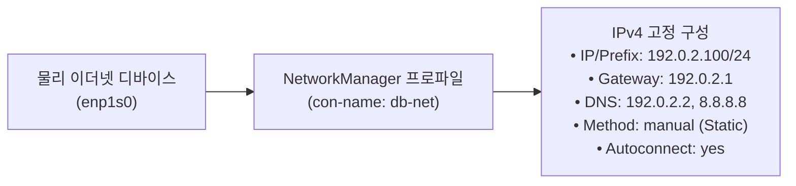
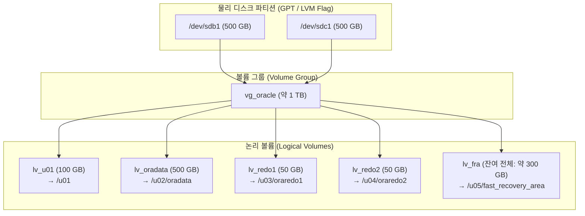

<!-- 
[조판 및 폰트 지정 규격 (Typography Specification)]
- 책 본문 (Body Text): Noto Sans KR
- 장/절 제목 (Headings): Noto Sans KR Bold
- 표 (Table): Noto Sans KR
- 캡션 (Caption): Noto Sans KR
- 영문 기술 용어 (Technical Terms): Noto Sans KR
- 코드 및 SQL 블록 (Code & SQL Blocks): DejaVu Sans Mono
-->

# CHAPTER 03. Oracle Linux 9 Minimal (CUI) 설치 및 기본 설정

Oracle Database 19c가 최상의 성능과 안정성을 발휘하려면 데이터베이스 엔진과 직접 맞물려 동작하는 운영체제(OS) 기반 환경이 정밀하게 구축되어야 합니다[1]. 그래픽 사용자 인터페이스(GUI)를 완전히 배제한 **Minimal Install(CUI/Headless)** 구성은 운영체제 자체의 메모리·CPU 점유율을 낮추고 불필요한 패키지 보안 취약점을 원천 차단하는 엔터프라이즈 데이터센터의 표준 구축 방식입니다[1, 2].

이 장에서는 Oracle Linux 9 Minimal(CUI) 설치 기준과 `grubby` 기반 커널 부트 파라미터 설정, `nmcli` 유틸리티를 활용한 고정 IP 바인딩 및 `/etc/hosts` 이름 해석(Name Resolution) 검증, 그리고 CLI 기반의 GPT 디스크 파티셔닝과 LVM(Logical Volume Manager) XFS 파일시스템 생성 절차를 단계별로 다룹니다.

---

## 3.1 Server (Minimal Install) OS 설치 및 콘솔 설정

### 3.1.1 OS 소프트웨어 패키지 그룹 선택 및 Headless 구성

Oracle Linux 9 설치 프로그램(Anaconda)의 **Software Selection(소프트웨어 선택)** 단계에서는 기본 환경을 **'Minimal Install'** 또는 GUI가 제외된 **'Server'**로 선택합니다[2]. 만약 'Server with GUI'를 선택하면 X11 디스플레이 서버, Wayland, GNOME 데스크톱 매니저 및 수백 개의 그래픽 의존성 패키지가 함께 설치되어 약 1.5 GB ~ 2 GB 이상의 물리 메모리가 상시 소비되며, 보안 패치 관리 대상과 커널 공격 표면(Attack Surface)이 불필요하게 넓어집니다.

*표 3-1. Oracle Linux 9 설치 소프트웨어 기본 환경 비교*

| 비교 항목 | Server with GUI | Minimal Install / Server (CUI) |
| :--- | :--- | :--- |
| **인터페이스 환경** | GNOME Desktop, Wayland 및 X11 그래픽 패키지 포함 | 100% CUI (SSH 터미널 및 시리얼 콘솔 전용) |
| **OS 기본 메모리 점유** | 약 1.5 GB ~ 2.0 GB 이상 상시 점유 | 약 400 MB ~ 500 MB 이하 (DB SGA/PGA 가용량 극대화) |
| **보안 및 패치 관리** | 그래픽 데몬 및 X11 관련 보안 취약점 노출 가능성 존재 | 필수 시스템 데몬만 구동되어 보안성 극대화 |
| **오라클 배포 방식** | OUI 대화형 GUI 마법사 기반 수동 설치 | Silent Mode(`-silent`) 및 응답 파일 기반 무인 자동화 설치 |

Minimal Install 설치를 마치고 첫 부팅을 완료하면 시스템은 그래픽 타깃(`graphical.target`)이 아닌 다중 사용자 텍스트 모드인 **`multi-user.target`**으로 구동됩니다[2]. 현재 시스템의 기본 부팅 타깃은 다음 명령으로 확인하고 고정할 수 있습니다.

```bash
# 현재 기본 systemd 부팅 타깃 확인 및 multi-user.target 설정
$ systemctl get-default
multi-user.target

$ sudo systemctl set-default multi-user.target
```

---

### 3.1.2 부트로더(BLS) 콘솔 환경 및 시리얼 터미널 최적화

데이터센터의 Headless 서버 관리자는 물리 모니터를 직접 연결하는 대신 SSH 터미널이나 하드웨어 원격 관리 콘솔(HPE iLO, Dell iDRAC, KVM over IP, 또는 Oracle Cloud Infrastructure Serial Console)을 통해 서버에 접속합니다. 커널 패닉(Kernel Panic)이나 부팅 장애 발생 시 원격 시리얼 콘솔에서 부트 로그를 즉시 확인하려면 커널 명령줄(Kernel Command Line)에 시리얼 콘솔 출력 파라미터(`console=ttyS0,115200n8`)를 등록해야 합니다[3].

> ⚠️ **주의(Caution)**: **Oracle Linux 9의 BLS(Boot Loader Specification) 구조와 `grubby` 사용 원칙**
> Oracle Linux 9(특히 9.3 이상)는 부트로더 관리에 **BLS(Boot Loader Specification)** 표준을 적용하여 개별 커널 부트 항목을 `/boot/loader/entries/` 하위의 스니펫 파일로 관리합니다[3]. 과거 Linux 버전처럼 `/etc/default/grub` 파일만 수정한 뒤 단순히 `grub2-mkconfig -o /boot/grub2/grub.cfg`를 실행하면 기존 BLS 부트 엔트리에 커널 파라미터 변경 사항이 반영되지 않습니다[3].
> 따라서 Oracle Linux 9에서는 오라클 공식 문서가 권장하는 **`grubby`** 유틸리티를 사용하여 커널 인자를 안전하게 갱신하거나, `grub2-mkconfig` 실행 시 반드시 **`--update-bls-cmdline`** 옵션을 함께 지정해야 합니다[3].

#### `grubby`를 활용한 시리얼 콘솔 파라미터 등록 및 검증 (권장 방식)

```bash
# 1. 설치된 모든 커널 부트 엔트리에 콘솔 출력 파라미터 추가
$ sudo grubby --update-kernel=ALL --args="console=tty0 console=ttyS0,115200n8"

# 2. 현재 기본 커널에 반영된 명령줄 인자(args) 검증
$ sudo grubby --info=DEFAULT
index=0
kernel="/boot/vmlinuz-5.15.0-200.131.27.el9uek.x86_64"
args="ro crashkernel=1G-4G:192M,4G-64G:256M,64G-:512M resume=/dev/mapper/ol-swap rd.lvm.lv=ol/root rd.lvm.lv=ol/swap console=tty0 console=ttyS0,115200n8"
root="/dev/mapper/ol-root"
```

만약 `/etc/default/grub` 설정 파일을 직접 편집하여 전체 시스템 템플릿을 동기화하려는 경우에는 다음과 같이 `--update-bls-cmdline` 플래그를 필수로 포함하여 실행합니다[3].

```bash
# /etc/default/grub 수정 후 BLS 엔트리 강제 동기화
$ sudo vi /etc/default/grub
GRUB_CMDLINE_LINUX="crashkernel=1G-4G:192M,4G-64G:256M,64G-:512M resume=/dev/mapper/ol-swap rd.lvm.lv=ol/root rd.lvm.lv=ol/swap console=tty0 console=ttyS0,115200n8"

$ sudo grub2-mkconfig -o /boot/grub2/grub.cfg --update-bls-cmdline
Generating grub configuration file ...
Adding boot menu entry for UEFI Firmware Settings ...
done
```

---

## 3.2 CLI 기반 네트워크 바인딩 및 호스트 이름 해석 검증

### 3.2.1 `nmcli` 유틸리티를 활용한 고정 IP 구성

Oracle Database 19c 및 Oracle Grid Infrastructure(SEHA) 서버는 IP 주소가 유동적으로 바뀌는 DHCP 구성을 지원하지 않으며, 반드시 **고정 IP(Static IP)**를 할당하고 재부팅 후에도 인터페이스가 자동 활성화(`autoconnect=yes`)되도록 구성해야 합니다[1, 4].

Oracle Linux 9에서는 과거의 `/etc/sysconfig/network-scripts/ifcfg-*` 스크립트 방식이 지원 중단(Deprecated)되었으며, NetworkManager의 표준 커맨드라인 도구인 **`nmcli`**를 통해 `/etc/NetworkManager/system-connections/` 하위의 키파일(Keyfile) 프로파일을 제어합니다[5].


*그림 3-1. `nmcli` 기반 고정 IP 네트워크 프로파일 바인딩 구조*

#### `nmcli` 기반 고정 IP 설정 및 활성화 절차

```bash
# 1. 시스템 네트워크 디바이스 상태 및 인터페이스 명칭 확인
$ nmcli device status
DEVICE  TYPE      STATE         CONNECTION 
enp1s0  ethernet  disconnected  --         
lo      loopback  unmanaged     --         

# 2. 이더넷 인터페이스(enp1s0)에 고정 IPv4, 게이트웨이, DNS 및 수동(manual) 모드 설정
$ sudo nmcli connection add type ethernet con-name db-net ifname enp1s0 \
  ipv4.method manual \
  ipv4.addresses 192.0.2.100/24 \
  ipv4.gateway 192.0.2.1 \
  ipv4.dns "192.0.2.2 8.8.8.8" \
  connection.autoconnect yes

# 3. 네트워크 프로파일 활성화
$ sudo nmcli connection up db-net
Connection successfully activated (D-Bus active path: /org/freedesktop/NetworkManager/ActiveConnection/1)

# 4. 할당된 IP 주소 및 링크 상태 검증
$ ip -4 addr show enp1s0
2: enp1s0: <BROADCAST,MULTICAST,UP,LOWER_UP> mtu 1500 qdisc fq_codel state UP group default qlen 1000
    inet 192.0.2.100/24 brd 192.0.2.255 scope global noprefixroute enp1s0
       valid_lft forever preferred_lft forever
```

---

### 3.2.2 `/etc/hosts` 파일 구성 및 호스트 이름 해석(Name Resolution) 검증

Oracle Universal Installer(OUI)와 Oracle Net Listener 프로세스가 정상적으로 소켓을 바인딩하려면 서버의 호스트명과 IP 주소가 양방향으로 정확히 해석(Name Resolution)되어야 합니다[1, 6]. 외부 DNS 서버의 일시적 장애가 데이터베이스 접속 장애로 이어지지 않도록 `/etc/hosts` 파일에 서버의 고정 IP와 정규화된 도메인 이름(Fully Qualified Domain Name, FQDN), 단축 호스트명(Short Hostname)을 명확히 등록해야 합니다[1, 6].

#### `/etc/hosts` 작성 시 필수 준수 규칙

1. **루프백(`127.0.0.1`) 라인에 실제 서버 호스트명 매핑 금지**:
   `127.0.0.1` 또는 `::1` 루프백 항목에는 오직 `localhost`와 `localhost.localdomain`만 남겨 두어야 합니다[1]. 만약 `127.0.0.1`에 실제 데이터베이스 호스트명(`dbserver`)을 함께 적어 넣으면, 오라클 리스너와 데이터베이스 인스턴스가 루프백 인터페이스(`127.0.0.1`)로 바인딩되어 외부 클라이언트에서 `ORA-12541: TNS:no listener` 접속 장애가 발생합니다[6].
2. **표준 기재 순서(`<IP 주소> <FQDN> <단축 호스트명>`) 준수**:
   오라클 설치 가이드 표준 포맷에 맞춰 고정 IP 주소 뒤에 **FQDN(`dbserver.example.com`)**을 먼저 표기하고, 그 뒤에 **단축 별칭(`dbserver`)**을 기재합니다[1].

#### `/etc/hosts` 설정 및 호스트명 검증 절차

```ini
# /etc/hosts
127.0.0.1   localhost localhost.localdomain localhost4 localhost4.localdomain4
::1         localhost localhost.localdomain localhost6 localhost6.localdomain6

# Oracle Database 19c Server Primary IP Mapping
192.0.2.100  dbserver.example.com  dbserver
```

`/etc/hosts` 파일을 저장한 후 `hostnamectl` 명령으로 시스템 호스트명을 설정하고, `hostname`, `getent`, `ping` 명령을 통해 루프백(`127.0.0.1`)이 아닌 실제 서버 고정 IP(`192.0.2.100`)로 해석되는지 검증합니다[1].

```bash
# 1. OS 시스템 호스트명(FQDN) 설정
$ sudo hostnamectl set-hostname dbserver.example.com

# 2. FQDN, 단축 호스트명 및 IP 매핑 검증
$ hostname -f
dbserver.example.com

$ hostname -s
dbserver

$ getent hosts dbserver
192.0.2.100     dbserver.example.com dbserver

# 3. ping 응답 IP가 127.0.0.1이 아닌 192.0.2.100인지 확인
$ ping -c 2 dbserver
PING dbserver.example.com (192.0.2.100) 56(84) bytes of data.
64 bytes from dbserver.example.com (192.0.2.100): icmp_seq=1 ttl=64 time=0.038 ms
64 bytes from dbserver.example.com (192.0.2.100): icmp_seq=2 ttl=64 time=0.042 ms
```

> 💡 **노트(Note)**: **다중 네트워크 인터페이스(Multihomed) 서버의 `ORACLE_HOSTNAME` 설정**
> 백업 전용 망이나 관리 망 등 2개 이상의 네트워크 카드(NIC)가 장착된 서버에서는 오라클 설치 마법사(OUI)가 올바른 서비스 IP와 호스트명을 인식하도록 `oracle` 계정의 환경 변수에 `export ORACLE_HOSTNAME=dbserver.example.com`을 명시적으로 선언해야 합니다[1]. 또한 OS 방화벽(`firewalld`)이 활성화된 환경에서는 클라이언트 접속을 위해 오라클 리스너 기본 포트(`1521/tcp`)를 개방(`sudo firewall-cmd --permanent --add-port=1521/tcp && sudo firewall-cmd --reload`)하고, `chronyd` 데몬을 통한 NTP 시간 동기화 상태를 반드시 확인해야 합니다[1, 5].

---

## 3.3 스토리지 파티셔닝 및 CLI 파일시스템 생성

### 3.3.1 `parted` 유틸리티를 활용한 GPT 디스크 파티셔닝

데이터베이스 엔진 바이너리, 데이터 파일, 다중화 리두 로그, Fast Recovery Area(FRA)를 배치할 추가 블록 디바이스가 서버에 연결되면 파티셔닝 작업을 수행합니다. 레거시 MBR(Master Boot Record) 파티션 테이블은 최대 2 TB까지만 인식할 수 있으므로, 최신 엔터프라이즈 환경에서는 디스크 용량과 관계없이 모든 데이터 디스크를 **`parted` 유틸리티와 GPT(GUID Partition Table)** 레이블로 통일하여 구성하고 첫 번째 섹터를 `2048s`(1 MiB 경계)로 정렬(Sector Alignment)하는 것이 I/O 성능상 유리합니다[2].

```bash
# 1. 서버에 연결된 블록 디바이스 목록 확인
$ lsblk -d -o NAME,SIZE,TYPE,MODEL
NAME  SIZE TYPE DISK
sda    64G disk VirtIO_Block_Device
sdb   500G disk VirtIO_Block_Device
sdc   500G disk VirtIO_Block_Device

# 2. 비대화형(-s) parted 명령으로 GPT 레이블 생성, 1 MiB(2048s) 정렬 파티션 할당 및 LVM 플래그 설정
$ for dev in /dev/sdb /dev/sdc; do
    sudo parted -s $dev mklabel gpt
    sudo parted -s $dev mkpart primary 2048s 100%
    sudo parted -s $dev set 1 lvm on
  done

# 3. 커널 파티션 테이블 갱신 및 결과 확인
$ sudo partprobe
$ sudo parted /dev/sdb print
Model: VirtIO Block Device (virtblk)
Disk /dev/sdb: 500GB
Sector size (logical/physical): 512B/512B
Partition Table: gpt
Disk Flags: 

Number  Start   End    Size   File system  Name     Flags
 1      1049kB  500GB  500GB               primary  lvm
```

---

### 3.3.2 LVM(Logical Volume Manager) 구성 및 논리 볼륨 할당

파티셔닝이 완료된 물리 파티션을 물리 볼륨(PV, Physical Volume)으로 초기화한 뒤 볼륨 그룹(VG, Volume Group)으로 묶고, Chapter 2에서 설계한 마운트 포인트 규격에 맞춰 논리 볼륨(LV, Logical Volume)을 분할합니다.


*그림 3-2. LVM 기반 물리 볼륨(PV), 볼륨 그룹(VG), 논리 볼륨(LV) 계층 구조도*

> ⚠️ **주의(Caution)**: **LVM 볼륨 그룹의 마지막 논리 볼륨 할당 시 `-l 100%FREE` 사용 원칙**
> 500 GB 디스크 2개로 구성된 볼륨 그룹(`vg_oracle`)의 명목 용량은 1,000 GB이지만, 각 디스크의 1 MiB 파티션 정렬 오프셋과 LVM 메타데이터 헤더(Physical Extent 반올림)로 인해 실제 가용 공간은 약 `999.99 GiB`입니다. 따라서 마지막 논리 볼륨(`lv_fra`)을 생성할 때 고정 크기 옵션(`-L 300G`)을 지정하면 1~2개의 PE(Physical Extent)가 부족하여 `Volume group "vg_oracle" has insufficient free space` 오류가 발생합니다. 볼륨 그룹의 남은 잔여 공간을 모두 할당할 때는 반드시 **`-l 100%FREE`** 옵션을 사용해야 합니다. 또한 실무 운영 환경에서는 단일 디스크 장애에 대비하여 `lv_redo1`과 `lv_redo2`가 서로 다른 물리 디스크(`pvcreate` 대상)에 배치되도록 구성하는 것이 안전합니다.

#### LVM CLI 생성 명령어 실행 절차

```bash
# 1. 물리 볼륨(PV) 생성
$ sudo pvcreate /dev/sdb1 /dev/sdc1
  Physical volume "/dev/sdb1" successfully created.
  Physical volume "/dev/sdc1" successfully created.

# 2. 볼륨 그룹(VG) 생성
$ sudo vgcreate vg_oracle /dev/sdb1 /dev/sdc1
  Volume group "vg_oracle" successfully created

# 3. 용도별 논리 볼륨(LV) 생성 (Redo Log 다중화 볼륨은 서로 다른 물리 디스크에 분리 배치)
$ sudo lvcreate -L 100G -n lv_u01     vg_oracle /dev/sdb1
  Logical volume "lv_u01" created.

$ sudo lvcreate -L 50G  -n lv_redo1   vg_oracle /dev/sdb1
  Logical volume "lv_redo1" created.

$ sudo lvcreate -L 50G  -n lv_redo2   vg_oracle /dev/sdc1
  Logical volume "lv_redo2" created.

$ sudo lvcreate -L 500G -n lv_oradata vg_oracle
  Logical volume "lv_oradata" created.

# 4. 볼륨 그룹의 잔여 가용 공간 전체(-l 100%FREE)를 FRA 볼륨으로 할당
$ sudo lvcreate -l 100%FREE -n lv_fra vg_oracle
  Logical volume "lv_fra" created.

# 5. 생성된 논리 볼륨 목록 및 크기 검증
$ sudo lvs vg_oracle
  LV         VG        Attr       LSize    Pool Origin Data%  Meta%
  lv_fra     vg_oracle -wi-a----- <299.99g
  lv_oradata vg_oracle -wi-a-----  500.00g
  lv_redo1   vg_oracle -wi-a-----   50.00g
  lv_redo2   vg_oracle -wi-a-----   50.00g
  lv_u01     vg_oracle -wi-a-----  100.00g
```

---

### 3.3.3 XFS 파일시스템 포맷 및 영구 마운트 구성

생성된 각 논리 볼륨을 Oracle Linux 9의 표준 고성능 저널링 파일시스템인 **XFS**로 포맷하고, 마운트 포인트 디렉터리를 생성한 뒤 `/etc/fstab`에 등록합니다.

```bash
# 1. 각 논리 볼륨에 XFS 파일시스템 포맷 수행
$ for lv in lv_u01 lv_oradata lv_redo1 lv_redo2 lv_fra; do
    sudo mkfs.xfs /dev/vg_oracle/$lv
  done

# 2. 마운트 포인트 디렉터리 일괄 생성
$ sudo mkdir -p /u01 /u02/oradata /u03/oraredo1 /u04/oraredo2 /u05/fast_recovery_area

# 3. /etc/fstab 영구 마운트 등록 (XFS 파일시스템은 마지막 두 필드를 0 0으로 설정)
$ sudo vi /etc/fstab
/dev/mapper/vg_oracle-lv_u01     /u01                    xfs  defaults                    0 0
/dev/mapper/vg_oracle-lv_oradata /u02/oradata            xfs  defaults,noatime,nodiratime 0 0
/dev/mapper/vg_oracle-lv_redo1   /u03/oraredo1           xfs  defaults,noatime,nodiratime 0 0
/dev/mapper/vg_oracle-lv_redo2   /u04/oraredo2           xfs  defaults,noatime,nodiratime 0 0
/dev/mapper/vg_oracle-lv_fra     /u05/fast_recovery_area xfs  defaults,noatime,nodiratime 0 0

# 4. systemd 마운트 유닛 갱신, 전체 마운트 적용 및 결과 확인
$ sudo systemctl daemon-reload
$ sudo mount -a
$ df -hT | grep vg_oracle
/dev/mapper/vg_oracle-lv_u01      xfs       100G  746M  100G   1% /u01
/dev/mapper/vg_oracle-lv_oradata  xfs       500G  3.6G  497G   1% /u02/oradata
/dev/mapper/vg_oracle-lv_redo1    xfs        50G  390M   50G   1% /u03/oraredo1
/dev/mapper/vg_oracle-lv_redo2    xfs        50G  390M   50G   1% /u04/oraredo2
/dev/mapper/vg_oracle-lv_fra      xfs       300G  2.1G  298G   1% /u05/fast_recovery_area
```

---

## 3.4 장 요약 (Chapter Summary)

이 장에서는 Oracle Database 19c SE2가 구동될 **Oracle Linux 9 Minimal(CUI)** 운영체제의 설치 기준과 네트워크·스토리지 초기 구성 절차를 완성했습니다.

* **Minimal Install 및 BLS 부트로더 설정**: GUI 패키지를 배제한 `multi-user.target` 기반의 Minimal Install을 통해 OS 메모리 소비와 보안 위협을 최소화하고, Oracle Linux 9의 BLS 표준 도구인 **`grubby`**(`--update-kernel=ALL --args=...`)를 사용하여 시리얼 콘솔 파라미터를 안전하게 구성했습니다.
* **고정 IP 바인딩 및 호스트 이름 해석**: `nmcli`를 통해 정적 IPv4 프로파일(`ipv4.method manual`, `connection.autoconnect yes`)을 구성하고, `/etc/hosts`에서 루프백(`127.0.0.1`)과 실제 서버 IP(`FQDN` + 단축 호스트명)를 엄격히 분리하여 오라클 리스너 바인딩 오류를 예방했습니다.
* **GPT 파티셔닝 및 LVM/XFS 구축**: `parted`를 통해 1 MiB(`2048s`) 섹터 정렬된 GPT 파티션을 생성하고, LVM에서 Redo Log 다중화 볼륨의 물리 디스크 분리 및 `-l 100%FREE` 옵션을 적용하여 5개 표준 마운트 포인트(`/u01` ~ `/u05`)를 XFS 파일시스템(`noatime,nodiratime`, `0 0`)으로 마운트했습니다.

다음 **CHAPTER 04**에서는 `oracle-database-preinstall-19c` 패키지를 활용한 OS 사전 환경 자동 구성, 오라클 사용자 및 그룹 권한 설계, 커널 파라미터(`sysctl`) 및 Static HugePages 설정, 그리고 UEK R7 환경의 ASMLib v3(`io_uring`) 구성 절차를 상세히 다룹니다.

---

# References

[1] Oracle. 2024. *Oracle Database Installation Guide 19c for Linux (E96272)*. Oracle America, Inc. Retrieved September 30, 2026 from https://docs.oracle.com/en/database/oracle/oracle-database/19/ladbi/
[2] Oracle. 2024. *Oracle Linux 9: Installing Oracle Linux (F52960)*. Oracle America, Inc. Retrieved September 30, 2026 from https://docs.oracle.com/en/operating-systems/oracle-linux/9/install/
[3] Oracle. 2024. *Oracle Linux 9: Managing Kernels and System Boot (F52963)*. Oracle America, Inc. Retrieved September 30, 2026 from https://docs.oracle.com/en/operating-systems/oracle-linux/9/boot/
[4] Oracle. 2024. *Oracle Clusterware Administration and Deployment Guide 19c (E96264)*. Oracle America, Inc. Retrieved September 30, 2026 from https://docs.oracle.com/en/database/oracle/oracle-database/19/cwadd/
[5] Oracle. 2024. *Oracle Linux 9: Setting Up Networking (F52965)*. Oracle America, Inc. Retrieved September 30, 2026 from https://docs.oracle.com/en/operating-systems/oracle-linux/9/network/
[6] Oracle. 2024. *Oracle Database Net Services Administrator's Guide 19c (E96275)*. Oracle America, Inc. Retrieved September 30, 2026 from https://docs.oracle.com/en/database/oracle/oracle-database/19/netag/
