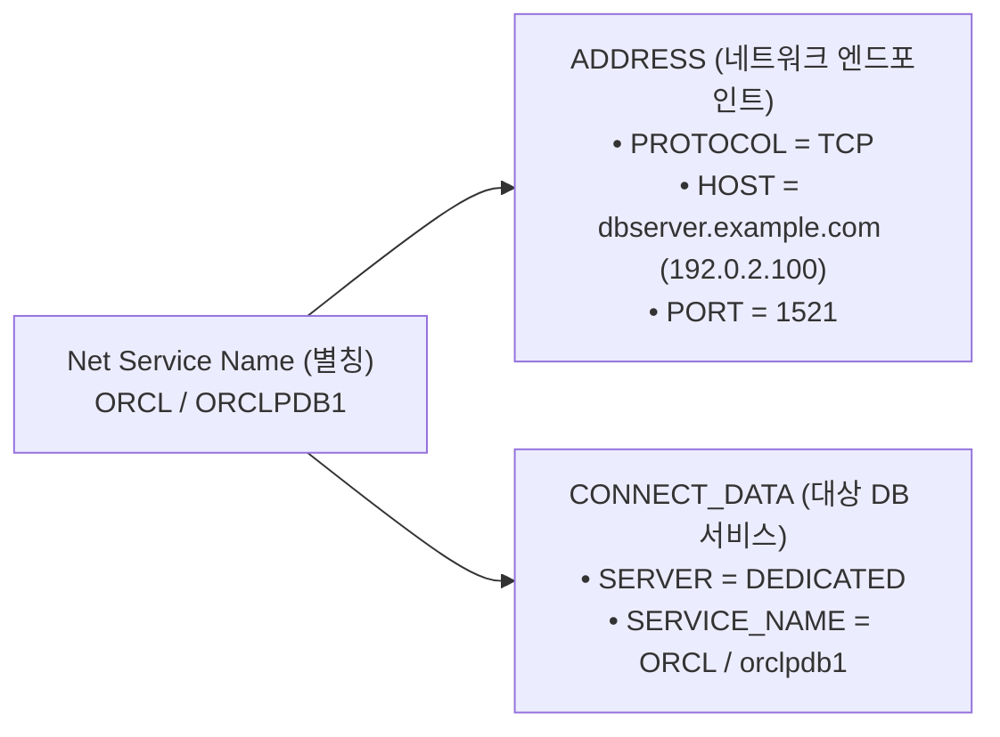

<!-- 
[조판 및 폰트 지정 규격 (Typography Specification)]
- 책 본문 (Body Text): Noto Sans KR
- 장/절 제목 (Headings): Noto Sans KR Bold
- 표 (Table): Noto Sans KR
- 캡션 (Caption): Noto Sans KR
- 영문 기술 용어 (Technical Terms): Noto Sans KR
- 코드 및 SQL 블록 (Code & SQL Blocks): DejaVu Sans Mono
-->

# CHAPTER 06. `netca -silent`를 활용한 리스너 및 네트워크 구성

오라클 데이터베이스 인스턴스와 클라이언트 애플리케이션 간의 네트워크 통신을 중개하는 **Oracle Net Listener(리스너)**는 외부의 최초 접속 요청을 수신하여 데이터베이스 서버 프로세스(Dedicated Server Process)로 세션을 전달하는 핵심 인프라 계층입니다[1]. 그래픽 화면을 사용할 수 없는 Headless(CUI) 환경에서는 GUI 기반의 Oracle Net Manager나 대화형 마법사 대신 **`netca -silent`** 커맨드라인 인터페이스를 사용하여 리스너 및 네트워크 프로파일을 비대화형으로 자동 구성합니다[2, 3].

이 장에서는 응답 파일(`netca.rsp`)을 활용한 Silent 리스너 생성, `$ORACLE_HOME/network/admin` 경로의 `listener.ora` 및 `sqlnet.ora` 보안·성능 튜닝, `lsnrctl` 유틸리티를 통한 리스너 제어, 그리고 로컬 이름 해석(Local Naming)을 위한 `tnsnames.ora` 작성 및 `tnsping` 검증 절차를 단계별로 다룹니다.

---

## 6.1 Response File을 이용한 Silent 리스너 생성

### 6.1.1 NETCA Silent Mode의 동작 메커니즘

**Oracle Net Configuration Assistant(NETCA)**는 리스너, 이름 해석 방식(Naming Methods), 로컬 서비스 이름을 구성하는 표준 유틸리티입니다[1, 3]. Headless 환경에서는 `-silent` 옵션과 `-responseFile` 매개변수를 결합하여 GUI 호출 없이 수 초 내에 기본 리스너(`LISTENER`) 생성과 기동까지 자동으로 완료할 수 있습니다[3].

* **표준 응답 파일 템플릿 경로**: `$ORACLE_HOME/assistants/netca/netca.rsp` 파일을 그대로 참조하거나 작업 디렉터리(`/u01/stage/`)로 복사하여 사용합니다[3].
* **설정 파일 생성 경로**: NETCA를 실행하면 `$TNS_ADMIN` 환경 변수(미지정 시 기본 경로인 **`$ORACLE_HOME/network/admin`**) 하위에 `listener.ora`와 `sqlnet.ora` 파일을 자동 생성하고 리스너 프로세스(`tnslsnr`)를 즉시 기동합니다[1, 3].

---

### 6.1.2 `netca.rsp` 응답 파일 핵심 매개변수 명세

`$ORACLE_HOME/assistants/netca/netca.rsp` 템플릿 파일은 `[GENERAL]` 헤더 섹션과 `[oracle.net.ca]` 구성 섹션으로 이루어져 있으며, 별도의 수정 없이 기본 템플릿 값을 그대로 사용하더라도 표준 포트(`TCP 1521`) 기반의 `LISTENER`가 즉시 구성됩니다[1, 3].

*표 6-1. Oracle Database 19c `netca.rsp` 핵심 설정 매개변수 명세*

| 섹션 구분 | 매개변수 명칭 (Parameter Name) | 기본 설정값 | 기능 및 설정 목적 |
| :--- | :--- | :--- | :--- |
| **`[GENERAL]`** | **`RESPONSEFILE_VERSION`** | `"19.0"` | NETCA 응답 파일 스키마 버전 정의 |
| **`[GENERAL]`** | **`CREATE_TYPE`** | `"CUSTOM"` | 사용자 정의 응답 파일 구성 모드 지정 |
| **`[oracle.net.ca]`** | **`INSTALLED_COMPONENTS`** | `{"server","net8","javavm"}` | 네트워크 구성을 적용할 설치 컴포넌트 목록 |
| **`[oracle.net.ca]`** | **`INSTALL_TYPE`** | `""typical""` | 표준(Typical) 네트워크 구성 유형 지정 |
| **`[oracle.net.ca]`** | **`LISTENER_NUMBER`** | `1` | 생성할 오라클 리스너의 총 개수 |
| **`[oracle.net.ca]`** | **`LISTENER_NAMES`** | `{"LISTENER"}` | 생성할 리스너의 고유 명칭 (기본값: `LISTENER`) |
| **`[oracle.net.ca]`** | **`LISTENER_PROTOCOLS`** | `{"TCP;1521"}` | 리스너가 바인딩할 프로토콜 및 포트 번호 (기본값: `TCP 1521`) |
| **`[oracle.net.ca]`** | **`LISTENER_START`** | `""LISTENER""` | 리스너 구성 완료 직후 즉시 기동할 리스너 명칭 |
| **`[oracle.net.ca]`** | **`NAMING_METHODS`** | `{"TNSNAMES","ONAMES","HOSTNAME"}` | 클라이언트 이름 해석(Naming Method) 우선순위 목록 |

---

### 6.1.3 CLI 기반 Silent 리스너 생성 및 실행

`oracle` 계정에서 `$ORACLE_HOME/assistants/netca/netca.rsp` 응답 파일을 지정하여 `netca -silent` 명령을 실행합니다[3].

```bash
# 1. netca.rsp 핵심 설정값 사전 확인
$ grep -vE '^#|^$' $ORACLE_HOME/assistants/netca/netca.rsp
[GENERAL]
RESPONSEFILE_VERSION="19.0"
CREATE_TYPE="CUSTOM"
[oracle.net.ca]
INSTALLED_COMPONENTS={"server","net8","javavm"}
INSTALL_TYPE=""typical""
LISTENER_NUMBER=1
LISTENER_NAMES={"LISTENER"}
LISTENER_PROTOCOLS={"TCP;1521"}
LISTENER_START=""LISTENER""
NAMING_METHODS={"TNSNAMES","ONAMES","HOSTNAME"}
NSN_NUMBER=1
NSN_NAMES={"EXTPROC_CONNECTION_DATA"}
NSN_SERVICE={"PLSExtProc"}
NSN_PROTOCOLS={"TCP;HOSTNAME;1521"}

# 2. netca -silent 비대화형 실행
$ $ORACLE_HOME/bin/netca -silent -responseFile $ORACLE_HOME/assistants/netca/netca.rsp

Parsing command line arguments:
    Parameter "silent" = true
    Parameter "responsefile" = /u01/app/oracle/product/19.0.0/dbhome_1/assistants/netca/netca.rsp
Done parsing command line arguments.
Oracle Net Services Configuration:
Profile configuration complete.
Oracle Net Listener Startup:
    Running Listener Control: 
      /u01/app/oracle/product/19.0.0/dbhome_1/bin/lsnrctl start LISTENER
    Listener Control complete.
    Listener started successfully.
Listener configuration complete.
Oracle Net Services configuration successful. The exit code is 0
```

---

## 6.2 커맨드라인 기반 `listener.ora` 및 `sqlnet.ora` 보안·성능 튜닝

### 6.2.1 `$ORACLE_HOME/network/admin` 경로와 `TNS_ADMIN` 환경 변수

오라클 네트워크 구성 파일(`listener.ora`, `sqlnet.ora`, `tnsnames.ora`)은 기본적으로 **`$ORACLE_HOME/network/admin`** 디렉터리에 생성됩니다[1, 3].

만약 향후 패치나 업그레이드로 인해 오라클 홈(`ORACLE_HOME`) 경로가 변경되더라도 동일한 네트워크 설정 파일을 유지하려면, 별도의 공통 디렉터리(예: `/u01/app/oracle/network/admin`)를 생성하고 `oracle` 계정의 `~/.bash_profile`에 **`TNS_ADMIN`** 환경 변수를 지정하여 네트워크 설정 경로를 분리할 수 있습니다[1, 3].

```bash
# (선택 사항) 네트워크 설정 파일을 독립 디렉터리로 분리할 때 사용하는 환경 변수
export TNS_ADMIN=$ORACLE_BASE/network/admin
```

---

### 6.2.2 `listener.ora` 구성 분석 및 엔터프라이즈 보안·성능 튜닝

`netca -silent` 실행으로 자동 생성된 `$ORACLE_HOME/network/admin/listener.ora` 파일의 기본 구성을 확인하고, 서비스 거부(DoS) 공격 방어 및 비인가 설정 변경 차단을 위한 핵심 보안 파라미터를 추가합니다[1, 2].

```ini
# $ORACLE_HOME/network/admin/listener.ora
LISTENER =
  (DESCRIPTION_LIST =
    (DESCRIPTION =
      (ADDRESS = (PROTOCOL = TCP)(HOST = dbserver.example.com)(PORT = 1521))
      (ADDRESS = (PROTOCOL = IPC)(KEY = EXTPROC1521))
    )
  )

# [엔터프라이즈 보안 및 연결 타임아웃 최적화 파라미터]
# 1. 리스너 수준 초기 접속 완료 대기 시간 제한 (단위: 초, 기본값 60초)
INBOUND_CONNECT_TIMEOUT_LISTENER = 10

# 2. lsnrctl set 명령을 통한 런타임 동적 설정 변경 차단 (기본값 OFF -> ON 권장)
ADMIN_RESTRICTIONS_LISTENER = ON

# 3. 동적 서비스 등록(Dynamic Registration) 허용 범위 제어 (기본값 ON: 로컬 노드만 허용)
VALID_NODE_CHECKING_REGISTRATION_LISTENER = ON
```

*표 6-2. `listener.ora` 핵심 보안 및 튜닝 파라미터 명세*

| 파라미터 명칭 | 기본값 / 권장값 | 기능 및 아키텍처 동작 설명 |
| :--- | :---: | :--- |
| **`INBOUND_CONNECT_TIMEOUT_<listener_name>`** | `60` / `10` | 클라이언트가 리스너에 TCP 연결을 맺은 후 접속 요청 패킷을 완료해야 하는 제한 시간(초)입니다. 미완료 연결로 리스너를 마비시키는 DoS 공격을 차단합니다[2]. |
| **`ADMIN_RESTRICTIONS_<listener_name>`** | `OFF` / `ON` | `ON`으로 설정하면 운영 중 `lsnrctl set` 명령어를 통한 모든 동적 파라미터 변경을 거부하며, 오직 `listener.ora` 파일을 직접 수정한 후 `reload`해야만 반영되도록 강제합니다[2]. |
| **`VALID_NODE_CHECKING_REGISTRATION_<listener_name>`** | `ON` / `ON` (또는 `SUBNET`) | 원격 악성 인스턴스가 리스너에 위조 서비스를 등록하여 세션을 가로채는 **TNS Poisoning(CVE-2012-1675)** 공격을 방어하는 VNCR 파라미터입니다. 기본값 `ON`은 로컬 서버 IP에서의 동적 등록만 허용하며, SEHA 등 클러스터 서브넷 내 등록을 허용할 때는 `SUBNET`으로 지정합니다[1, 2]. |

---

### 6.2.3 `sqlnet.ora` 클라이언트/서버 프로파일 파라미터 제어

`$ORACLE_HOME/network/admin/sqlnet.ora` 파일은 데이터베이스 서버와 클라이언트의 이름 해석 순서, 인증 타임아웃, 비정상 종료 세션 정리(Dead Connection Detection, DCD) 주기를 제어합니다[1, 2].

```ini
# $ORACLE_HOME/network/admin/sqlnet.ora
# 1. 이름 해석 어댑터 탐색 우선순위 지정 (tnsnames.ora 우선, 이후 Easy Connect 탐색)
NAMES.DIRECTORY_PATH = (TNSNAMES, EZCONNECT)

# 2. DB 서버 프로세스 인증 완료 타임아웃 제한 (단위: 초, 기본값 60초)
#    리스너의 INBOUND_CONNECT_TIMEOUT_LISTENER(10초)보다 크거나 같게 설정 권장
SQLNET.INBOUND_CONNECT_TIMEOUT = 12

# 3. Dead Connection Detection (DCD) 유휴 세션 생존 확인 주기 (단위: 분, 기본값 0)
SQLNET.EXPIRE_TIME = 10
```

* **`SQLNET.INBOUND_CONNECT_TIMEOUT`**: 리스너로부터 연결을 넘겨받은 데이터베이스 서버 프로세스가 클라이언트 인증을 완료할 때까지 기다리는 시간(초)입니다[2]. 지정된 시간 내에 인증이 완료되지 않으면 연결을 즉시 종료하고 `alert.log`에 `WARNING: inbound connection timed out (ORA-3136)`을 기록합니다. 오라클 공식 문서에서는 이 값을 리스너의 `INBOUND_CONNECT_TIMEOUT_<listener_name>`보다 약간 크게 설정할 것을 권장합니다[1, 2].
* **`SQLNET.EXPIRE_TIME`**: 클라이언트 PC가 비정상 종료되거나 방화벽에 의해 세션이 끊어졌을 때 데이터베이스 서버 프로세스가 이를 감지하고 점유 자원과 락(Lock)을 해제하도록 **분(Minutes) 단위**로 프로브(Probe) 주기를 지정하는 DCD 파라미터입니다[1, 2]. Oracle 19c에서는 OS 커널의 TCP Keepalive 타이머와 연동하여 네트워크 부하를 최소화하며, 실무에서는 **`10`분** 설정을 표준으로 권장합니다[2].

> ⚠️ **주의(Caution)**: **Linux 환경에서 `SQLNET.AUTHENTICATION_SERVICES = (ALL)` 설정 금지**
> Windows 서버 환경에서는 OS 인증을 위해 `SQLNET.AUTHENTICATION_SERVICES = (NTS)`를 사용하지만, **Linux/UNIX 환경에서 `SQLNET.AUTHENTICATION_SERVICES = (ALL)`을 지정하면 구성되지 않은 외부 인증 어댑터(Kerberos, Radius 등) 초기화를 시도하다가 `sqlplus / as sysdba` 로컬 OS 인증 접속이 실패(`ORA-01017` 또는 `ORA-12641`)**합니다[2, 3]. 따라서 Linux 환경에서는 해당 파라미터를 아예 생략하거나 기본값(`NONE`)으로 유지해야 `oinstall`/`dba` 그룹 기반의 로컬 OS 인증이 정상 작동합니다[2].

---

### 6.2.4 `lsnrctl` 커맨드라인 관리 및 동적 서비스 등록 원리

`listener.ora` 및 `sqlnet.ora` 구성을 마친 후에는 **`lsnrctl`(Listener Control Utility)** 명령어로 설정을 다시 로드(`reload`)하고 리스너의 바인딩 상태를 검증합니다[1, 2].

```bash
# 1. 수정된 listener.ora 설정을 무중단으로 재적용 (lsnrctl reload)
$ lsnrctl reload
LSNRCTL for Linux: Version 19.0.0.0.0 - Production on 30-SEP-2026 10:50:00
Connecting to (DESCRIPTION=(ADDRESS=(PROTOCOL=TCP)(HOST=dbserver.example.com)(PORT=1521)))
The command completed successfully

# 2. 리스너 작동 상태 및 엔드포인트 상세 점검 (lsnrctl status)
$ lsnrctl status

LSNRCTL for Linux: Version 19.0.0.0.0 - Production on 30-SEP-2026 10:50:05

Connecting to (DESCRIPTION=(ADDRESS=(PROTOCOL=TCP)(HOST=dbserver.example.com)(PORT=1521)))
STATUS of the LISTENER
------------------------
Alias                     LISTENER
Version                   TNSLSNR for Linux: Version 19.0.0.0.0 - Production
Start Date                30-SEP-2026 10:45:12
Uptime                    0 days 0 hr. 4 min. 53 sec
Trace Level               off
Security                  ON: Local OS Authentication
SNMP                      OFF
Listener Parameter File   /u01/app/oracle/product/19.0.0/dbhome_1/network/admin/listener.ora
Listener Log File         /u01/app/oracle/diag/tnslsnr/dbserver/listener/alert/log.xml
Listening Endpoints Summary...
  (DESCRIPTION=(ADDRESS=(PROTOCOL=tcp)(HOST=dbserver.example.com)(PORT=1521)))
  (DESCRIPTION=(ADDRESS=(PROTOCOL=ipc)(KEY=EXTPROC1521)))
The listener supports no services
The command completed successfully
```

> 💡 **노트(Note)**: **`LREG` 백그라운드 프로세스와 동적 서비스 등록(Dynamic Service Registration)**
> 현재는 엔진 소프트웨어만 설치된 상태이므로 `lsnrctl status` 출력 하단에 `The listener supports no services`라고 표시되는 것이 정상입니다[1]. 다음 장(Chapter 7)에서 데이터베이스 인스턴스를 생성하고 오픈하면, 오라클의 **`LREG`(Listener Registration Process)** 백그라운드 프로세스가 기본 리스너(`TCP 1521`)와 자동으로 통신하여 CDB 서비스명과 각 PDB 서비스명을 실시간 등록(`READY` 상태)합니다[1]. 따라서 특별한 정적 원격 기동 요건이 없는 한 `listener.ora` 파일에 `SID_LIST_LISTENER`를 수동으로 작성할 필요가 없습니다[1].

---

## 6.3 `tnsnames.ora` CLI 구성 및 로컬 서비스 이름 검증

### 6.3.1 Local Naming 방식과 커넥트 디스크립터(Connect Descriptor) 구조

클라이언트 애플리케이션이나 데이터베이스 링크(Database Link)가 복잡한 IP 주소, 포트 번호, 서비스 이름을 매번 입력하지 않고 직관적인 별칭(Net Service Name)으로 접속할 수 있도록 매핑 정보를 정의한 파일이 **`$ORACLE_HOME/network/admin/tnsnames.ora`**입니다[1, 2].


*그림 6-1. `tnsnames.ora` 로컬 서비스 이름(Net Service Name)과 커넥트 디스크립터 매핑 구조*

---

### 6.3.2 멀티테넌트(CDB/PDB) 환경을 위한 `tnsnames.ora` 작성

Oracle Database 19c 멀티테넌트 환경에서는 루트 컨테이너(CDB) 접속용 서비스 별칭(`ORCL`)뿐만 아니라, 실제 업무 데이터가 저장되는 플러그형 데이터베이스(PDB)에 직접 접속하기 위한 전용 서비스 별칭(`ORCLPDB1`)을 반드시 `tnsnames.ora`에 함께 등록해야 합니다[1].

```bash
# $ORACLE_HOME/network/admin/tnsnames.ora 파일 생성
$ cat << 'EOF' > $ORACLE_HOME/network/admin/tnsnames.ora
# 1. CDB 루트 컨테이너(CDB$ROOT) 접속 식별자
ORCL =
  (DESCRIPTION =
    (ADDRESS = (PROTOCOL = TCP)(HOST = dbserver.example.com)(PORT = 1521))
    (CONNECT_DATA =
      (SERVER = DEDICATED)
      (SERVICE_NAME = ORCL)
    )
  )

# 2. 업무용 플러그형 데이터베이스(ORCLPDB1) 직접 접속 식별자
ORCLPDB1 =
  (DESCRIPTION =
    (ADDRESS = (PROTOCOL = TCP)(HOST = dbserver.example.com)(PORT = 1521))
    (CONNECT_DATA =
      (SERVER = DEDICATED)
      (SERVICE_NAME = orclpdb1)
    )
  )
EOF
```

---

### 6.3.3 `tnsping` 유틸리티를 통한 리스너 도달성 검증

작성한 `tnsnames.ora` 파일의 문법 무결성과 리스너 TCP 포트(`1521`) 도달 가능 여부를 검증하기 위해 **`tnsping`** 유틸리티를 실행합니다[1].

```bash
# 1. CDB 서비스 별칭(ORCL)에 대한 tnsping 검증
$ tnsping ORCL

TNS Ping Utility for Linux: Version 19.0.0.0.0 - Production on 30-SEP-2026 10:55:00
Copyright (c) 1997, 2023, Oracle.  All rights reserved.

Used parameter files:
/u01/app/oracle/product/19.0.0/dbhome_1/network/admin/sqlnet.ora

Used TNSNAMES adapter to resolve the alias
Attempting to contact (DESCRIPTION = (ADDRESS = (PROTOCOL = TCP)(HOST = dbserver.example.com)(PORT = 1521)) (CONNECT_DATA = (SERVER = DEDICATED) (SERVICE_NAME = ORCL)))
OK (0 msec)

# 2. PDB 서비스 별칭(ORCLPDB1)에 대한 tnsping 검증
$ tnsping ORCLPDB1

TNS Ping Utility for Linux: Version 19.0.0.0.0 - Production on 30-SEP-2026 10:55:05
Copyright (c) 1997, 2023, Oracle.  All rights reserved.

Used parameter files:
/u01/app/oracle/product/19.0.0/dbhome_1/network/admin/sqlnet.ora

Used TNSNAMES adapter to resolve the alias
Attempting to contact (DESCRIPTION = (ADDRESS = (PROTOCOL = TCP)(HOST = dbserver.example.com)(PORT = 1521)) (CONNECT_DATA = (SERVER = DEDICATED) (SERVICE_NAME = orclpdb1)))
OK (0 msec)
```

> 💡 **노트(Note)**: **`tnsping` 검증 범위와 실제 SQL*Plus 데이터베이스 접속의 차이**
> `tnsping` 유틸리티는 `tnsnames.ora`의 구문을 해석하여 대상 호스트의 **오라클 리스너(`TCP 1521`)와 소켓 핸드셰이크가 정상 이루어지는지만 검사**하며, 실제 데이터베이스 인스턴스가 열려 있는지는 확인하지 않습니다[1]. 따라서 데이터베이스를 생성하기 전에도 리스너만 기동되어 있다면 `tnsping`은 `OK`를 반환합니다. 실제 `sqlplus system@ORCL` 또는 `sqlplus system@ORCLPDB1` 접속 검증은 다음 장(Chapter 7)에서 `dbca -silent`로 데이터베이스를 생성한 직후에 수행합니다.

---

## 6.4 장 요약 (Chapter Summary)

이 장에서는 Headless(CUI) 환경에서 오라클 네트워크 인프라의 핵심인 **Oracle Net Listener**와 클라이언트/서버 네트워크 설정 파일을 구축하고 최적화했습니다.

* **`netca -silent` 기반 무인 리스너 구성**: `$ORACLE_HOME/assistants/netca/netca.rsp` 표준 응답 파일을 활용하여 대화형 화면 없이 `TCP 1521` 포트 기반의 기본 리스너(`LISTENER`)를 자동 생성하고 기동했습니다.
* **`listener.ora` 및 `sqlnet.ora` 보안·성능 최적화**: 리스너 런타임 변조를 막는 `ADMIN_RESTRICTIONS_LISTENER = ON`, TNS Poisoning을 방어하는 `VALID_NODE_CHECKING_REGISTRATION_LISTENER = ON`, 미인증 연결 지연 공격을 차단하는 `INBOUND_CONNECT_TIMEOUT`, 그리고 비정상 종료 세션을 자동 회수하는 `SQLNET.EXPIRE_TIME = 10`(DCD)을 적용했습니다.
* **멀티테넌트 대응 `tnsnames.ora` 및 `tnsping` 검증**: CDB 루트(`ORCL`)와 업무용 PDB(`ORCLPDB1`)의 커넥트 디스크립터를 각각 정의하고 `tnsping` 유틸리티를 통해 리스너 도달성을 검증했습니다.

다음 **CHAPTER 07**에서는 지금까지 준비한 엔진과 리스너 환경 위에 **`dbca -silent`** 명령어를 실행하여 Oracle Database 19c SE2 멀티테넌트(CDB/PDB) 데이터베이스를 비대화형으로 생성하고, 리스너 동적 서비스 등록과 사후 아카이브 로그·메모리 구성을 검증하는 실무 과정을 상세히 다룹니다.

---

# References

[1] Oracle. 2024. *Oracle Database Net Services Administrator's Guide 19c (E96275)*. Oracle America, Inc. Retrieved September 30, 2026 from https://docs.oracle.com/en/database/oracle/oracle-database/19/netag/
[2] Oracle. 2024. *Oracle Database Net Services Reference 19c (E96276)*. Oracle America, Inc. Retrieved September 30, 2026 from https://docs.oracle.com/en/database/oracle/oracle-database/19/netrf/
[3] Oracle. 2024. *Oracle Database Administrator's Reference 19c for Linux and UNIX-Based Operating Systems (E96347)*. Oracle America, Inc. Retrieved September 30, 2026 from https://docs.oracle.com/en/database/oracle/oracle-database/19/unxar/
