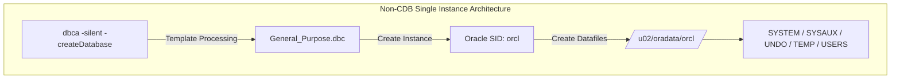

# CHAPTER 07. DBCA를 활용한 Database 생성 (CDB/PDB & Single Instance)

오라클 데이터베이스 엔진 소프트웨어 설치와 네트워크 리스너 구성을 마친 후, 서비스 워크로드를 처리할 최상위 데이터 구조인 **데이터베이스(Database) 및 인스턴스(Instance)**를 생성합니다. Headless(Non-GUI) 환경에서는 그래픽 기반의 DBCA(Database Configuration Assistant) 대화창 대신 커맨드라인 인터페이스(CLI)를 사용하는 **`dbca -silent`** 명령을 활용하여 자동화된 데이터베이스 구축을 수행합니다 (출처: database-administrators-guide.pdf, 2019).

본 장에서는 DBCA Silent Mode 커맨드라인 구문 구조 분석, Single Instance (Non-CDB) 자동 생성 스크립트, Multitenant CDB 및 PDB 생성, 그리고 OMF(Oracle Managed Files) 및 FRA(Fast Recovery Area) 스토리지 연동 자동화 기법을 단계별로 다룹니다.

---

## 7.1 DBCA Silent Mode 커맨드라인 구문 구조 분석

### DBCA Silent 명령어 구문 및 주요 옵션 해설

DBCA를 비대화형 모드로 구동할 때는 `dbca -silent` 키워드 뒤에 서브 명령어(`-createDatabase`, `-createPluggableDatabase` 등)와 세부 매개변수를 나열합니다 (출처: database-administrators-guide.pdf, 2019).

```bash
# DBCA Silent Mode 기본 구문 구조
$ dbca -silent -createDatabase [매개변수 목록]
```

#### 표 7-1. `dbca -createDatabase` 주요 CLI 매개변수 명세

| 매개변수 항목 | 필수 여부 | 기능 및 설정 목적 |
| :--- | :---: | :--- |
| **`-silent`** | 필수 | DBCA를 비대화형(Silent) 모드로 구동함 지정 (출처: database-administrators-guide.pdf, 2019) |
| **`-createDatabase`** | 필수 | 데이터베이스 신규 생성 작업 수행 지정 (출처: database-administrators-guide.pdf, 2019) |
| **`-gdbName`** | 필수 | 글로벌 데이터베이스 이름 지정 (예: `orcl.example.com`) (출처: database-administrators-guide.pdf, 2019) |
| **`-sid`** | 선택 | 인스턴스 식별자(SID) 지정 (미지정 시 `-gdbName` 명칭 사용) (출처: database-administrators-guide.pdf, 2019) |
| **`-templateName`** | 필수 | 템플릿 XML 파일 지정 (`General_Purpose.dbc` 또는 `Data_Warehouse.dbc`) (출처: database-administrators-guide.pdf, 2019) |
| **`-characterSet`** | 선택 | 데이터베이스 기본 캐릭터셋 지정 (`AL32UTF8` 권장) (출처: database-administrators-guide.pdf, 2019) |
| **`-nationalCharacterSet`** | 선택 | NCHAR/NVARCHAR2 전용 국립 캐릭터셋 (`AL16UTF16`) (출처: database-administrators-guide.pdf, 2019) |
| **`-memoryMgmtType`** | 선택 | 메모리 관리 방식 지정 (`AUTO_SGA`, `AUTO`, `CUSTOM_SGA`) (출처: database-administrators-guide.pdf, 2019) |
| **`-storageType`** | 선택 | 저장소 유형 지정 (`FS` - 파일시스템, `ASM` - 오라클 ASM) (출처: database-administrators-guide.pdf, 2019) |
| **`-emConfiguration`** | 선택 | Enterprise Manager Express 구성 여부 (`NONE`, `DBEXPRESS`) (출처: database-administrators-guide.pdf, 2019) |

---

### DBCA 템플릿(Template)의 종류와 선택 기준

DBCA는 오라클이 사전 정의한 XML 템플릿 파일을 참조하여 초기 데이터파일의 구조와 인스턴스 파라미터를 할당합니다 (출처: database-administrators-guide.pdf, 2019).

* **`General_Purpose.dbc`**: 트랜잭션 처리가 빈번한 OLTP(Online Transaction Processing) 및 일반 목적용 시스템에 최적화된 시드 데이터파일 구조를 복제 생성합니다 (출처: database-administrators-guide.pdf, 2019).
* **`Data_Warehouse.dbc`**: 대용량 데이터 조회 및 분석 워크로드에 맞춰 초기 블록 크기 및 세션 파라미터가 조정되어 있습니다 (출처: database-administrators-guide.pdf, 2019).

---

### DBCA Exit Code 및 생성 로그 추적 위치

Silent 생성 작업의 수행 결과는 OS 반환 코드(Exit Code)로 전달되며, 상세 진행 내역은 로그 디렉토리에 기록됩니다 (출처: database-administrators-guide.pdf, 2019).

* **정상 종료 (Exit Code 0)**: 성공적으로 데이터베이스 인스턴스가 생성되고 오픈되었음을 의미합니다 (출처: database-administrators-guide.pdf, 2019).
* **비정상 종료 (Exit Code 0 이외)**: 오류가 발생한 경우 로그 파일을 확인하여 원인을 분석합니다 (출처: database-administrators-guide.pdf, 2019).
* **DBCA 로그 저장 경로**: `$ORACLE_BASE/cfgtoollogs/dbca/<gdbName>/`

---

## 7.2 단일 인스턴스 Single Database (Non-CDB) 생성 스크립트

### Non-CDB 단일 데이터베이스 생성 워크플로우

Oracle 19c SE2 환경에서 기존 독립형 구조인 **Non-CDB(Non-Container Database)** 단일 데이터베이스를 생성하는 비대화형 CLI 스크립트입니다 (출처: database-administrators-guide.pdf, 2019).



---

### Non-CDB 생성 커맨드라인 원라이너(One-liner)

`oracle` 계정으로 수행하는 Non-CDB 생성 스크립트 예시는 다음과 같습니다.

```bash
# Non-CDB Single Instance 생성 스크립트
$ dbca -silent -createDatabase \
    -gdbName orcl \
    -sid orcl \
    -templateName General_Purpose.dbc \
    -createAsContainerDatabase false \
    -sysPassword "Oracle_1234#!" \
    -systemPassword "Oracle_1234#!" \
    -emConfiguration NONE \
    -storageType FS \
    -datafileDestination /u02/oradata \
    -characterSet AL32UTF8 \
    -nationalCharacterSet AL16UTF16 \
    -memoryMgmtType AUTO_SGA \
    -sgaTargetInMB 4096 \
    -pgaAggregateTargetInMB 2096 \
    -redoLogFileSize 200 \
    -sampleSchema false
```

#### 표 7-2. Non-CDB 생성 주요 매개변수 설정값 해설

| 매개변수 항목 | 설정값 | 해설 |
| :--- | :--- | :--- |
| **`-createAsContainerDatabase`** | `false` | 멀티테넌트 CDB가 아닌 독립형 Non-CDB 데이터베이스로 생성 (출처: database-administrators-guide.pdf, 2019) |
| **`-memoryMgmtType`** | `AUTO_SGA` | ASMM 메모리 관리 방식을 적용하여 SGA와 PGA를 명시적으로 분리 할당 (출처: database-administrators-guide.pdf, 2019) |
| **`-sgaTargetInMB`** | `4096` | SGA 타깃 크기를 4GB(4,096MB)로 지정 (출처: database-administrators-guide.pdf, 2019) |
| **`-pgaAggregateTargetInMB`** | `2096` | PGA 타깃 크기를 약 2GB(2,096MB)로 지정 (출처: database-administrators-guide.pdf, 2019) |
| **`-redoLogFileSize`** | `200` | 각 Online Redo Log 파일의 용량을 200MB로 지정 (출처: database-administrators-guide.pdf, 2019) |

---

## 7.3 Multitenant CDB & PDB 자동 생성 스크립트

### Multitenant 아키텍처 개요 (CDB\$ROOT & PDB)

Oracle Database 19c의 기본 아키텍처인 **멀티테넌트(Multitenant)** 구조는 하나의 중앙 컨테이너 데이터베이스(CDB) 내에 여러 개의 플러그인할 수 있는 데이터베이스(PDB)를 수용하는 형태입니다 (출처: multitenant-administrators-guide.pdf, 2019).

```
[ Multitenant Container Database (CDB) ]
├── CDB$ROOT  : 공통 메타데이터 및 시스템 카탈로그 관리 영역
├── PDB$SEED  : 신규 PDB 복제 생성을 위한 템플릿 전용 읽기 전용 PDB
└── PDB1      : 실제 사용자 데이터 및 애플리케이션 서비스가 격리 작동하는 PDB
```

---

### CDB 및 최초 PDB 동시 자동 생성 스크립트

`dbca -silent -createDatabase` 명령 실행 시 `-createAsContainerDatabase true` 파라미터를 활성화하여 CDB\\(ROOT, PDB\\)SEED 및 최초의 사용자 PDB(PDB1)를 한 번의 작업으로 생성합니다 (출처: database-administrators-guide.pdf, 2019).

```bash
# Multitenant CDB & PDB 자동 생성 스크립트
$ dbca -silent -createDatabase \
    -gdbName cdborcl \
    -sid cdborcl \
    -templateName General_Purpose.dbc \
    -createAsContainerDatabase true \
    -numberOfPDBs 1 \
    -pdbName pdb1 \
    -pdbAdminPassword "Pdb_Admin1234#!" \
    -useLocalUndoForPDBs true \
    -sysPassword "Oracle_1234#!" \
    -systemPassword "Oracle_1234#!" \
    -emConfiguration NONE \
    -storageType FS \
    -datafileDestination /u02/oradata \
    -characterSet AL32UTF8 \
    -nationalCharacterSet AL16UTF16 \
    -memoryMgmtType AUTO_SGA \
    -sgaTargetInMB 4096 \
    -pgaAggregateTargetInMB 2096
```

#### 표 7-3. CDB/PDB 전용 생성 파라미터 해설

| 매개변수 항목 | 설정값 | 해설 |
| :--- | :--- | :--- |
| **`-createAsContainerDatabase`** | `true` | 멀티테넌트 컨테이너 데이터베이스(CDB) 생성을 활성화 (출처: database-administrators-guide.pdf, 2019) |
| **`-numberOfPDBs`** | `1` | CDB 생성 직후 함께 복제 생성할 초기 PDB 개수 지정 (출처: database-administrators-guide.pdf, 2019) |
| **`-pdbName`** | `pdb1` | 신규 생성할 PDB의 고유 이름 지정 (출처: database-administrators-guide.pdf, 2019) |
| **`-pdbAdminPassword`** | `"Pdb_Admin1234#!"` | PDB 로컬 관리자 계정(PDB_ADMIN)의 초기 암호 설정 (출처: database-administrators-guide.pdf, 2019) |
| **`-useLocalUndoForPDBs`** | `true` | 각 PDB가 독립적인 Undo 테이블스페이스를 갖는 Local Undo 모드 적용 (출처: multitenant-administrators-guide.pdf, 2019) |

---

### 생성 결과 검증 및 `CON_ID` 상태 확인 SQL

데이터베이스 생성이 완료되면 SQL*Plus로 접속하여 컨테이너 ID(`CON_ID`) 및 오픈 상태를 검증합니다 (출처: multitenant-administrators-guide.pdf, 2019).

```sql
-- SQL*Plus 접속 및 CDB/PDB 상태 조회
$ sqlplus / as sysdba

SQL> SELECT name, cdb, open_mode, con_id FROM v$database;

NAME      CDB OPEN_MODE  CON_ID
--------- --- ---------- ------
CDBORCL   YES READ WRITE      0

SQL> SELECT con_id, name, open_mode FROM v$pdbs;

    CON_ID NAME       OPEN_MODE
---------- ---------- ------------------------------
         2 PDB$SEED   READ ONLY
         3 PDB1       READ WRITE
```

---

## 7.4 OMF(Oracle Managed Files) 및 FRA(Fast Recovery Area) 스토리지 자동 구성

### OMF(`-useOMF true`) 스토리지 관리 방식의 개념과 이점

**Oracle Managed Files (OMF)**는 사용자가 데이터파일의 개별 파일 경로와 이름을 직접 지정하지 않고, 오라클 데이터베이스가 기본 디렉토리 내에 고유한 파일 이름을 자동으로 부여하고 관리하는 기능입니다 (출처: database-administrators-guide.pdf, 2019).

* **자동 파일명 생성**: `o1_mf_<tablespace>_<unique_id>_.dbf` 형식의 표준화된 규칙으로 생성됩니다 (출처: automatic-storage-management-administrators-guide.pdf, 2019).
* **유지보수 편의성**: 테이블스페이스 삭제(`DROP TABLESPACE`) 시 OS 상의 파일도 자동으로 함께 삭제되므로 잔여 유령 파일(Orphan File)이 남지 않습니다 (출처: database-administrators-guide.pdf, 2019).

---

### FRA 및 아카이브 모드(`-enableArchive true`) 통합 연동 스크립트

OMF 옵션과 Fast Recovery Area(FRA) 백업 저장소를 결합하고, 아카이브로그 모드(ARCHIVELOG)를 DBCA 생성 시점에 동시에 자동 활성화하는 완벽한 CLI 스크립트입니다 (출처: database-administrators-guide.pdf, 2019).

```bash
# OMF + FRA + ARCHIVELOG 모드 통합 DBCA 생성 스크립트
$ dbca -silent -createDatabase \
    -gdbName orcl \
    -sid orcl \
    -templateName General_Purpose.dbc \
    -createAsContainerDatabase false \
    -sysPassword "Oracle_1234#!" \
    -systemPassword "Oracle_1234#!" \
    -emConfiguration NONE \
    -storageType FS \
    -useOMF true \
    -datafileDestination /u02/oradata \
    -recoveryAreaDestination /u05/fast_recovery_area \
    -recoveryAreaSize 20480 \
    -enableArchive true \
    -characterSet AL32UTF8 \
    -memoryMgmtType AUTO_SGA \
    -sgaTargetInMB 4096 \
    -pgaAggregateTargetInMB 2096
```

#### 표 7-4. OMF 및 FRA 연동 매개변수 해설

| 매개변수 항목 | 설정값 | 해설 |
| :--- | :--- | :--- |
| **`-useOMF`** | `true` | 오라클 관리 파일(OMF) 방식을 적용하여 파일 자동 할당 (출처: database-administrators-guide.pdf, 2019) |
| **`-datafileDestination`** | `/u02/oradata` | OMF 데이터파일이 생성될 최상위 Base 디렉토리 지정 (`DB_CREATE_FILE_DEST`) (출처: database-administrators-guide.pdf, 2019) |
| **`-recoveryAreaDestination`** | `/u05/fast_recovery_area` | FRA 복구 영역 마운트 디렉토리 지정 (`DB_RECOVERY_FILE_DEST`) (출처: database-administrators-guide.pdf, 2019) |
| **`-recoveryAreaSize`** | `20480` | FRA 최대 수용 제한 용량을 MB 단위(20GB)로 설정 (`DB_RECOVERY_FILE_DEST_SIZE`) (출처: database-administrators-guide.pdf, 2019) |
| **`-enableArchive`** | `true` | 데이터베이스 생성 직후 아카이브로그 모드(ARCHIVELOG) 자동 전환 (출처: database-administrators-guide.pdf, 2019) |

---

> **💡 [Technical Note] DBCA 생성 후 아카이브 모드 및 OMF 설정 검증**
> 생성 완료 후 SQL*Plus에서 DB 파라미터를 점검하여 OMF 및 FRA가 올바르게 바인딩되었는지 확인합니다 (출처: database-administrators-guide.pdf, 2019).
>
> ```sql
> SQL> ARCHIVE LOG LIST;
> Database log mode              Archive Mode
> Automatic archival             Enabled
> Archive destination            USE_DB_RECOVERY_FILE_DEST
> Oldest online log sequence     1
> Next log sequence to archive   1
> Current log sequence           1
> 
> SQL> SHOW PARAMETER db_create_file_dest;
> NAME                 TYPE        VALUE
> -------------------- ----------- ------------------------------
> db_create_file_dest  string      /u02/oradata
> 
> SQL> SHOW PARAMETER db_recovery_file_dest;
> NAME                      TYPE        VALUE
> ------------------------- ----------- ------------------------------
> db_recovery_file_dest     string      /u05/fast_recovery_area
> db_recovery_file_dest_size big integer 20G
> ```

---

### 💬 기획 편집자 노트 (Next Step)

Chapter 7에서는 `dbca -silent` 매개변수 구조 분석, Single Instance (Non-CDB) 및 Multitenant (CDB/PDB) 자동 생성 스크립트 작성, 그리고 OMF 및 FRA 스토리지 연동까지 완성했습니다.

이어지는 **CHAPTER 08**에서는 Oracle Linux 9 UEK R7 환경에서의 메모리 관리 기법(AMM vs ASMM), `USE_LARGE_PAGES=ONLY` 설정을 통한 SGA의 Static HugePages 고정 매핑, 및 `/dev/shm` 공유 메모리 커널 튜닝을 정밀하게 집필할 예정입니다. 계속해서 CHAPTER 08 집필을 진행할까요?
