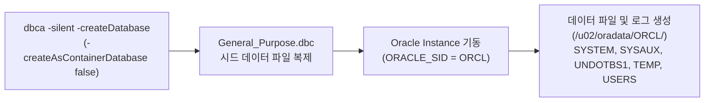
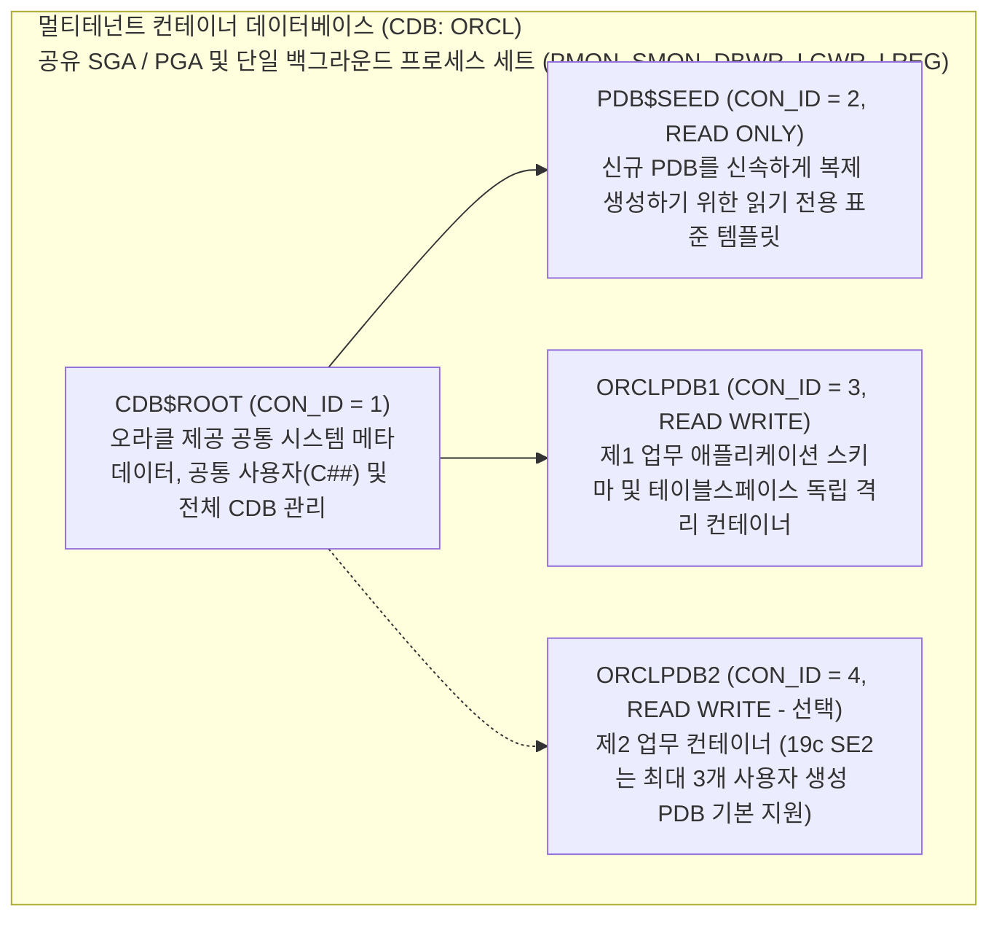

<!-- 
[조판 및 폰트 지정 규격 (Typography Specification)]
- 책 본문 (Body Text): Noto Sans KR
- 장/절 제목 (Headings): Noto Sans KR Bold
- 표 (Table): Noto Sans KR
- 캡션 (Caption): Noto Sans KR
- 영문 기술 용어 (Technical Terms): Noto Sans KR
- 코드 및 SQL 블록 (Code & SQL Blocks): DejaVu Sans Mono
-->

# CHAPTER 07. DBCA를 활용한 Database 생성 (CDB/PDB 및 Single Instance)

오라클 데이터베이스 엔진 소프트웨어 설치(Chapter 5)와 네트워크 리스너 구성(Chapter 6)을 마친 후에는 실제 비즈니스 데이터를 저장하고 트랜잭션을 처리할 **데이터베이스(Database)와 인스턴스(Instance)**를 생성합니다[1]. 그래픽 화면이 없는 Headless(CUI) 환경에서는 대화형 GUI 마법사 대신 **`dbca -silent`** 커맨드라인 인터페이스(CLI)를 사용하여 데이터베이스 생성 전 과정을 표준화된 스크립트로 수행합니다[1, 2].

이 장에서는 DBCA Silent Mode의 명령줄 구문과 템플릿 구조 분석, 레거시 호환을 위한 Non-CDB 단일 데이터베이스 생성, Oracle 19c 표준인 멀티테넌트(CDB/PDB) 자동 생성 및 PDB 상태 저장(`SAVE STATE`), 그리고 OMF(Oracle Managed Files)와 Fast Recovery Area(FRA)·아카이브 로그 모드(`ARCHIVELOG`)를 결합한 엔터프라이즈 통합 구축 기법을 단계별로 다룹니다.

---

## 7.1 DBCA Silent Mode 커맨드라인 구문 및 템플릿 구조

### 7.1.1 `dbca -silent` 명령어 구문 및 핵심 매개변수 명세

**Database Configuration Assistant(DBCA)**를 비대화형 모드로 실행할 때는 `dbca -silent` 뒤에 수행할 작업 명령어(`-createDatabase`, `-createPluggableDatabase`, `-deleteDatabase` 등)와 세부 설정 플래그를 지정하거나 응답 파일(`$ORACLE_HOME/assistants/dbca/dbca.rsp`)을 전달합니다[1, 2].

```bash
# DBCA Silent Mode 기본 실행 구문 및 도움말 확인
$ $ORACLE_HOME/bin/dbca -createDatabase -help
$ $ORACLE_HOME/bin/dbca -silent -createDatabase [매개변수 목록]
```

*표 7-1. `dbca -silent -createDatabase` 핵심 CLI 매개변수 명세*

| 매개변수 명칭 (Flag) | 필수 여부 | 기능 및 설정 목적 |
| :--- | :---: | :--- |
| **`-silent`** | 필수 | GUI 없이 비대화형(Silent) 모드로 DBCA 실행[1] |
| **`-createDatabase`** | 필수 | 신규 데이터베이스 생성 작업 지정[1] |
| **`-gdbName`** | 필수 | 글로벌 데이터베이스 이름(Global Database Name, 예: `ORCL`) 지정[1] |
| **`-sid`** | 선택 | 오라클 인스턴스 식별자(`ORACLE_SID`, 예: `ORCL`) 지정 (미지정 시 `-gdbName`의 호스트 접두사 사용)[1] |
| **`-templateName`** | 필수 | 데이터베이스 생성 템플릿 지정 (`General_Purpose.dbc` 또는 `Data_Warehouse.dbc`)[1] |
| **`-createAsContainerDatabase`** | 선택 | 멀티테넌트 컨테이너 데이터베이스(CDB) 생성 여부 (`true`: CDB 생성, `false`: Non-CDB 생성)[1, 3] |
| **`-characterSet`** | 선택 | 데이터베이스 기본 문자셋 지정 (유니코드 표준인 `AL32UTF8` 강력 권장)[1] |
| **`-nationalCharacterSet`** | 선택 | `NCHAR`/`NVARCHAR2` 전용 국가별 문자셋 지정 (기본값: `AL16UTF16`)[1] |
| **`-memoryMgmtType`** | 선택 | 메모리 관리 아키텍처 지정 (`AUTO_SGA`: ASMM 권장, `AUTO`: AMM, `CUSTOM_SGA`: 수동 설정)[1] |
| **`-totalMemory`** | 선택 | 오라클 인스턴스에 할당할 총 메모리(SGA + PGA) 크기(단위: **MB**)[1] |
| **`-initParams`** | 선택 | `sga_target=4096M,pga_aggregate_target=2048M` 등 개별 초기화 파라미터를 쉼표(`,`)로 구분하여 직접 지정[1] |
| **`-storageType`** | 선택 | 스토리지 유형 지정 (`FS`: 일반 파일시스템, `ASM`: Oracle ASM 디스크 그룹)[1] |
| **`-emConfiguration`** | 선택 | Enterprise Manager Database Express 구성 여부 (`NONE` 또는 `DBEXPRESS`)[1] |

---

### 7.1.2 DBCA 사전 정의 템플릿(`.dbc`)의 종류와 선택 기준

`$ORACLE_HOME/assistants/dbca/templates/` 디렉터리에는 오라클이 워크로드 특성에 맞춰 사전 정의한 템플릿 파일이 포함되어 있습니다[1].

1. **`General_Purpose.dbc`** (또는 `Transaction_Processing.dbc`):
   * 온라인 트랜잭션 처리(OLTP) 및 범용 워크로드에 최적화된 템플릿입니다[1].
   * 사전 생성된 시드 데이터 파일 압축본(`Seed_Database.dfb`)을 복원(Restore)하는 방식으로 작동하므로 데이터 딕셔너리를 처음부터 생성하지 않아 약 5~10분 이내에 빠르게 데이터베이스를 구축할 수 있습니다[1].
2. **`Data_Warehouse.dbc`**:
   * 대용량 데이터 집계 및 분석(DSS/DW) 워크로드에 맞춰 초기화 파라미터가 조정된 시드 기반 템플릿입니다[1].
3. **사용자 정의 스크립트 생성 모드(`New_Database.dbt`)**:
   * 시드 백업본을 사용하지 않고 `CREATE DATABASE` SQL문과 카탈로그 스크립트(`catalog.sql`, `catproc.sql`)를 처음부터 순차 실행합니다. 블록 크기(`DB_BLOCK_SIZE`)를 비표준 크기로 변경해야 할 때 사용하지만 생성 시간이 40분 이상 소요되므로, 일반 환경에서는 **`General_Purpose.dbc`** 템플릿 사용이 표준으로 권장됩니다[1].

---

### 7.1.3 DBCA 종료 코드(Exit Code) 및 실시간 로그 추적 위치

Silent 모드 실행 결과는 셸 종료 코드(`$?`)로 반환되며, 상세 진행 로그와 추적 파일은 ADR 및 `cfgtoollogs` 경로에 실시간 기록됩니다[1, 2].

* **정상 완료 (`Exit Code 0`)**: 데이터베이스 생성, 인스턴스 기동 및 리스너 서비스 등록이 모두 성공적으로 완료되었음을 의미합니다.
* **DBCA 생성 로그 및 트레이스 경로**: `$ORACLE_BASE/cfgtoollogs/dbca/<gdbName>/` 디렉터리 하위의 `<gdbName>.log` 요약 파일과 `trace.log_*` 상세 로그를 `tail -f`로 모니터링할 수 있습니다[1].

---

## 7.2 단일 인스턴스 Single Database (Non-CDB) 생성 스크립트

### 7.2.1 Non-CDB 아키텍처 개요 및 지원 정책 주의사항

전통적인 **Non-CDB(Non-Container Database)** 아키텍처는 루트 컨테이너와 PDB의 구분 없이 단일 데이터베이스 인스턴스가 하나의 데이터 딕셔너리와 사용자 스키마를 직접 관리하는 구조입니다[1, 3].

> ⚠️ **주의(Caution)**: **Non-CDB 아키텍처의 지원 중단(Desupport) 로드맵과 19c 권장 사항**
> 오라클 공식 업그레이드 및 멀티테넌트 가이드에 따르면, Non-CDB 아키텍처는 Oracle Database 12c(12.1.0.2)에서 지원 중단 예고(Deprecated)되었으며 **Oracle Database 21c 이후 버전부터는 완전히 지원 중단(Desupported)**되어 더 이상 생성할 수 없습니다[3].
> 또한 Oracle Database 19c SE2에서는 별도의 유상 라이선스 없이도 최대 3개의 사용자 생성 PDB가 기본 제공되므로, 향후 차기 LTS 버전으로의 원활한 업그레이드와 PDB 복제·이관 편의성을 위해 단일 업무 시스템이라도 **7.3절의 멀티테넌트(Single-Tenant CDB/PDB) 구조로 생성하는 것이 오라클의 공식 권장 사항**입니다[3]. Non-CDB 구성은 레거시 패키지 솔루션이 CDB 접속을 지원하지 않는 예외적인 경우에만 선택적으로 사용해야 합니다.


*그림 7-1. Non-CDB 단일 데이터베이스 Silent 생성 워크플로우*

---

### 7.2.2 Non-CDB 생성 CLI 스크립트

레거시 호환성을 위해 Non-CDB 단일 데이터베이스를 생성할 때는 `-createAsContainerDatabase false` 옵션을 지정합니다[1]. 이때 Bash 셸에서 느낌표(`!`)나 달러 기호(`$`)가 포함된 비밀번호를 쌍따옴표(`" "`)로 감싸면 셸 히스토리 확장(History Expansion) 오류가 발생하므로 반드시 **작은따옴표(`' '`)**로 감싸서 전달해야 합니다.

```bash
# Non-CDB 단일 인스턴스 데이터베이스 비대화형 생성 스크립트
$ $ORACLE_HOME/bin/dbca -silent -createDatabase \
  -templateName General_Purpose.dbc \
  -gdbName ORCL \
  -sid ORCL \
  -createAsContainerDatabase false \
  -sysPassword 'Oracle_1234#!' \
  -systemPassword 'Oracle_1234#!' \
  -emConfiguration NONE \
  -storageType FS \
  -datafileDestination /u02/oradata \
  -characterSet AL32UTF8 \
  -nationalCharacterSet AL16UTF16 \
  -memoryMgmtType AUTO_SGA \
  -totalMemory 6144 \
  -initParams "sga_target=4096M,pga_aggregate_target=2048M,processes=300" \
  -redoLogFileSize 512 \
  -sampleSchema false
```

*표 7-2. Non-CDB 생성 스크립트 주요 매개변수 설정 해설*

| 매개변수 명칭 | 지정 설정값 | 아키텍처 반영 내용 |
| :--- | :--- | :--- |
| **`-createAsContainerDatabase`** | `false` | 멀티테넌트 CDB가 아닌 전통적인 독립형 Non-CDB 구조로 생성[1] |
| **`-memoryMgmtType`** | `AUTO_SGA` | 4 GB 초과 엔터프라이즈 표준인 ASMM(`SGA_TARGET` + `PGA_AGGREGATE_TARGET`) 적용[1] |
| **`-totalMemory`** / **`-initParams`** | `6144` / `sga_target=4096M,pga_aggregate_target=2048M` | 총 6 GB(6,144 MB) 메모리 중 SGA에 4 GB(4,096 MB), PGA에 2 GB(2,048 MB)를 명시적으로 분리 할당[1] |
| **`-redoLogFileSize`** | `512` | 초기 생성되는 Online Redo Log 그룹의 파일당 크기를 512 MB로 설정 (기본값 200 MB 대체)[1] |

---

## 7.3 Multitenant CDB 및 PDB 자동 생성 스크립트

### 7.3.1 멀티테넌트(Multitenant) 아키텍처 개요 (`CDB$ROOT`, `PDB$SEED`, `PDB`)

Oracle Database 19c의 표준 아키텍처인 **멀티테넌트(Multitenant)** 구조는 백그라운드 프로세스와 SGA 공유 메모리를 관리하는 하나의 **컨테이너 데이터베이스(CDB)** 내부에 실제 업무 스키마와 데이터를 담는 **플러그형 데이터베이스(PDB)**를 분리하여 수용합니다[3].


*그림 7-2. Oracle Database 19c SE2 멀티테넌트(CDB/PDB) 아키텍처 구조*

---

### 7.3.2 CDB 및 초기 PDB(`ORCLPDB1`) 동시 자동 생성 스크립트

`dbca -silent -createDatabase` 실행 시 `-createAsContainerDatabase true`를 지정하면 루트 컨테이너(`CDB$ROOT`), 시드 컨테이너(`PDB$SEED`), 그리고 지정한 개수(`-numberOfPDBs 1`)만큼의 초기 사용자 PDB(`ORCLPDB1`)를 단일 작업으로 일괄 생성합니다[1, 3].

```bash
# Multitenant CDB(ORCL) 및 초기 PDB(ORCLPDB1) 통합 생성 스크립트
$ $ORACLE_HOME/bin/dbca -silent -createDatabase \
  -templateName General_Purpose.dbc \
  -gdbName ORCL \
  -sid ORCL \
  -createAsContainerDatabase true \
  -numberOfPDBs 1 \
  -pdbName ORCLPDB1 \
  -pdbAdminPassword 'Pdb_Admin1234#!' \
  -useLocalUndoForPDBs true \
  -sysPassword 'Oracle_1234#!' \
  -systemPassword 'Oracle_1234#!' \
  -emConfiguration NONE \
  -storageType FS \
  -datafileDestination /u02/oradata \
  -characterSet AL32UTF8 \
  -nationalCharacterSet AL16UTF16 \
  -memoryMgmtType AUTO_SGA \
  -totalMemory 6144 \
  -initParams "sga_target=4096M,pga_aggregate_target=2048M,max_pdbs=3" \
  -redoLogFileSize 512 \
  -sampleSchema false
```

*표 7-3. 멀티테넌트 CDB/PDB 전용 생성 매개변수 명세*

| 매개변수 명칭 | 지정 설정값 | 기능 및 아키텍처 동작 설명 |
| :--- | :--- | :--- |
| **`-createAsContainerDatabase`** | `true` | 멀티테넌트 컨테이너 데이터베이스(CDB) 아키텍처로 생성[1, 3] |
| **`-numberOfPDBs`** | `1` | CDB 생성 시 함께 생성할 초기 사용자 PDB 개수 (SE2는 최대 `3`까지 허용)[1, 3] |
| **`-pdbName`** | `ORCLPDB1` | 생성할 초기 사용자 PDB의 컨테이너 이름 및 기본 서비스 이름[1] |
| **`-pdbAdminPassword`** | `'Pdb_Admin1234#!'` | 해당 PDB 내부의 로컬 관리자 계정(`PDBADMIN`) 초기 비밀번호 설정[1] |
| **`-useLocalUndoForPDBs`** | `true` | 각 PDB마다 고유한 Undo 테이블스페이스를 분리 생성하는 **Local Undo 모드** 활성화 (19c 기본값이자 온라인 PDB 복제·이관의 필수 조건)[3] |
| **`-initParams "...max_pdbs=3"`** | `max_pdbs=3` | SE2 라이선스 기준(최대 3개 사용자 생성 PDB)을 초과하지 않도록 CDB 상한 고정[3] |

---

### 7.3.3 CDB/PDB 생성 검증 및 PDB 자동 오픈 상태 저장(`SAVE STATE`)

데이터베이스 생성이 완료되면 SQL*Plus로 접속하여 CDB 및 PDB의 오픈 상태(`V$DATABASE`, `V$PDBS`)를 확인하고, 향후 CDB 인스턴스를 재기동할 때 사용자 PDB(`ORCLPDB1`)가 `MOUNTED` 상태에 머물지 않고 자동으로 함께 `READ WRITE` 오픈되도록 **`ALTER PLUGGABLE DATABASE ALL SAVE STATE`** 명령을 실행합니다[3].

```sql
-- 1. OS 인증을 통해 CDB$ROOT에 SYSDBA로 접속
$ sqlplus / as sysdba

SQL*Plus: Release 19.0.0.0.0 - Production on Wed Sep 30 11:20:00 2026
Version 19.19.0.0.0
Connected to:
Oracle Database 19c Standard Edition 2 Release 19.0.0.0.0 - Production
Version 19.19.0.0.0

-- 2. CDB 여부 및 루트 컨테이너 상태 확인
SQL> SELECT name, cdb, open_mode, con_id FROM v$database;

NAME      CDB OPEN_MODE            CON_ID
--------- --- -------------------- ------
ORCL      YES READ WRITE                0

-- 3. 생성된 PDB 목록 및 오픈 모드 확인
SQL> SHOW PDBS;

    CON_ID CON_NAME                       OPEN MODE  RESTRICTED
---------- ------------------------------ ---------- ----------
         2 PDB$SEED                       READ ONLY  NO
         3 ORCLPDB1                       READ WRITE NO

-- 4. CDB 재기동 시 모든 PDB가 자동으로 READ WRITE 오픈되도록 상태 영구 저장
SQL> ALTER PLUGGABLE DATABASE ALL SAVE STATE;

Pluggable database altered.

-- 5. PDB 자동 오픈 상태 저장 내역 검증
SQL> SELECT con_name, instance_name, state FROM dba_pdb_saved_states;

CON_NAME             INSTANCE_NAME        STATE
-------------------- -------------------- --------------
ORCLPDB1             ORCL                 OPEN
```

> 💡 **노트(Note)**: **운영 중 추가 PDB(`ORCLPDB2`)를 CLI로 생성하는 방법**
> 운영 중 SE2 라이선스 허용 범위(최대 3개 PDB) 내에서 두 번째 업무용 PDB(`ORCLPDB2`)를 추가 생성할 때는 SQL*Plus의 `CREATE PLUGGABLE DATABASE` 구문을 사용하거나 다음과 같이 `dbca -silent -createPluggableDatabase` 명령을 실행할 수 있습니다[1, 3].
> ```bash
> $ $ORACLE_HOME/bin/dbca -silent -createPluggableDatabase \
>   -sourceDB ORCL \
>   -pdbName ORCLPDB2 \
>   -createPDBFrom DEFAULT \
>   -pdbAdminPassword 'Pdb_Admin1234#!' \
>   -datafileDestination /u02/oradata
> ```

---

## 7.4 OMF 및 FRA 스토리지·아카이브 모드 통합 자동 구성

### 7.4.1 OMF(Oracle Managed Files) 스토리지 관리 방식의 개념과 이점

**Oracle Managed Files(OMF)**는 DBA가 테이블스페이스나 리두 로그를 추가할 때 개별 OS 파일 경로와 파일명을 일일이 지정하지 않아도, 오라클 엔진이 초기화 파라미터에 정의된 기본 디렉터리 하위에 표준화된 규칙으로 파일을 자동 생성·명명·삭제하는 기능입니다[1].

* **관련 핵심 초기화 파라미터**:
  * **`DB_CREATE_FILE_DEST`**: 데이터 파일, Temp 파일, Undo 파일이 생성될 기본 루트 디렉터리(`/u02/oradata`)를 지정합니다[1, 4].
  * **`DB_CREATE_ONLINE_LOG_DEST_n`** ($n = 1 \dots 5$): 온라인 리두 로그와 제어 파일(Control File)을 다중화(Multiplexing)하여 생성할 독립 마운트 포인트(`/u03/oraredo1`, `/u04/oraredo2`)를 지정합니다[1, 4].
* **표준 파일 명명 규칙**: `/u02/oradata/<DB_UNIQUE_NAME>/datafile/o1_mf_<tablespace>_<id>_.dbf` 형태로 디렉터리와 고유 파일명이 자동 부여됩니다[1].
* **고아 파일(Orphan File) 원천 방지**: `DROP TABLESPACE` 또는 `DROP PLUGGABLE DATABASE ... INCLUDING DATAFILES` 실행 시 오라클이 OS 디스크 상의 물리 파일까지 즉시 자동 삭제하므로 관리자의 수동 `rm` 작업 실수를 방지합니다[1].

---

### 7.4.2 OMF + Redo 다중화 + FRA + `ARCHIVELOG` 통합 DBCA 구축 스크립트

Chapter 2~4에서 설계한 5개 마운트 포인트(`/u01` ~ `/u05`)와 Static HugePages(`USE_LARGE_PAGES = ONLY`), Direct/Async I/O(`FILESYSTEMIO_OPTIONS = SETALL`), OMF 기반 리두 로그 다중화, Fast Recovery Area(FRA), 그리고 온라인 백업의 필수 전제인 **아카이브 로그 모드(`-enableArchive true`)**를 DBCA 생성 시점에 한 번에 완성하는 엔터프라이즈 표준 CLI 스크립트입니다[1].

```bash
# 엔터프라이즈 표준 CDB/PDB + OMF + Redo 다중화 + FRA + ARCHIVELOG 통합 생성 스크립트
$ $ORACLE_HOME/bin/dbca -silent -createDatabase \
  -templateName General_Purpose.dbc \
  -gdbName ORCL \
  -sid ORCL \
  -createAsContainerDatabase true \
  -numberOfPDBs 1 \
  -pdbName ORCLPDB1 \
  -pdbAdminPassword 'Pdb_Admin1234#!' \
  -useLocalUndoForPDBs true \
  -sysPassword 'Oracle_1234#!' \
  -systemPassword 'Oracle_1234#!' \
  -emConfiguration NONE \
  -storageType FS \
  -useOMF true \
  -datafileDestination /u02/oradata \
  -recoveryAreaDestination /u05/fast_recovery_area \
  -recoveryAreaSize 204800 \
  -enableArchive true \
  -characterSet AL32UTF8 \
  -nationalCharacterSet AL16UTF16 \
  -memoryMgmtType AUTO_SGA \
  -totalMemory 20480 \
  -initParams "sga_max_size=16384M,sga_target=16384M,pga_aggregate_target=4096M,pga_aggregate_limit=8192M,use_large_pages=ONLY,filesystemio_options=SETALL,max_pdbs=3,db_create_online_log_dest_1='/u03/oraredo1',db_create_online_log_dest_2='/u04/oraredo2'" \
  -redoLogFileSize 1024 \
  -sampleSchema false
```

*표 7-4. 엔터프라이즈 스토리지 및 복구 연동 매개변수 해설*

| 매개변수 명칭 | 지정 설정값 | 기능 및 아키텍처 반영 내용 |
| :--- | :--- | :--- |
| **`-useOMF`** | `true` | Oracle Managed Files(OMF) 기반 파일 자동 생성·관리 활성화[1] |
| **`-datafileDestination`** | `/u02/oradata` | `DB_CREATE_FILE_DEST` 파라미터에 매핑되어 CDB/PDB 데이터 파일 자동 배치[1, 4] |
| **`-recoveryAreaDestination`** | `/u05/fast_recovery_area` | `DB_RECOVERY_FILE_DEST` 파라미터에 매핑되어 아카이브 로그 및 RMAN 백업 저장[1, 4] |
| **`-recoveryAreaSize`** | `204800` | `DB_RECOVERY_FILE_DEST_SIZE` 쿼터를 MB 단위(200 GB = `204,800 MB`)로 지정[1, 4] |
| **`-enableArchive`** | `true` | 생성 과정에서 데이터베이스를 자동으로 **`ARCHIVELOG` 모드**로 전환[1] |
| **`db_create_online_log_dest_1/2`** | `/u03/oraredo1`, `/u04/oraredo2` | 제어 파일과 온라인 리두 로그 그룹의 각 멤버를 두 개의 독립 디스크에 자동 다중화 배치[1, 4] |

---

### 7.4.3 아카이브 모드, OMF 경로 및 리스너 서비스 등록 최종 검증

데이터베이스 생성이 완료되면 SQL*Plus와 `lsnrctl status` 명령을 통해 아카이브 로그 모드, OMF/FRA 파라미터, 그리고 Chapter 6에서 구성한 리스너에 CDB(`ORCL`)와 PDB(`ORCLPDB1`) 서비스가 정상 등록되었는지 종합 검증합니다[1, 2].

```sql
-- 1. SQL*Plus 접속 후 아카이브 로그 모드 및 OMF/FRA 파라미터 확인
$ sqlplus / as sysdba

SQL> ARCHIVE LOG LIST;
Database log mode              Archive Mode
Automatic archival             Enabled
Archive destination            USE_DB_RECOVERY_FILE_DEST
Oldest online log sequence     1
Next log sequence to archive   3
Current log sequence           3

SQL> SHOW PARAMETER db_create;
NAME                         TYPE        VALUE
---------------------------- ----------- ------------------------------
db_create_file_dest          string      /u02/oradata
db_create_online_log_dest_1  string      /u03/oraredo1
db_create_online_log_dest_2  string      /u04/oraredo2

SQL> SHOW PARAMETER db_recovery_file_dest;
NAME                         TYPE        VALUE
---------------------------- ----------- ------------------------------
db_recovery_file_dest        string      /u05/fast_recovery_area
db_recovery_file_dest_size   big integer 200G
```

이어서 OS 셸에서 리스너의 동적 서비스 등록 상태와 `tnsnames.ora` 별칭(`ORCLPDB1`)을 통한 원격 접속을 확인합니다.

```bash
# 2. LREG 프로세스에 의해 리스너에 동적 등록된 CDB(ORCL) 및 PDB(orclpdb1) 서비스 확인
$ lsnrctl status
...
Services Summary...
Service "ORCL" has 1 instance(s).
  Instance "ORCL", status READY, has 1 handler(s) for this service...
Service "orclpdb1" has 1 instance(s).
  Instance "ORCL", status READY, has 1 handler(s) for this service...
The command completed successfully

# 3. 업무용 PDB(ORCLPDB1) TNS 별칭을 통한 직접 접속 검증
$ sqlplus system@ORCLPDB1
Enter password: 
Connected to:
Oracle Database 19c Standard Edition 2 Release 19.0.0.0.0 - Production
Version 19.19.0.0.0

SQL> SHOW CON_NAME;

CON_NAME
------------------------------
ORCLPDB1
```

---

## 7.5 장 요약 (Chapter Summary)

이 장에서는 Headless(CUI) 환경에서 **`dbca -silent`** 명령어를 활용하여 Oracle Database 19c SE2 데이터베이스를 생성하고 스토리지·복구 아키텍처를 자동화하는 전 과정을 다루었습니다.

* **DBCA Silent Mode 및 템플릿 구조**: `dbca -silent -createDatabase` 명령과 시드 기반 `General_Purpose.dbc` 템플릿, `-memoryMgmtType AUTO_SGA`, `-totalMemory`, `-initParams` 옵션을 조합하여 GUI 없이 신속하고 일관된 데이터베이스 배포 체계를 구축했습니다.
* **Non-CDB 지원 중단 로드맵과 멀티테넌트(CDB/PDB) 표준화**: 21c 이후 완전 지원 중단(Desupported)되는 Non-CDB 대신, 19c SE2에서 추가 비용 없이 최대 3개 PDB를 지원하는 멀티테넌트 아키텍처(`-createAsContainerDatabase true`, `-useLocalUndoForPDBs true`)로 CDB(`ORCL`)와 업무용 PDB(`ORCLPDB1`)를 생성하고 `ALTER PLUGGABLE DATABASE ALL SAVE STATE`로 자동 오픈 구성을 완료했습니다.
* **OMF, Redo 다중화, FRA 및 `ARCHIVELOG` 통합 구성**: `-useOMF true`, `db_create_online_log_dest_1/2`, `-recoveryAreaDestination`, `-enableArchive true`를 결합하여 생성 시점에 데이터 파일·리두 로그 분리 배치와 온라인 백업 준비 태세를 한 번에 완성했습니다.

다음 **CHAPTER 08**에서는 생성된 데이터베이스의 메모리 아키텍처(AMM vs. ASMM) 심화 진단, `USE_LARGE_PAGES = ONLY` 기반의 Static HugePages 매핑 검증, 그리고 SGA/PGA 동적 성능 뷰(`V$SGAINFO`, `V$PGASTAT`, `V$MEMORY_DYNAMIC_COMPONENTS`)를 활용한 실무 메모리 튜닝 기법을 상세히 다룹니다.

---

# References

[1] Oracle. 2024. *Oracle Database Administrator's Guide 19c (E96348)*. Oracle America, Inc. Retrieved September 30, 2026 from https://docs.oracle.com/en/database/oracle/oracle-database/19/admin/
[2] Oracle. 2024. *Oracle Database Installation Guide 19c for Linux (E96272)*. Oracle America, Inc. Retrieved September 30, 2026 from https://docs.oracle.com/en/database/oracle/oracle-database/19/ladbi/
[3] Oracle. 2024. *Oracle Multitenant Administrator's Guide 19c (E96162)*. Oracle America, Inc. Retrieved September 30, 2026 from https://docs.oracle.com/en/database/oracle/oracle-database/19/multi/
[4] Oracle. 2024. *Oracle Database Reference 19c (E96200)*. Oracle America, Inc. Retrieved September 30, 2026 from https://docs.oracle.com/en/database/oracle/oracle-database/19/refrn/
