<!-- 
  [출판 조판 및 폰트 지정 명세 (Typography Specification)]
  - 본문(Body), 표(Table), 캡션(Caption), 영문 기술 용어: Noto Sans KR (Regular/Medium)
  - 장/절 제목(Headings H1~H4): Noto Sans KR Bold
  - 코드, 명령어, SQL 및 설정 블록(Code/SQL Blocks): DejaVu Sans Mono
-->

# CHAPTER 08. 사후 구성 및 메모리 최적화 (Post-Configuration & Memory Tuning)

데이터베이스 생성이 완료되었다고 해서 곧바로 실무 운영(Production) 트래픽을 수용할 수 있는 것은 아닙니다. 오라클 데이터베이스가 서버의 물리적 하드웨어 자원을 100%에 가깝게 끌어내고, 대규모 동시 접속(High Concurrency) 환경에서도 흔들림 없는 응답 속도를 보장하려면 정밀한 **사후 메모리 튜닝(Post-Installation Memory Tuning)**이 뒷받침되어야 합니다.

본 장에서는 오라클의 메모리 관리 기법인 AMM(자동 메모리 관리)과 ASMM(자동 공유 메모리 관리)의 구조적 차이를 살펴보고, 대용량 메모리 환경의 필수 요소인 리눅스 커널 **HugePages**와 오라클 인스턴스를 완벽하게 결속시키는 `USE_LARGE_PAGES = ONLY` 구성을 실습합니다. 아울러 운영 중 빈번하게 마주치는 공유 메모리 부족 에러(`ORA-00845`)의 발생 원리와 해결책을 함께 다룹니다.

---

## 8.1 AMM(자동 메모리 관리) 비활성화 및 ASMM 전환

오라클 데이터베이스의 메모리 영역은 크게 모든 프로세스가 공유하는 **SGA(System Global Area)**와 개별 서버 프로세스가 독립적으로 사용하는 **PGA(Program Global Area)**로 나뉩니다. 오라클은 이 두 영역을 관리하기 위해 두 가지 자동화 모드를 제공합니다.

```mermaid
flowchart TB
    subgraph AMM["1. AMM (Automatic Memory Management)"]
        direction TB
        MT["MEMORY_TARGET / MEMORY_MAX_TARGET<br/>(SGA + PGA 통합 풀)"]
        SHM["기반 아키텍처: POSIX 공유 메모리 (/dev/shm, tmpfs)<br/>메모리 페이지 크기: 4 KB (Standard Pages 고정)"]
        LIM1["제약 사항: Linux HugePages (2 MB) 호환 불가<br/>Oracle 19c 기준 총할당량 4 GB 초과 시 설정 차단"]
        MT --> SHM --> LIM1
    end

    subgraph ASMM["2. ASMM (Automatic Shared Memory Management) + Automatic PGA"]
        direction TB
        SGA["SGA 영역: SGA_TARGET / SGA_MAX_SIZE<br/>(Shared Pool, Buffer Cache, Redo Log Buffer 등 자동 배분)"]
        PGA["PGA 영역: PGA_AGGREGATE_TARGET / PGA_AGGREGATE_LIMIT<br/>(Sort, Hash Join 등 세션별 작업 공간 자동 제어)"]
        HP["기반 아키텍처: System V Shared Memory & Linux HugePages (hugetlbfs)<br/>메모리 페이지 크기: 2 MB (Large Pages 고정 잠금)"]
        SGA & PGA --> HP
    end
```


*그림 8-1: 오라클 메모리 관리 아키텍처 비교 (AMM vs. ASMM + HugePages)*

### 1. AMM(Automatic Memory Management)의 구조적 한계

Oracle 11g에서 도입된 AMM은 `MEMORY_TARGET`과 `MEMORY_MAX_TARGET` 파라미터만으로 SGA와 PGA의 경계를 허물고 오라클이 알아서 메모리를 재분배하는 기능입니다. 관리 편의성은 높지만, 리눅스 엔터프라이즈 환경에서는 다음과 같은 구조적 한계가 존재합니다.

* **Linux HugePages와의 비호환성**: 리눅스 환경에서 AMM은 `/dev/shm`에 마운트된 `tmpfs`(POSIX 공유 메모리 파일)를 통해 메모리를 동적으로 할당하고 해제합니다. 반면 리눅스 커널의 Static HugePages(`hugetlbfs`)는 물리 메모리를 2 MB 단위로 사전 예약하여 고정(Pinning)하는 방식을 사용하므로 `/dev/shm` 기반의 AMM과 함께 사용할 수 없습니다.
* **4 KB 페이지에 따른 TLB Miss 및 페이지 테이블 오버헤드**: AMM을 사용하면 모든 SGA 메모리가 기본 4 KB 페이지 단위로 쪼개져 관리됩니다. 수십 GB 이상의 SGA를 4 KB 단위로 관리하면 CPU의 가상 주소 변환 캐시인 **TLB(Translation Lookaside Buffer) 히트율**이 급격히 떨어지고, 프로세스별 페이지 테이블(Page Table) 크기가 비대해져 심각한 CPU 오버헤드가 발생합니다.
* **Oracle 19c의 4 GB 상한선 강제**: 이러한 성능 저하를 방지하기 위해 Oracle Database 19c에서는 인스턴스에 할당할 전체 메모리(`SGA + PGA`)가 **4 GB를 초과하면 DBCA 및 설치 프로그램에서 AMM 선택을 원천 차단**합니다(`INS-35172` / `DBT-11211`).

### 2. ASMM(Automatic Shared Memory Management)의 실무적 이점

반면 **ASMM**은 `MEMORY_TARGET`을 `0`으로 비활성화하고, **SGA는 `SGA_TARGET`(`SGA_MAX_SIZE`)**으로, **PGA는 `PGA_AGGREGATE_TARGET`(`PGA_AGGREGATE_LIMIT`)**으로 분리하여 각각의 영역 내부에서만 자동 튜닝을 수행하는 방식입니다.

| 비교 항목 | AMM (`MEMORY_TARGET`) | ASMM (`SGA_TARGET` + `PGA_AGGREGATE_TARGET`) |
| :--- | :--- | :--- |
| **관리 범위** | SGA + PGA 통합 동적 재분배 | SGA 내부 컴포넌트 자동 관리 + PGA 독립 자동 관리 |
| **리눅스 공유 메모리 방식** | POSIX 공유 메모리 (`/dev/shm`, `tmpfs`) | System V 공유 메모리 (`shmget`) 또는 `hugetlbfs` |
| **Linux HugePages 지원** | **미지원 (절대 혼용 불가)** | **완벽 지원 (엔터프라이즈 표준)** |
| **메모리 페이지 크기** | 4 KB (Standard Pages) | **2 MB (HugePages 적용 시)** |
| **Oracle 19c 권장 환경** | 4 GB 이하 소규모 테스트/개발 환경 | **모든 실무 운영(Production) 환경** |

*표 8-1: AMM과 ASMM의 리눅스 아키텍처 비교*

### 3. 메모리 관리 모드 확인 및 ASMM 최적화 구성

Chapter 07에서 우리는 `dbca` 실행 시 `-memoryMgmtType AUTO_SGA`와 `-totalMemory 15360`(15 GB)을 부여하여 처음부터 ASMM 모드로 데이터베이스를 생성했습니다. 현재 인스턴스에 설정된 메모리 파라미터와 실제 할당 상태를 점검해 보겠습니다.

```sql
-- oracle 계정에서 SQL*Plus 접속 후 메모리 파라미터 점검
$ sqlplus / as sysdba

SQL> SHOW PARAMETER target

NAME                                 TYPE        VALUE
------------------------------------ ----------- ------------------------------
archive_lag_target                   integer     0
db_big_table_cache_percent_target    string      0
db_flashback_retention_target        integer     1440
fast_start_io_target                 integer     0
fast_start_mttr_target               integer     0
memory_max_target                    big integer 0
memory_target                        big integer 0
parallel_servers_target              integer     64
pga_aggregate_target                 big integer 3840M
sga_target                           big integer 11520M

SQL> SHOW PARAMETER sga_max_size

NAME                                 TYPE        VALUE
------------------------------------ ----------- ------------------------------
sga_max_size                         big integer 11520M

SQL> SHOW PARAMETER pga_aggregate_limit

NAME                                 TYPE        VALUE
------------------------------------ ----------- ------------------------------
pga_aggregate_limit                  big integer 7680M
```

`memory_target`과 `memory_max_target`이 `0`으로 설정되어 있고, 전체 15 GB(15,360 MB) 중 75%인 `11520M`(11.25 GB)가 `sga_target`에, 25%인 `3840M`(3.75 GB)가 `pga_aggregate_target`에 할당되어 있음을 확인할 수 있습니다. 또한 PGA의 하드 리밋인 `pga_aggregate_limit`은 기본 규칙에 따라 `pga_aggregate_target`의 200%인 `7680M`(7.5 GB)로 자동 설정되어 있습니다.

만약 기존 데이터베이스가 AMM(`memory_target > 0`)으로 구성되어 있거나, Chapter 02 및 Chapter 04에서 설계한 **32 GB RAM 서버 표준 규격(SGA 16 GB, PGA 목표치 4 GB, PGA 상한선 8 GB)**에 맞춰 ASMM 구성을 정밀하게 조정하려면 다음과 같이 `SPFILE`을 변경합니다.

```sql
-- 1. (AMM 사용 중인 경우) MEMORY_TARGET 및 MEMORY_MAX_TARGET 비활성화
ALTER SYSTEM SET memory_target = 0 SCOPE=SPFILE;
ALTER SYSTEM SET memory_max_target = 0 SCOPE=SPFILE;

-- 2. ASMM 기반 SGA 및 PGA 목표/상한 파라미터 설정 (예: SGA 12G, PGA Target 4G, PGA Limit 8G)
-- 주의: SGA_MAX_SIZE는 Chapter 04에서 예약한 HugePages 총용량(예: 6554페이지 = 약 12.8 GB) 이내여야 합니다!
ALTER SYSTEM SET sga_max_size = 12G SCOPE=SPFILE;
ALTER SYSTEM SET sga_target = 12G SCOPE=SPFILE;
ALTER SYSTEM SET pga_aggregate_target = 4G SCOPE=SPFILE;
ALTER SYSTEM SET pga_aggregate_limit = 8G SCOPE=SPFILE;
```

> 💡 **노트(Note)**: `PGA_AGGREGATE_TARGET`은 오라클이 세션들의 작업 메모리(Sort, Hash Join 등)를 조절할 때 참고하는 **소프트 목표치(Soft Target)**이며, 악성 쿼리나 과도한 병렬 세션으로 인해 서버 물리 메모리가 고갈되는 것을 막아주는 실제 **하드 상한선(Hard Limit)**은 `PGA_AGGREGATE_LIMIT`입니다. 물리 메모리(32 GB)에서 OS 여유분과 HugePages 고정 영역을 제외한 범위 내에서 `PGA_AGGREGATE_LIMIT`을 명시적으로 관리하는 것이 안전합니다.

---

## 8.2 `USE_LARGE_PAGES` 파라미터를 통한 HugePages 강제 고정

Chapter 04에서 우리는 리눅스 커널 파라미터 `vm.nr_hugepages = 6554`(약 12.8 GB)를 설정하여 물리 RAM에 2 MB 단위의 HugePages 풀을 예약했습니다. 이제 오라클 데이터베이스 인스턴스가 기동할 때 일반 4 KB 메모리 페이지로 타협하지 않고, **반드시 OS의 HugePages 영역만을 100% 사용하도록 강제**해야 합니다. 이를 제어하는 초기화 파라미터가 바로 `USE_LARGE_PAGES`입니다.

### 1. `USE_LARGE_PAGES` 파라미터의 공식 속성

Oracle Database 19c 공식 레퍼런스(*Oracle Database Reference 19c*)에 정의된 `USE_LARGE_PAGES`의 설정값별 동작 방식은 다음과 같습니다.

| 설정값 | 동작 방식 및 특징 | 실무 권장 여부 |
| :--- | :--- | :--- |
| **`TRUE`** (기본값) | OS에 예약된 HugePages가 있으면 우선 사용합니다. 단, 예약된 HugePages가 `SGA_MAX_SIZE`보다 부족하더라도 에러를 내지 않고, **부족한 만큼 일반 4 KB 페이지(Small Pages)를 섞어서(Mixed Mode) 인스턴스를 기동**합니다. | 비권장 (성능 저하 은폐 위험) |
| **`ONLY`** | **SGA 전체가 100% HugePages에 적재될 수 있을 때만 인스턴스를 기동합니다.** 만약 OS의 가용 HugePages가 단 1페이지라도 부족하면 인스턴스 기동을 즉시 거부하고 에러를 발생시킵니다. | **엔터프라이즈 실무 표준 (강력 권장)** |
| **`AUTO_ONLY`** | `ONLY`와 동일하게 100% HugePages 사용을 강제하되, 가용 HugePages가 부족할 경우 오라클 데몬(`ora_dmon`)이 OS 커널에 필요한 만큼의 HugePages 추가 할당을 자동으로 요청합니다. 할당에 실패하면 인스턴스는 기동되지 않습니다. | 조건부 권장 (동적 할당 허용 시) |
| **`FALSE`** | OS에 HugePages가 설정되어 있더라도 오라클 인스턴스가 이를 전혀 사용하지 않고 4 KB 일반 페이지만 사용합니다. | 사용 금지 |

*표 8-2: `USE_LARGE_PAGES` 파라미터 설정값 비교*

> ⚠️ **주의(Caution)**: 왜 기본값인 `TRUE` 대신 **`ONLY`**를 고집해야 할까요? 실무에서 DBA가 향후 `SGA_TARGET`을 증설하면서 리눅스 커널의 `vm.nr_hugepages` 값을 함께 늘려주는 것을 잊어버리는 경우가 흔합니다. 이때 `USE_LARGE_PAGES = TRUE`로 되어 있으면, 인스턴스는 아무런 경고 없이 기동되지만 SGA의 상당 부분이 4 KB 일반 페이지로 할당되면서 스왑(Swap)이 발생하고 서버 전체가 느려지는 현상(Silent Degradation)을 겪게 됩니다. 반면 **`ONLY`**로 설정해 두면 기동 단계에서 즉각 오류를 발견하고 조치할 수 있어 운영 중 장애를 예방할 수 있습니다.

### 2. `USE_LARGE_PAGES = ONLY` 적용 및 인스턴스 재기동

현재 `USE_LARGE_PAGES` 설정을 확인하고 `ONLY`로 변경한 뒤 인스턴스를 재기동합니다. (실습 환경의 `vm.nr_hugepages = 6554`, 즉 약 12.8 GB HugePages 풀에 맞춰 `SGA_MAX_SIZE`와 `SGA_TARGET`은 `11520M` 상태를 유지합니다.)

```sql
-- 1. 현재 USE_LARGE_PAGES 설정 확인
SQL> SHOW PARAMETER use_large_pages

NAME                                 TYPE        VALUE
------------------------------------ ----------- ------------------------------
use_large_pages                      string      TRUE

-- 2. USE_LARGE_PAGES를 ONLY로 변경 (SPFILE 전용 파라미터이므로 재기동 필수)
SQL> ALTER SYSTEM SET use_large_pages = ONLY SCOPE=SPFILE;

System altered.

-- 3. 인스턴스 정상 종료 및 재기동
SQL> SHUTDOWN IMMEDIATE;
Database closed.
Database dismounted.
ORACLE instance shut down.

SQL> STARTUP;
ORACLE instance started.

Total System Global Area 1.2079E+10 bytes
Fixed Size                  9146128 bytes
Variable Size            1879048192 bytes
Database Buffers         1.0167E+10 bytes
Redo Buffers               24379392 bytes
Database mounted.
Database opened.
```

인스턴스가 아무런 에러 없이 `Database opened.` 메시지를 출력하며 기동되었다면, 11.25 GB(`11520M`)의 SGA 전체가 100% 리눅스 HugePages(2 MB 페이지) 위에 성공적으로 안착한 것입니다.

> 💡 **노트(Note)**: 만약 `STARTUP` 시 다음과 같은 에러가 발생하며 기동이 중단된다면 어떻게 해야 할까요?
> ```text
> ORA-27137: unable to allocate Large Pages to create a shared memory segment
> Linux-x86_64 Error: 12: Cannot allocate memory
> ```
> 이는 오라클이 요구하는 SGA 크기(`SGA_MAX_SIZE`)보다 OS에 남아 있는 가용 HugePages(`HugePages_Free`)가 작다는 명확한 신호입니다. 이 경우 Chapter 04에서 다룬 `/etc/sysctl.d/99-oracle-database-preinstall-19c-sysctl.conf`의 `vm.nr_hugepages` 수치를 늘리거나(`sysctl -p`), `/etc/security/limits.d/oracle-database-preinstall-19c.conf`의 `memlock` 한도가 충분한지 확인해야 합니다.

### 3. HugePages 정상 할당 여부 교차 검증 (3단계)

설정이 의도대로 적용되었는지 **① 데이터 딕셔너리 뷰(`V$SGAINFO`)**, **② 오라클 Alert Log**, **③ 리눅스 커널 `/proc/meminfo`**의 3단계로 교차 검증합니다.

#### ① `V$SGAINFO` 뷰를 통한 Large Pages 사용 확인

```sql
SQL> COL name FORMAT A35
SQL> COL bytes_mb FORMAT 999,999.99
SQL> SELECT name, ROUND(bytes / 1024 / 1024, 2) AS bytes_mb, resizeable
     FROM v$sgainfo;

NAME                                   BYTES_MB RES
----------------------------------- ----------- ---
Fixed SGA Size                             8.72 No
Redo Buffers                              23.25 No
Buffer Cache Size                      9,696.00 Yes
Shared Pool Size                       1,760.00 Yes
Large Pool Size                           32.00 Yes
Java Pool Size                             0.00 Yes
Streams Pool Size                          0.00 Yes
Shared IO Pool Size                      128.00 Yes
Data Transfer Cache Size                   0.00 Yes
Granule Size                              32.00 No
Maximum SGA Size                      11,520.00 No
Startup overhead in Shared Pool          184.77 No
Free SGA Memory Available                  0.00
```

#### ② 오라클 Alert Log(`alert_orcl.log`)의 `Large Pages Information` 검증

오라클 19c 인스턴스는 기동 시점에 HugePages 할당 내역을 Alert Log에 상세한 표 형태로 기록합니다.

```bash
# oracle 계정에서 Alert Log 내 Large Pages 섹션 추출
$ adrci exec="set homepath diag/rdbms/orcl/orcl; show alert -tail 150" | grep -A 22 "Large Pages Information"
```

```text
****************** Large Pages Information *****************
Parameter use_large_pages = ONLY

Total Shared Global Region in Large Pages = 11522 MB (100%)

Large Pages used by this instance: 5761 (11522 MB)
Large Pages unused system wide = 793 (1586 MB)
Large Pages configured system wide = 6554 (13108 MB)
Large Page size = 2048 KB

  PAGESIZE  AVAILABLE_PAGES  EXPECTED_PAGES  ALLOCATED_PAGES  ERROR(s)
  2048K                6554            5761             5761        0
************************************************************
```

출력 결과를 살펴보면 다음과 같은 핵심 팩트를 확인할 수 있습니다.
* `Parameter use_large_pages = ONLY`가 정확히 인식되었습니다.
* `Total Shared Global Region in Large Pages = 11522 MB (100%)`: SGA의 **100%**가 단 하나의 누락도 없이 2048 KB(2 MB) Large Pages에 할당되었습니다.
* 시스템 전체에 설정된 `6554`개의 HugePages 중 오라클 인스턴스가 요구한(`EXPECTED_PAGES`) `5761`개가 에러(`0`) 없이 그대로 할당(`ALLOCATED_PAGES`)되었고, 시스템에는 `793`개의 여유 페이지가 남아 있습니다.

#### ③ 리눅스 커널 `/proc/meminfo` 상태 검증

```bash
$ grep -i huge /proc/meminfo
AnonHugePages:         0 kB
ShmemHugePages:        0 kB
FileHugePages:         0 kB
HugePages_Total:    6554
HugePages_Free:     5617
HugePages_Rsvd:     4824
HugePages_Surp:        0
Hugepagesize:       2048 kB
Hugetlb:        13422592 kB
```

> 💡 **노트(Note)**: `/proc/meminfo`를 볼 때 많은 엔지니어가 "`HugePages_Free`가 왜 아직 많이 남아 있지?"라고 오해하곤 합니다. 리눅스와 오라클은 공유 메모리를 생성할 때 먼저 필요한 총량(`5761`페이지)을 커널에 예약(`HugePages_Rsvd`)하고, 물리 메모리 페이지를 실제로 터치(Pre-page / Touch)한 만큼만 `HugePages_Total`에서 차감합니다. 따라서 **실제 오라클이 점유한 HugePages 수량은 `(HugePages_Total - HugePages_Free) + HugePages_Rsvd`**로 계산해야 합니다. 위 출력에서 `(6554 - 5617) + 4824 = 937 + 4824 = 5761`페이지가 되어 Alert Log의 `5761`페이지와 정확히 일치함을 알 수 있습니다!

---

## 8.3 `/dev/shm` 마운트 공간과 `ORA-00845` 에러 해결

오라클 데이터베이스를 운영하거나 파라미터를 변경한 뒤 재기동할 때, 다음과 같은 에러와 함께 인스턴스 기동이 실패하는 사례를 종종 겪게 됩니다.

```text
SQL> STARTUP;
ORA-00845: MEMORY_TARGET not supported on this system
```

이 에러 메시지만 보면 마치 리눅스 버전이 오라클의 `MEMORY_TARGET` 기능을 아예 지원하지 않는 것처럼 보이지만, 실제 원인은 **POSIX 공유 메모리 파일 시스템인 `/dev/shm`(`tmpfs`)의 가용 용량 부족** 또는 **HugePages와의 파라미터 충돌**입니다.

### 1. `ORA-00845` 발생의 정확한 메커니즘

리눅스에서 공유 메모리를 구현하는 두 가지 방식을 명확히 구분해야 이 에러를 근본적으로 이해할 수 있습니다.

1. **ASMM (`MEMORY_TARGET = 0`, `SGA_TARGET > 0`) 사용 시**:
   오라클은 **System V 공유 메모리(`shmget` / `ipcs -m`)** 또는 **HugePages(`hugetlbfs`)**를 사용하여 SGA를 할당합니다. 이 방식은 **`/dev/shm` 공간을 전혀 사용하지 않습니다.** 따라서 ASMM 모드에서는 `/dev/shm` 용량이 `SGA_MAX_SIZE`보다 작더라도 `ORA-00845` 에러가 발생하지 않습니다.
2. **AMM (`MEMORY_TARGET > 0` 또는 `MEMORY_MAX_TARGET > 0`) 사용 시**:
   오라클은 `/dev/shm` 디렉터리 아래에 `ora_<sid>_*` 형태의 공유 메모리 파일들을 생성합니다. 이때 **`MEMORY_MAX_TARGET` 설정값이 `/dev/shm` 파일 시스템의 가용 용량(Free Space)보다 단 1 MB라도 크면** 오라클은 즉시 `ORA-00845: MEMORY_TARGET not supported on this system` 에러를 발생시킵니다.
3. **`USE_LARGE_PAGES = ONLY`와 `MEMORY_TARGET > 0`이 동시에 설정된 경우**:
   앞서 살펴보았듯 AMM(`MEMORY_TARGET`)은 HugePages와 호환되지 않습니다. 두 파라미터를 동시에 활성화하면 기동 시 충돌 에러(`ORA-00845` 또는 `ORA-00849`)가 발생합니다.

### 2. 시나리오별 `ORA-00845` 해결 방법

#### 해결책 A: 실무 운영 환경의 정석 — AMM을 끄고 ASMM으로 전환 (권장)

관리자가 실수로 `MEMORY_TARGET`을 설정했거나 기존 AMM 환경에서 메모리를 증설하다가 `ORA-00845`가 발생했다면, `/dev/shm`을 늘리는 대신 **AMM을 비활성화하고 ASMM(`SGA_TARGET` + `PGA_AGGREGATE_TARGET`)으로 전환**하는 것이 정석입니다. 인스턴스가 내려가 있는 상태이므로 `PFILE`(텍스트 초기화 파라미터 파일)로 추출하여 수정한 뒤 `SPFILE`을 재생성합니다.

```sql
-- 1. 현재 SPFILE로부터 텍스트 PFILE 생성
$ sqlplus / as sysdba
SQL> CREATE PFILE='/tmp/initorcl.ora' FROM SPFILE;
```

`/tmp/initorcl.ora` 파일을 열어 `*.memory_target` 및 `*.memory_max_target` 줄을 삭제(또는 `0`으로 변경)하고, `*.sga_target=11520M`, `*.pga_aggregate_target=3840M`가 올바르게 지정되어 있는지 확인한 뒤 저장합니다.

```sql
-- 2. 수정된 PFILE로 SPFILE을 덮어쓴 후 인스턴스 기동
SQL> CREATE SPFILE FROM PFILE='/tmp/initorcl.ora';
SQL> STARTUP;
```

#### 해결책 B: AMM을 반드시 사용해야 하는 경우 — `/dev/shm` 용량 확장

4 GB 이하의 소규모 개발/테스트 DB나 기본 AMM으로 동작하는 일부 보조 인스턴스에서 의도적으로 `MEMORY_TARGET`을 사용해야 한다면, 리눅스의 `/dev/shm` 마운트 크기를 `MEMORY_MAX_TARGET` 이상으로 확장해야 합니다.

리눅스 커널은 기본적으로 `/dev/shm` 크기를 물리 RAM의 50%로 잡습니다. 현재 `/dev/shm`의 크기를 확인해 봅니다.

```bash
$ df -h /dev/shm
Filesystem      Size  Used Avail Use% Mounted on
tmpfs            16G     0   16G   0% /dev/shm
```

만약 `/dev/shm` 용량을 온라인 상태에서 즉시 20 GB로 확장하고 서버 재부팅 후에도 영구적으로 유지하려면, `root` 계정에서 `/etc/fstab`에 설정을 추가하고 재마운트(`remount`)를 수행합니다.

```bash
# 1. root 계정에서 /etc/fstab 하단에 /dev/shm 용량 명시
# echo "tmpfs   /dev/shm   tmpfs   defaults,size=20G   0 0" >> /etc/fstab

# 2. 시스템 재부팅 없이 즉시 /dev/shm 온라인 재마운트 적용
# mount -o remount /dev/shm

# 3. 변경된 /dev/shm 용량 확인
# df -h /dev/shm
Filesystem      Size  Used Avail Use% Mounted on
tmpfs            20G     0   20G   0% /dev/shm
```

> ⚠️ **주의(Caution)**: `/dev/shm`(`tmpfs`)은 디스크가 아닌 물리 RAM과 스왑(Swap) 공간을 기반으로 동작하는 메모리 파일 시스템입니다. 만약 서버에 이미 Static HugePages(`vm.nr_hugepages`)가 대량으로 예약되어 있어 실제 남은 물리 RAM이 부족한 상태에서 `/dev/shm`에 큰 용량을 할당해 사용하면, 심각한 스왑 인/아웃(Swapping)이나 커널 패닉(OOM)이 발생할 수 있습니다. 따라서 실무 운영 데이터베이스에서는 언제나 **ASMM + Static HugePages(`USE_LARGE_PAGES = ONLY`)** 조합을 표준으로 유지하시기 바랍니다.

---

## 8.4 장 요약 (Chapter Summary)

이번 장에서는 생성이 완료된 오라클 데이터베이스 인스턴스가 하드웨어 메모리를 최고 효율로 활용할 수 있도록 사후 최적화 작업을 수행했습니다.

1. **AMM과 ASMM의 아키텍처 구분**: POSIX 공유 메모리(`/dev/shm`, 4 KB 페이지)를 사용하여 HugePages와 호환되지 않고 4 GB 초과 시 차단되는 AMM(`MEMORY_TARGET`) 대신, 엔터프라이즈 실무 표준인 **ASMM(`SGA_TARGET` + `PGA_AGGREGATE_TARGET` / `PGA_AGGREGATE_LIMIT`)** 아키텍처를 검증했습니다.
2. **`USE_LARGE_PAGES = ONLY` 강제 고정**: SGA 메모리가 일반 4 KB 페이지로 누수되어 성능이 저하되는 현상을 원천 차단하기 위해 `USE_LARGE_PAGES = ONLY`를 적용하고, `V$SGAINFO`, `alert_orcl.log`의 `Large Pages Information`, 그리고 `/proc/meminfo`를 통해 SGA의 100%가 2 MB HugePages에 적재되었음을 확인했습니다.
3. **`ORA-00845` 트러블슈팅**: `/dev/shm` 공간 부족이나 HugePages와의 충돌로 발생하는 `ORA-00845` 에러의 원리를 규명하고, ASMM 전환 및 `/dev/shm` 온라인 리사이징 방법을 정리했습니다.

다음 **Chapter 09**에서는 운영 중인 오라클 데이터베이스의 보안과 안정성을 유지하기 위해 필수적인 **OPatch 유틸리티 최신화, 분기별 Release Update(RU) 및 월별 MRP 패치의 무대화형(`-silent`) 적용, 그리고 `datapatch`를 통한 멀티테넌트 데이터 딕셔너리 동기화** 절차를 실습합니다.

---

# References

[1] Oracle. 2024. *Oracle Database Reference 19c (E96228): USE_LARGE_PAGES, SGA_TARGET, PGA_AGGREGATE_TARGET, PGA_AGGREGATE_LIMIT, MEMORY_TARGET*. Oracle America, Inc. Retrieved April 6, 2026 from https://docs.oracle.com/en/database/oracle/oracle-database/19/refrn/
[2] Oracle. 2024. *Oracle Database Administrator's Guide 19c (E96348): Chapter 6 Managing Memory*. Oracle America, Inc. Retrieved April 6, 2026 from https://docs.oracle.com/en/database/oracle/oracle-database/19/admin/managing-memory.html
[3] Oracle. 2024. *Oracle Database VLDB and Partitioning Guide 19c (E96199): Very Large Memory and HugePages Configuration on Linux*. Oracle America, Inc. Retrieved April 6, 2026 from https://docs.oracle.com/en/database/oracle/oracle-database/19/vldbg/
[4] Oracle. 2024. *Oracle Database Installation Guide 19c for Linux (E96297): Configuring Kernel Parameters and HugePages for Linux*. Oracle America, Inc. Retrieved April 6, 2026 from https://docs.oracle.com/en/database/oracle/oracle-database/19/ladbi/
[5] Oracle. 2024. *Database Tuning Guide 19c (E96347): Configuring and Using Memory*. Oracle America, Inc. Retrieved April 6, 2026 from https://docs.oracle.com/en/database/oracle/oracle-database/19/tgdba/
