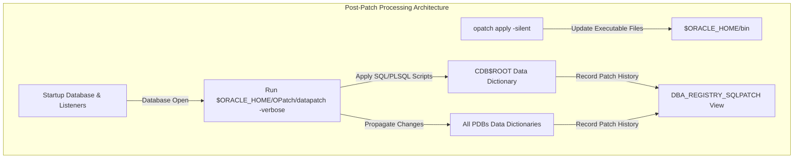

# CHAPTER 09. OPatch & Release Update(RU) CLI 패치 관리

Oracle Database 19c 환경에서 데이터베이스의 안정성과 보안성을 유지하기 위해서는 정기적인 버그 수정 및 보안 권고 패치 적용이 필수적입니다 (출처: oracle-database-patch-maintenance.pdf, 2026). Oracle 19c부터는 과거의 패치셋(Patch Set)이나 번들 패치(Bundle Patch) 체계 대신 분기별 **Release Update (RU)** 및 월별 **Monthly Recommended Patch (MRP)** 체계로 전환되었습니다 (출처: database-administrators-guide.pdf, 2019; oracle-database-patch-maintenance.pdf, 2026).

본 장에서는 OPatch 유틸리티 최신화, `opatch apply -silent` 명령을 활용한 RU 및 MRP 패치 수순, 사전 충돌 검증(Prerequisite Check), 그리고 바이너리 패치 후 데이터 카탈로그를 동기화하는 **`datapatch`** 유틸리티 실행 및 패치 적용 상태 검증 절차를 단계별로 다룹니다.

---

## 9.1 OPatch 유틸리티 최신화 (`opatch version`)

### OPatch 유틸리티의 개념과 최신화 필요성

**OPatch**는 오라클 홈(`$ORACLE_HOME`) 디렉토리 내 바이너리에 단일 패치(One-off Patch), Release Update(RU), 패치 세트 등을 적용하거나 롤백할 때 사용하는 오라클 표준 커맨드라인 유틸리티입니다 (출처: 2-day-dba.pdf, 2019; oracle-database-patch-maintenance.pdf, 2026).

신규 Release Update 패치나 MRP를 적용하기 전에는 반드시 해당 패치가 요구하는 최신 버전의 OPatch 유틸리티(Patch 6880880)를 My Oracle Support(MOS)에서 다운로드하여 오라클 홈에 교체 적용해야 합니다 (출처: high-availability-overview-and-best-practices.pdf, 2026; oracle-database-patch-maintenance.pdf, 2026). 구버전 OPatch를 사용할 경우 패치 압축 해제 오류, 메타데이터 파싱 실패, 또는 사전 검증 단계 오류가 발생할 수 있습니다.

---

### 기존 OPatch 백업 및 최신 OPatch 압축 해제 수순

`oracle` 계정으로 기존 오라클 홈 내의 `OPatch` 디렉토리를 백업 디렉토리로 이동한 후, 최신 OPatch 압축 파일(`p6880880_190000_Linux-x86-64.zip`)을 해제합니다.

```bash
# 1. oracle 계정 환경 변수 점검
$ su - oracle
$ echo $ORACLE_HOME
/u01/app/oracle/product/19.0.0/dbhome_1

# 2. 기존 OPatch 디렉토리 백업
$ cd $ORACLE_HOME
$ mv OPatch OPatch_bak_20260930

# 3. 최신 OPatch 패키지(Patch 6880880) 압축 해제
$ unzip -q /u01/app/oracle/stage/p6880880_190000_Linux-x86-64.zip -d $ORACLE_HOME
```

---

### OPatch 버전 및 중앙 인벤토리 검증 (`opatch version`, `opatch lsinventory`)

교체된 OPatch의 버전을 확인하고, 중앙 인벤토리(`oraInventory`)와 오라클 홈 바이너리 상태를 교차 검증합니다 (출처: high-availability-overview-and-best-practices.pdf, 2026).

```bash
# 1. OPatch 버전 확인
$ opatch version
OPatch Version: 12.2.0.1.43

OPatch succeeded.

# 2. 오라클 홈에 설치된 현재 패치 이력 확인 (opatch lsinventory)
$ opatch lsinventory
Oracle Interim Patch Installer version 12.2.0.1.43
Copyright (c) 2026, Oracle Corporation.  All rights reserved.

Oracle Home       : /u01/app/oracle/product/19.0.0/dbhome_1
Central Inventory : /u01/app/oraInventory
   from           : /u01/app/oracle/product/19.0.0/dbhome_1/oraInst.loc
OPatch version    : 12.2.0.1.43
OUI version       : 12.2.0.7.0
Log file location : /u01/app/oracle/product/19.0.0/dbhome_1/cfgtoollogs/opatch/opatch2026-09-30_11-00-00AM_1.log

Lsinventory Output file location : /u01/app/oracle/product/19.0.0/dbhome_1/cfgtoollogs/opatch/lsinv/lsinventory2026-09-30_11-00-00AM_1.txt

--------------------------------------------------------------------------------
Installed Top-level Products (1):

Oracle Database 19c                                                  19.0.0.0.0
There are 1 products installed in this Oracle Home.

There are no Interim patches installed in this Oracle Home.

--------------------------------------------------------------------------------

OPatch succeeded.
```

---

## 9.2 Silent Mode 기반 Release Update (RU) / MRP 패치 적용

### Oracle 19c 패치 체계: Release Update (RU) 및 Monthly Recommended Patch (MRP)

Oracle Database 19c의 선제적(Proactive) 소프트웨어 유지보수는 매분기 제공되는 **Release Update (RU)**와 Linux x86-64 플랫폼 전용 **Monthly Recommended Patch (MRP)**를 통해 이루어집니다 (출처: oracle-database-patch-maintenance.pdf, 2026).

* **Release Update (RU)**: 매년 1월, 4월, 7월, 10월 셋째 주 화요일에 출시되는 분기별 패치 번들입니다 (출처: oracle-database-patch-maintenance.pdf, 2026). 기능 개선, 보안 패치(CPU/PSU 연동), 회귀 버그 수정, 옵티마이저 수정 사항을 포함합니다 (출처: oracle-database-patch-maintenance.pdf, 2026). 버전을 구별하는 버전 표기는 `19.7.0.0.0` 또는 `19.25.0.0.241015` 형식의 5자리 수치 구조를 사용합니다 (출처: database-administrators-guide.pdf, 2019; oracle-database-patch-maintenance.pdf, 2026).
* **Monthly Recommended Patch (MRP)**: RU 출시 이후 분기 간 공백기 동안 핵심 및 권장 버그 수정 사항을 월 단위로 제공하는 패치 번들입니다 (출처: oracle-database-patch-maintenance.pdf, 2026). RU와 달리 데이터베이스 정식 버전 번호를 변경하지 않으며, `opatch napply` 또는 `opatchauto`를 통해 적용합니다 (출처: oracle-database-patch-maintenance.pdf, 2026).

#### 표 9-1. Release Update (RU)와 Monthly Recommended Patch (MRP) 비교

| 구분 | Release Update (RU) | Monthly Recommended Patch (MRP) |
| :--- | :--- | :--- |
| **제공 주기** | 분기별 (1월, 4월, 7월, 10월) | 월별 (Linux x86-64 전용) |
| **버전 번호 변경** | 버전 번호 변경됨 (예: 19.3 \\(\rightarrow\\) 19.25) | 정식 버전 번호 변경 없음 (RU 버전 유지) |
| **포함 내용** | 보안, 기능 확장, 회귀 버그, 옵티마이저 패치 | RU 출시 이후 보고된 권장 단일 패치들의 모음 |
| **적용 유틸리티** | `opatch apply` / `opatchauto` / `runInstaller` | `opatch napply` / `opatchauto` |

---

### 패치 전 사전 검증 (`CheckConflictAgainstOHWithDetail`)

패치를 오라클 홈에 실제로 반영하기 전, 기존 바이너리와의 충돌 여부 및 인벤토리 정합성을 검증하기 위해 `opatch prereq CheckConflictAgainstOHWithDetail` 명령을 구동합니다 (출처: high-availability-overview-and-best-practices.pdf, 2026).

```bash
# 1. RU 패치 압축 해제 디렉토리 이동
$ cd /u01/app/oracle/stage/36912597

# 2. 사전 충돌 검증(Prerequisite Check) 실행
$ opatch prereq CheckConflictAgainstOHWithDetail -ph ./

Oracle Interim Patch Installer version 12.2.0.1.43
Copyright (c) 2026, Oracle Corporation.  All rights reserved.

PREREQ session
Oracle Home       : /u01/app/oracle/product/19.0.0/dbhome_1
Central Inventory : /u01/app/oraInventory
   from           : /u01/app/oracle/product/19.0.0/dbhome_1/oraInst.loc
OPatch version    : 12.2.0.1.43
OUI version       : 12.2.0.7.0
Log file location : /u01/app/oracle/product/19.0.0/dbhome_1/cfgtoollogs/opatch/opatch2026-09-30_11-05-00AM_1.log

Invoking prereq "checkconflictagainstohwithdetail"

Prereq "checkConflictAgainstOHWithDetail" passed.

OPatch succeeded.
```

---

### 데이터베이스 인스턴스 및 리스너 정지 수순

In-place 바이너리 패치를 진행하려면 오라클 홈 프로세스를 사용하는 모든 데이터베이스 인스턴스, 네트워킹 리스너 및 유틸리티를 정상 종료해야 합니다 (출처: high-availability-overview-and-best-practices.pdf, 2026).

```
[ 인스턴스 및 서비스 정상 정지 순서 ]
애플리케이션 접속 차단 ───> Listener 정지 (lsnrctl stop) ───> DB Instance 정지 (SHUTDOWN IMMEDIATE)
```

> **⚠️ [주의] Data Pump 작업 중단 및 논리적 손상 방지**
> 패치 작업을 수행하기 전, 실행 중인 오라클 Data Pump 작업(`expdp`, `impdp`)이 존재하는지 점검하고 모든 작업이 완벽히 종료되었는지 확인해야 합니다 (출처: oracle-database-patch-maintenance.pdf, 2026). 패치 적용 중 데이터 펌프 작업이 수행될 경우 딕셔너리 메타데이터의 논리적 손상이 유발될 수 있습니다 (출처: oracle-database-patch-maintenance.pdf, 2026).

```bash
# 1. 네트워킹 리스너 정지
$ lsnrctl stop LISTENER

# 2. SQL*Plus 접속 및 데이터베이스 인스턴스 정상 정지
$ sqlplus / as sysdba
SQL> SHUTDOWN IMMEDIATE;
SQL> EXIT;

# 3. 오라클 홈 내 백그라운드 잔여 프로세스 검증
$ fuser -v $ORACLE_HOME/bin/oracle
```

---

### CLI 기반 Silent 패치 적용 (`opatch apply -silent`)

프로세스가 모두 정지된 상태에서 `-silent` 옵션을 지정하여 비대화형 모드로 Release Update 패치를 적용합니다 (출처: high-availability-overview-and-best-practices.pdf, 2026; oracle-database-patch-maintenance.pdf, 2026).

```bash
# Release Update 패치 디렉토리에서 Silent 적용 구동
$ cd /u01/app/oracle/stage/36912597
$ opatch apply -silent

Oracle Interim Patch Installer version 12.2.0.1.43
Copyright (c) 2026, Oracle Corporation.  All rights reserved.

Oracle Home       : /u01/app/oracle/product/19.0.0/dbhome_1
Central Inventory : /u01/app/oraInventory
   from           : /u01/app/oracle/product/19.0.0/dbhome_1/oraInst.loc
OPatch version    : 12.2.0.1.43
OUI version       : 12.2.0.7.0
Log file location : /u01/app/oracle/product/19.0.0/dbhome_1/cfgtoollogs/opatch/opatch2026-09-30_11-10-00AM_1.log

Verifying environment and performing prerequisite checks...
OPatch continues with these patches: 36912597

Do you want to proceed? [y|n] Y (Auto-selected by -silent)
User Responded with: Y
All checks passed.

Backing up files...
Applying interim patch '36912597' to OH '/u01/app/oracle/product/19.0.0/dbhome_1'

Patching component oracle.rdbms, 19.0.0.0.0...
Patch 36912597 successfully applied.
Log file location: /u01/app/oracle/product/19.0.0/dbhome_1/cfgtoollogs/opatch/opatch2026-09-30_11-10-00AM_1.log

OPatch succeeded.
```

---

### 패치 적용 후 상태 검증 (`opatch lspatches`)

패치 설치가 정상 완료되면 `opatch lspatches` 명령을 구동하여 적용된 RU 또는 패치 ID 목록을 확인합니다 (출처: high-availability-overview-and-best-practices.pdf, 2026).

```bash
# 적용된 패치 번호 및 패치 요약 조회
$ opatch lspatches
36912597;Database Release Update : 19.25.0.0.241015 (36912597)

OPatch succeeded.
```

---

## 9.3 Post-Patch Database Upgrade: `datapatch` 스크립트 실행

### SQLPatch 자동화 유틸리티인 `datapatch`의 역할 및 메커니즘

`opatch apply` 명령은 오라클 홈 디렉토리 내부의 바이너리와 C 라이브러리 파일만 업그레이드합니다. 따라서 데이터베이스 시스템 카탈로그와 데이터 딕셔너리 내부의 SQL/PLSQL 패키지 객체를 패치 버전과 동기화하기 위해서는 **`datapatch`** 유틸리티를 실행해야 합니다 (출처: database-administrators-guide.pdf, 2019; oracle-database-patch-maintenance.pdf, 2026).

* **SQLPatch 메커니즘**: `datapatch`는 데이터베이스에 접속하여 적용된 바이너리 패치가 필요로 하는 SQL 및 PL/SQL 스크립트를 탐색하고 데이터 딕셔너리에 자동 반영합니다 (출처: oracle-database-patch-maintenance.pdf, 2026).
* **Multitenant CDB/PDB 자동 전파**: 멀티테넌트 환경에서 `datapatch`를 구동하면 CDB\\$ROOT뿐만 아니라 오픈되어 있는 모든 Pluggable Database(PDB)에 대해 SQLPatch 작업을 자동으로 일괄 처리합니다.



---

### 데이터베이스 인스턴스 오픈 및 `datapatch -verbose` 실행 수순

`datapatch` 스크립트를 구동하기 전 데이터베이스 인스턴스와 리스너를 먼저 구동하여 데이터베이스가 `READ WRITE` 모드로 정상 오픈되어 있어야 합니다 (출처: database-administrators-guide.pdf, 2019).

```bash
# 1. 리스너 구동
$ lsnrctl start LISTENER

# 2. 데이터베이스 인스턴스 시작
$ sqlplus / as sysdba
SQL> STARTUP;
-- Multitenant 환경인 경우 모든 PDB 오픈
SQL> ALTER PLUGGABLE DATABASE ALL OPEN;
SQL> EXIT;

# 3. $ORACLE_HOME/OPatch/datapatch 실행
$ cd $ORACLE_HOME/OPatch
$ ./datapatch -verbose

SQL Patching tool version 19.25.0.0.0 Production on Wed Sep 30 11:20:00 2026
Subcomponent versions: RDBMS 19.25.0.0.0 / OJVM 19.25.0.0.0

Connecting to database...OK
Gathering database info...done

Note: datapatch will process the following PDBS: CDB$ROOT, PDB$SEED, PDB1

Bootstrapping registry$sqlpatch...done
Determining current state...done

Current state of SQL patches:
Bundle patch 36912597 (Database Release Update : 19.25.0.0.241015):
  Installed in the binary registry only; not installed in the database

Adding patches to installation queue and verification queue...done

Executing SQL scripts...
  Patch 36912597 apply: shutting down database instance, applying SQL scripts, reopening database instance...done
  SQL script execution finished successfully.

Check pdbs section for SQL script execution status:
  CDB$ROOT: SUCCESS
  PDB$SEED: SUCCESS
  PDB1: SUCCESS

datapatch summary:
  Patch 36912597 (Database Release Update : 19.25.0.0.241015): successfully applied on CDB$ROOT, PDB$SEED, PDB1

SQL Patching tool complete on Wed Sep 30 11:25:00 2026
```

---

### `DBA_REGISTRY_SQLPATCH` 및 `PRODUCT_COMPONENT_VERSION` 뷰를 통한 최종 검증

`datapatch` 작업이 성공하면 딕셔너리 뷰를 조회하여 데이터베이스에 반영된 패치 결과와 버전 정보를 검증합니다 (출처: database-administrators-guide.pdf, 2019; oracle-database-patch-maintenance.pdf, 2026).

```sql
-- 1. SQLPatch 적용 이력 및 성공 여부 확인 (DBA_REGISTRY_SQLPATCH)
$ sqlplus / as sysdba

SQL> SET LINESIZE 150 PAGESIZE 50
SQL> COLUMN patch_id FORMAT 99999999
SQL> COLUMN patch_type FORMAT A10
SQL> COLUMN action FORMAT A10
SQL> COLUMN status FORMAT A10
SQL> COLUMN description FORMAT A45

SQL> SELECT patch_id, patch_type, action, status, description 
     FROM dba_registry_sqlpatch;

 PATCH_ID PATCH_TYPE ACTION     STATUS     DESCRIPTION
--------- ---------- ---------- ---------- ---------------------------------------------
 36912597 RU         APPLY      SUCCESS    Database Release Update : 19.25.0.0.241015

-- 2. 오라클 데이터베이스 릴리스 버전 확인 (PRODUCT_COMPONENT_VERSION)
SQL> SELECT product, version, version_full, status 
     FROM product_component_version;

PRODUCT                        VERSION    VERSION_FULL STATUS
------------------------------ ---------- ------------ ------------
Oracle Database 19c Enterprise 19.0.0.0.0 19.25.0.0.0  Production
```

---

### 💬 기획 편집자 노트 (Next Step)

Chapter 9에서는 OPatch 유틸리티 최신화, RU 및 MRP 패치 구조 분석, `opatch apply -silent`를 활용한 비대화형 패치 적용, 및 `datapatch -verbose` 스크립트를 통한 데이터 딕셔너리 동기화 절차를 성공적으로 작성하였습니다.

이어지는 **CHAPTER 10**에서는 `/etc/oratab` 설정, systemd 서비스 유닛 스크립트(`oracle.service`) 작성을 통한 인스턴스/리스너 OS 자동 시작 구성, 및 CVU(Cluster Verification Utility) CLI 종합 검증을 다룰 예정입니다. 계속해서 CHAPTER 10 집필을 진행할까요?
