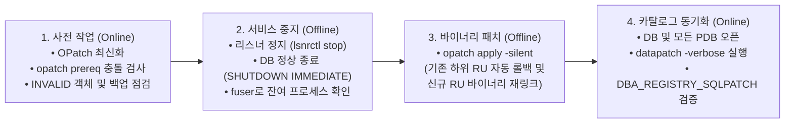
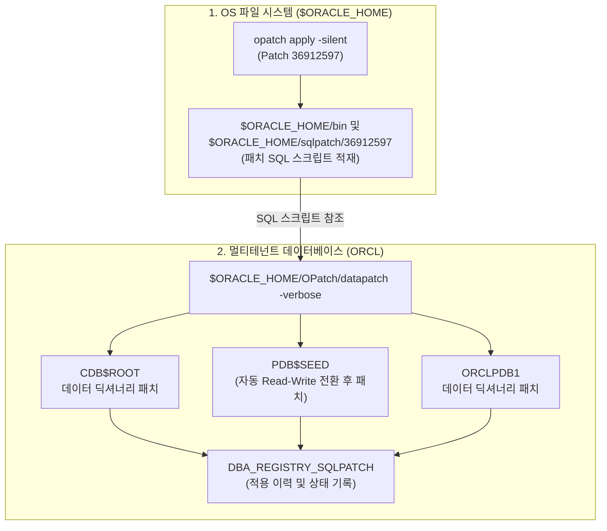

<!-- 
  [출판 조판 및 폰트 지정 명세 (Typography Specification)]
  - 본문(Body), 표(Table), 캡션(Caption), 영문 기술 용어: Noto Sans KR (Regular/Medium)
  - 장/절 제목(Headings H1~H4): Noto Sans KR Bold
  - 코드, 명령어, SQL 및 설정 블록(Code/SQL Blocks): DejaVu Sans Mono
-->

# CHAPTER 09. OPatch 및 Release Update(RU) CLI 패치 관리

엔터프라이즈 환경에서 운영 중인 Oracle Database 19c의 보안성과 기술적 안정성을 유지하려면 정기적인 버그 수정 및 보안 권고(Critical Patch Update, CPU) 패치 적용이 필수적입니다. Oracle Database 18c/19c부터는 과거 11g/12c 시절의 패치셋(Patch Set)이나 PSU(Patch Set Update) 체계 대신, 분기별로 제공되는 누적 패치 번들인 **Release Update(RU)**와 Linux x86-64 전용 월간 권장 패치인 **Monthly Recommended Patch(MRP)** 체계로 일원화되었습니다.

본 장에서는 오라클 표준 패치 관리 유틸리티인 **OPatch(Patch 6880880)**를 최신화하고, 사전 충돌 검증(Prerequisite Check)과 `opatch apply -silent` 명령을 통해 오라클 홈 바이너리를 업그레이드(예: RU 19.22 $\rightarrow$ RU 19.25)하는 절차를 다룹니다. 이어서 바이너리 패치 후 멀티테넌트(CDB/PDB) 데이터 딕셔너리 카탈로그를 동기화하는 **`datapatch`** 유틸리티의 내부 메커니즘과 최종 검증 방법을 단계별로 실습합니다.

---

## 9.1 OPatch 유틸리티 최신화 (`opatch version`)

### 1. OPatch 유틸리티의 개념과 최신화 필요성

**OPatch**는 오라클 홈(`$ORACLE_HOME`) 디렉터리 내부의 실행 파일 및 라이브러리에 단일 패치(Interim/One-off Patch), 분기별 Release Update(RU), 월별 MRP 등을 적용(`apply`)하거나 롤백(`rollback`)할 때 사용하는 오라클 공식 커맨드라인 유틸리티입니다.

새로운 분기의 Release Update나 MRP를 적용하기 전에는 반드시 해당 패치의 `README.html` 문서가 요구하는 최소 버전 이상의 **최신 OPatch 유틸리티(My Oracle Support 패치 번호 `6880880`)**를 다운로드하여 `$ORACLE_HOME/OPatch` 디렉터리를 먼저 교체해야 합니다.

> ⚠️ **주의(Caution)**: 구버전 OPatch 유틸리티로 최신 RU 패치를 적용하려고 시도하면 신규 패치 아카이브의 메타데이터 파싱에 실패하거나, 사전 검증 단계에서 `OPatch failed with error code 73` 등의 호환성 오류가 발생하며 패치가 중단됩니다. 따라서 **"패치 작업의 0순위는 언제나 OPatch(Patch 6880880) 최신화"**라는 원칙을 기억하시기 바랍니다.

### 2. 기존 OPatch 백업 및 최신 OPatch 교체 수순

Chapter 05에서 우리는 초기 설치 시점에 당시 버전의 OPatch를 적용한 바 있습니다. 시간이 흘러 새로운 분기의 RU(예: RU 19.25)를 적용해야 하는 시점이 되었다고 가정하고, `oracle` 계정으로 기존 `OPatch` 디렉터리를 백업한 뒤 최신 `p6880880_190000_Linux-x86-64.zip` 파일을 압축 해제합니다.

```bash
# 1. oracle 계정 환경 변수($ORACLE_HOME) 점검
$ su - oracle
$ echo $ORACLE_HOME
/u01/app/oracle/product/19.0.0/dbhome_1

# 2. 기존 OPatch 디렉터리를 날짜 태그를 붙여 백업
$ cd $ORACLE_HOME
$ mv OPatch OPatch_bak_$(date +%Y%m%d)

# 3. 최신 OPatch 패키지(Patch 6880880)를 $ORACLE_HOME 경로에 압축 해제
$ unzip -q /u01/stage/p6880880_190000_Linux-x86-64.zip -d $ORACLE_HOME
```

> 💡 **노트(Note)**: 기존 `OPatch` 디렉터리를 삭제하지 않고 이름을 변경(`mv`)하거나 별도 경로로 이동해 둔 뒤 `unzip`을 수행해야 파일 충돌이나 잔여 구버전 클래스(`.jar`) 파일로 인한 오류를 완벽하게 예방할 수 있습니다. 또한 `$ORACLE_HOME/OPatch` 경로를 `.bash_profile`의 `PATH` 환경 변수에 등록해 두면 어디서든 `opatch` 명령어를 바로 호출할 수 있습니다.

### 3. OPatch 버전 및 중앙 인벤토리 검증 (`opatch version`, `opatch lsinventory`)

교체된 OPatch의 버전을 확인하고, 중앙 인벤토리(`oraInventory`)와 현재 오라클 홈에 적용되어 있는 기존 패치 내역(Chapter 05에서 설치와 동시에 적용했던 RU 19.22)을 점검합니다.

```bash
# 1. 교체된 OPatch 버전 확인
$ $ORACLE_HOME/OPatch/opatch version
OPatch Version: 12.2.0.1.43

OPatch succeeded.

# 2. 오라클 홈의 중앙 인벤토리 정합성 및 현재 설치된 패치 이력 조회
$ $ORACLE_HOME/OPatch/opatch lsinventory
Oracle Interim Patch Installer version 12.2.0.1.43
Copyright (c) 2026, Oracle Corporation.  All rights reserved.

Oracle Home       : /u01/app/oracle/product/19.0.0/dbhome_1
Central Inventory : /u01/app/oraInventory
   from           : /u01/app/oracle/product/19.0.0/dbhome_1/oraInst.loc
OPatch version    : 12.2.0.1.43
OUI version       : 12.2.0.7.0
Log file location : /u01/app/oracle/product/19.0.0/dbhome_1/cfgtoollogs/opatch/opatch2026-09-30_11-00-00AM_1.log

Lsinventory Output file location : /u01/app/oracle/product/19.0.0/dbhome_1/cfgtoollogs/opatch/lsinv/lsinventory2026-09-30_11-00-00AM_1.txt

--------------------------------------------------------------------------------
Installed Top-level Products (1):

Oracle Database 19c                                                  19.0.0.0.0
There are 1 products installed in this Oracle Home.

Interim patches (1) :

Patch  35943157     : applied on Wed Sep 30 09:15:22 KST 2026
Unique Patch ID: 25501399
Patch description:  "Database Release Update : 19.22.0.0.240116 (35943157)"
   Created on 11 Jan 2024, 03:18:40 hrs PST8PDT
   Bugs fixed:
     ... (중략) ...
--------------------------------------------------------------------------------

OPatch succeeded.
```

---

## 9.2 Silent Mode 기반 Release Update(RU) 및 MRP 패치 적용

### 1. Oracle Database 19c 패치 체계: RU와 MRP의 이해

Oracle Database 19c의 선제적(Proactive) 패치 유지보수는 분기별로 릴리스되는 **Release Update(RU)**와 Linux x86-64 플랫폼에서 월별로 제공되는 **Monthly Recommended Patch(MRP)** 두 가지 축으로 운영됩니다. (과거 제공되던 RUR(Release Update Revision)은 Oracle 19.15 이후 공식 폐지되고 MRP로 대체되었습니다.)

* **Release Update (RU)**: 매년 1월, 4월, 7월, 10월 셋째 주 화요일에 정기 출시되는 **누적(Cumulative) 패치 번들**입니다. 보안 취약점 수정(CPU), 검증된 핵심 버그 패치, 옵티마이저 수정 사항(기본 비활성화 상태 포함) 및 새로운 기능(예: 19.7의 SEHA, 19.19의 OL9 지원 등)을 모두 포함합니다. RU를 적용하면 데이터베이스의 두 번째 버전 숫자(Update 숫자)가 올라갑니다(예: `19.22.0.0.0` $\rightarrow$ `19.25.0.0.0`).
* **Monthly Recommended Patch (MRP)**: 특정 분기 RU가 출시된 이후, 다음 분기 RU로 넘어가기 어려운 고객을 위해 매월(RU 출시 후 최대 6개월간) 핵심 권장 단일 패치(One-off Patches)들을 하나로 묶어 충돌 검증까지 마친 상태로 제공하는 월간 패치 번들입니다. MRP를 적용해도 데이터베이스의 기본 RU 버전 번호는 변경되지 않습니다.

| 비교 항목 | Release Update (RU) | Monthly Recommended Patch (MRP) |
| :--- | :--- | :--- |
| **제공 주기** | 분기별 (1월, 4월, 7월, 10월) | 월별 (각 RU 기준 최대 6회, Linux x86-64 전용) |
| **버전 번호 변경** | **변경됨** (예: `19.22.0.0.0` $\rightarrow$ `19.25.0.0.0`) | 정식 버전 번호 유지 (기존 RU 버전 그대로 유지) |
| **패치 성격 및 포함 범위** | 누적 보안 패치(CPU), 회귀 버그 수정, 기능 확장 | 해당 RU 위에서 검증된 핵심 권장 단일 패치(One-offs) 모음 |
| **패키지 구조** | 단일 통합 패치 디렉터리 | 복수의 하위 패치 디렉터리 번들 (`napply` 구조) |
| **적용 명령어 (DB 단독)** | `opatch apply -silent` | `opatch napply -silent` |

*표 9-1: Oracle Database 19c Release Update(RU)와 Monthly Recommended Patch(MRP) 비교*

---

### 2. 패치 전 사전 충돌 검증 (`CheckConflictAgainstOHWithDetail`)

실제 패치를 위해 서비스를 내리기 전에(온라인 상태에서), 새로 적용할 RU 패치(예: **RU 19.25, Patch 36912597**)가 현재 `$ORACLE_HOME`에 설치된 패치들과 충돌(Conflict)하지 않는지 사전 검증을 수행합니다. 이 단계는 데이터베이스가 운영 중인 상태에서도 아무런 영향 없이 실행할 수 있습니다.

```bash
# 1. 스테이징 디렉터리에 신규 RU 19.25 패치(p36912597) 압축 해제
$ cd /u01/stage
$ unzip -q p36912597_190000_Linux-x86-64.zip

# 2. 압축 해제된 패치 디렉터리로 이동하여 사전 충돌 검증 실행
$ cd /u01/stage/36912597
$ $ORACLE_HOME/OPatch/opatch prereq CheckConflictAgainstOHWithDetail -ph ./

Oracle Interim Patch Installer version 12.2.0.1.43
Copyright (c) 2026, Oracle Corporation.  All rights reserved.

PREREQ session
Oracle Home       : /u01/app/oracle/product/19.0.0/dbhome_1
Central Inventory : /u01/app/oraInventory
   from           : /u01/app/oracle/product/19.0.0/dbhome_1/oraInst.loc
OPatch version    : 12.2.0.1.43
OUI version       : 12.2.0.7.0
Log file location : /u01/app/oracle/product/19.0.0/dbhome_1/cfgtoollogs/opatch/opatch2026-09-30_11-05-00AM_1.log

Invoking prereq "checkconflictagainstohwithdetail"

Prereq "checkConflictAgainstOHWithDetail" passed.

OPatch succeeded.
```

> 💡 **노트(Note)**: 만약 단일 RU가 아니라 여러 개의 하위 패치 폴더를 포함하는 **MRP(Monthly Recommended Patch)**의 사전 충돌을 검사할 때는 `-ph ./` 대신 **`-phBaseDir ./`** 옵션을 사용합니다.
> ```bash
> $ $ORACLE_HOME/OPatch/opatch prereq CheckConflictAgainstOHWithDetail -phBaseDir ./
> ```

---

### 3. 패치 전체 워크플로우 및 인스턴스/리스너 정지 수순

현재의 `$ORACLE_HOME`에 직접 패치를 덮어쓰는 **In-Place 바이너리 패치**를 수행하려면, 해당 오라클 홈의 실행 파일이나 공유 라이브러리(`.so`)를 열고 있는 모든 프로세스(DB 인스턴스, 리스너, 백그라운드 에이전트 등)를 먼저 정상 종료해야 합니다.


*그림 9-1: Oracle 19c In-Place Release Update 패치 적용 전체 워크플로우*

> ⚠️ **주의(Caution): 패치 전 Data Pump 작업 및 백업 상태 확인**
> 인스턴스를 내리기 전에 실행 중인 오라클 Data Pump 작업(`DBA_DATAPUMP_JOBS` 뷰 조회)이나 RMAN 백업 세션이 없는지 반드시 확인하십시오. Data Pump 잡이 돌아가는 도중에 강제로 인스턴스를 내리고 `datapatch`를 수행하면 데이터 딕셔너리 메타데이터 손상이 발생할 수 있습니다. 또한 만일의 롤백 상황에 대비해 `$ORACLE_HOME` 디렉터리(또는 OS 스냅샷)와 데이터베이스 전체 백업을 확보한 뒤 작업을 시작하는 것이 안전합니다.

다음 순서에 따라 리스너와 데이터베이스 인스턴스를 안전하게 종료하고, 바이너리를 점유하고 있는 잔여 프로세스가 없는지 `fuser` 명령으로 확인합니다.

```bash
# 1. 외부 신규 접속 차단을 위해 리스너 먼저 정지
$ lsnrctl stop LISTENER

# 2. SQL*Plus 접속 및 데이터베이스 인스턴스 정상 종료 (체크포인트 수행)
$ sqlplus / as sysdba

SQL> SHUTDOWN IMMEDIATE;
Database closed.
Database dismounted.
ORACLE instance shut down.
SQL> EXIT;

# 3. $ORACLE_HOME 내 실행 파일이나 라이브러리를 점유 중인 잔여 프로세스 확인 (아무 출력이 없어야 정상)
$ fuser -v $ORACLE_HOME/bin/oracle
$ ps -ef | grep -E "ora_|tnslsnr" | grep -v grep
```

---

### 4. CLI 기반 무대화형 패치 적용 (`opatch apply -silent`)

모든 오라클 프로세스가 종료된 상태에서 `-silent` 옵션을 부여하여 RU 19.25(`36912597`) 패치를 적용합니다. RU는 누적 패치이므로, OPatch는 기존에 설치되어 있던 하위 RU(`35943157`, RU 19.22)를 자동으로 먼저 롤백(Rollback)한 뒤 신규 RU(`36912597`, RU 19.25)를 적용하고 `oracle` 바이너리를 재링크(Relink)합니다.

```bash
# 신규 RU 패치 디렉터리로 이동하여 Silent 모드로 패치 적용
$ cd /u01/stage/36912597
$ $ORACLE_HOME/OPatch/opatch apply -silent

Oracle Interim Patch Installer version 12.2.0.1.43
Copyright (c) 2026, Oracle Corporation.  All rights reserved.

Oracle Home       : /u01/app/oracle/product/19.0.0/dbhome_1
Central Inventory : /u01/app/oraInventory
   from           : /u01/app/oracle/product/19.0.0/dbhome_1/oraInst.loc
OPatch version    : 12.2.0.1.43
OUI version       : 12.2.0.7.0
Log file location : /u01/app/oracle/product/19.0.0/dbhome_1/cfgtoollogs/opatch/opatch2026-09-30_11-10-00AM_1.log

Verifying environment and performing prerequisite checks...
OPatch continues with these patches:   36912597  

Do you want to proceed? [y|n]
Y (auto-answered by -silent)
User Responded with: Y
All checks passed.

Please shutdown Oracle instances running out of this ORACLE_HOME on the local system.
(Oracle Home = '/u01/app/oracle/product/19.0.0/dbhome_1')

Is the local system ready for patching? [y|n]
Y (auto-answered by -silent)
User Responded with: Y
Backing up files...
Rolling back interim patch '35943157' from OH '/u01/app/oracle/product/19.0.0/dbhome_1'
Patching component oracle.rdbms, 19.0.0.0.0...
RollbackSession removing interim patch '35943157' from inventory

Applying interim patch '36912597' to OH '/u01/app/oracle/product/19.0.0/dbhome_1'
Patching component oracle.rdbms, 19.0.0.0.0...
Patching component oracle.rdbms.rsf, 19.0.0.0.0...
... (중략) ...
Patch 36912597 successfully applied.
Log file location: /u01/app/oracle/product/19.0.0/dbhome_1/cfgtoollogs/opatch/opatch2026-09-30_11-10-00AM_1.log

OPatch succeeded.
```

> 💡 **노트(Note)**: 만약 월간 권장 패치인 **MRP**를 추가로 적용하는 경우에는 해당 MRP 압축 해제 디렉터리로 이동한 뒤 **`$ORACLE_HOME/OPatch/opatch napply -silent`** 명령을 실행하면 됩니다.

### 5. 바이너리 패치 적용 결과 검증 (`opatch lspatches`)

패치 작업이 `OPatch succeeded.` 메시지와 함께 완료되었다면, `opatch lspatches` 명령을 실행하여 기존 RU 19.22가 제거되고 신규 RU 19.25(`36912597`)가 정상 등록되었는지 확인합니다.

```bash
$ $ORACLE_HOME/OPatch/opatch lspatches
36912597;Database Release Update : 19.25.0.0.241015 (36912597)

OPatch succeeded.
```

---

## 9.3 Post-Patch 데이터 딕셔너리 동기화: `datapatch` 실행

### 1. SQLPatch 자동화 도구 `datapatch`의 역할과 동작 원리

앞절에서 수행한 `opatch apply`는 오직 **OS 파일 시스템상의 `$ORACLE_HOME` 실행 바이너리와 C 라이브러리만 교체**하는 작업입니다. 아직 데이터베이스 파일(`.dbf`) 내부의 시스템 카탈로그(Data Dictionary)에 저장된 SQL 뷰, 카탈로그 테이블, PL/SQL 내장 패키지들은 이전 버전(19.22) 상태에 머물러 있습니다.

이처럼 바이너리에 적용된 패치 내역과 데이터베이스 내부의 데이터 딕셔너리를 일치시켜 주는 사후 패치(Post-Patch SQL Deployment) 도구가 바로 **`$ORACLE_HOME/OPatch/datapatch`**입니다.


*그림 9-2: 멀티테넌트(CDB/PDB) 환경의 `datapatch` 동작 아키텍처*

* **SQL 레지스트리 자동 비교**: `datapatch`는 실행 시 현재 `$ORACLE_HOME`의 바이너리 패치 인벤토리와 데이터베이스 내부의 `DBA_REGISTRY_SQLPATCH` 뷰를 대조합니다. 이를 통해 기존 패치(`35943157`)의 SQL 변경분은 롤백 큐(Rollback Queue)에 넣고, 신규 패치(`36912597`)의 SQL 스크립트는 적용 큐(Apply Queue)에 자동으로 구성합니다.
* **멀티테넌트(CDB/PDB) 일괄 반영**: CDB 환경에서 `datapatch`를 실행하면 먼저 `CDB$ROOT`에 SQL 패치를 적용한 뒤, 현재 열려 있는 모든 일반 PDB(`ORCLPDB1`)는 물론 기본 `READ ONLY` 상태인 **`PDB$SEED`까지도 내부적으로 열어서 자동으로 패치를 전파**합니다.

> ⚠️ **주의(Caution)**: Oracle Database 19c에서는 일반적인 RU 패치 후 `datapatch`를 실행할 때 과거 12.1 시절처럼 `STARTUP UPGRADE` 모드로 띄울 필요가 없습니다(OJVM 패치 등 README에 별도 명시가 있는 경우 제외). 반드시 일반 **`STARTUP`(정상 오픈) 상태에서 모든 사용자 PDB가 `READ WRITE`로 열려 있는지(`ALTER PLUGGABLE DATABASE ALL OPEN;`) 확인한 후** `datapatch`를 실행하십시오. 만약 특정 PDB가 `MOUNTED` 상태로 닫혀 있으면 해당 PDB에는 패치가 누락되며, 차후 그 PDB를 열 때 `PDB_PLUG_IN_VIOLATIONS` 경고가 발생합니다.

---

### 2. 데이터베이스 오픈 및 `datapatch -verbose` 실행 수순

리스너와 데이터베이스를 기동하고 모든 PDB가 정상 오픈된 것을 확인한 뒤 `datapatch -verbose`를 실행합니다.

```bash
# 1. 리스너 시작
$ lsnrctl start LISTENER

# 2. 데이터베이스 기동 및 PDB 오픈 상태 점검
$ sqlplus / as sysdba

SQL> STARTUP;
ORACLE instance started.
... (중략) ...
Database mounted.
Database opened.

-- Chapter 07에서 SAVE STATE를 설정했으므로 ORCLPDB1이 자동으로 READ WRITE 오픈되었는지 확인
SQL> SHOW PDBS

    CON_ID CON_NAME                       OPEN MODE  RESTRICTED
---------- ------------------------------ ---------- ----------
         2 PDB$SEED                       READ ONLY  NO
         3 ORCLPDB1                       READ WRITE NO

-- (만약 MOUNTED 상태인 PDB가 있다면 아래 명령으로 모두 오픈합니다)
SQL> ALTER PLUGGABLE DATABASE ALL OPEN;
SQL> EXIT;
```

이제 `$ORACLE_HOME/OPatch/datapatch -verbose` 명령을 실행하여 데이터 딕셔너리 패치를 진행합니다.

```bash
# 3. datapatch -verbose 실행
$ $ORACLE_HOME/OPatch/datapatch -verbose
SQL Patching tool version 19.25.0.0.0 Production on Wed Sep 30 11:20:00 2026
Copyright (c) 2012, 2026, Oracle.  All rights reserved.

Log file for this invocation: /u01/app/oracle/cfgtoollogs/sqlpatch/sqlpatch_31420_2026_09_30_11_20_00/sqlpatch_invocation.log

Connecting to database...OK
Gathering database info...done

Note:  Datapatch will only apply or rollback SQL fixes for PDBs
       that are in an open state, no patches will be applied to closed PDBs.
       Please refer to Note: Datapatch: Database 12c Post Patch SQL Automation
       (Doc ID 1585822.1)

Bootstrapping registry and package to current versions...done
Determining current state...done

Current state of interim SQL patches:
  No interim patches found

Current state of release update SQL patches:
  Binary registry:
    19.25.0.0.0 Release_Update 241015120000: Installed
  PDB CDB$ROOT:
    Applied 19.22.0.0.0 Release_Update 240111021840 successfully on 30-SEP-26 09.45.10.000000 AM
  PDB ORCLPDB1:
    Applied 19.22.0.0.0 Release_Update 240111021840 successfully on 30-SEP-26 09.45.10.000000 AM
  PDB PDB$SEED:
    Applied 19.22.0.0.0 Release_Update 240111021840 successfully on 30-SEP-26 09.45.10.000000 AM

Adding patches to installation queue and performing prereq checks...done
Installation queue:
  For the following PDBs: CDB$ROOT PDB$SEED ORCLPDB1
    No interim patches need to be rolled back
    Patch 36912597 (Database Release Update : 19.25.0.0.241015 (36912597)):
      Apply from 19.22.0.0.0 Release_Update 240111021840 to 19.25.0.0.0 Release_Update 241015120000
    No interim patches need to be applied

Installing patches...
Patch installation complete. Total patches installed: 3

Validating logfiles...done
Patch 36912597 apply (pdb CDB$ROOT): SUCCESS
  logfile: /u01/app/oracle/cfgtoollogs/sqlpatch/36912597/25891012/36912597_apply_ORCL_CDBROOT_2026Sep30_11_20_35.log (no errors)
Patch 36912597 apply (pdb PDB$SEED): SUCCESS
  logfile: /u01/app/oracle/cfgtoollogs/sqlpatch/36912597/25891012/36912597_apply_ORCL_PDBSEED_2026Sep30_11_22_10.log (no errors)
Patch 36912597 apply (pdb ORCLPDB1): SUCCESS
  logfile: /u01/app/oracle/cfgtoollogs/sqlpatch/36912597/25891012/36912597_apply_ORCL_ORCLPDB1_2026Sep30_11_22_15.log (no errors)

SQL Patching tool complete on Wed Sep 30 11:25:00 2026
```

---

### 3. 무효(INVALID) 객체 재컴파일 및 패치 최종 검증

`datapatch`가 완료된 후에는 데이터 딕셔너리 변경으로 인해 `INVALID`(무효) 상태로 전환된 뷰나 PL/SQL 객체가 없는지 점검하고, 필요시 `$ORACLE_HOME/rdbms/admin/utlrp.sql`(멀티테넌트 환경에서는 `catcon.pl` 유틸리티 활용 가능)을 실행하여 재컴파일합니다. 마지막으로 `CDB_REGISTRY_SQLPATCH` 및 `PRODUCT_COMPONENT_VERSION` 뷰를 통해 패치 결과를 최종 확인합니다.

```sql
$ sqlplus / as sysdba

-- 1. 모든 컨테이너(CDB$ROOT, PDB$SEED, ORCLPDB1)의 SQLPatch 반영 상태 조회
SQL> SET LINESIZE 160 PAGESIZE 50
SQL> COL con_id FORMAT 999
SQL> COL patch_id FORMAT 99999999
SQL> COL patch_type FORMAT A10
SQL> COL action FORMAT A10
SQL> COL status FORMAT A10
SQL> COL target_version FORMAT A15
SQL> COL description FORMAT A45

SQL> SELECT con_id, patch_id, patch_type, action, status, target_version, description
     FROM cdb_registry_sqlpatch
     WHERE status = 'SUCCESS'
     ORDER BY con_id, action_time;

CON_ID  PATCH_ID PATCH_TYPE ACTION     STATUS     TARGET_VERSION  DESCRIPTION
------ --------- ---------- ---------- ---------- --------------- ---------------------------------------------
     1  35943157 RU         APPLY      SUCCESS    19.22.0.0.0     Database Release Update : 19.22.0.0.240116
     1  36912597 RU         APPLY      SUCCESS    19.25.0.0.0     Database Release Update : 19.25.0.0.241015
     3  35943157 RU         APPLY      SUCCESS    19.22.0.0.0     Database Release Update : 19.22.0.0.240116
     3  36912597 RU         APPLY      SUCCESS    19.25.0.0.0     Database Release Update : 19.25.0.0.241015

-- 2. 전체 컨테이너 내 INVALID 객체 존재 여부 점검 (0건이면 정상)
SQL> SELECT con_id, owner, object_type, COUNT(*) AS invalid_cnt
     FROM cdb_objects
     WHERE status = 'INVALID'
     GROUP BY con_id, owner, object_type;

no rows selected

-- 3. 오라클 데이터베이스 에디션 및 풀 버전(VERSION_FULL) 최종 확인
SQL> COL product FORMAT A42
SQL> COL version FORMAT A12
SQL> COL version_full FORMAT A14
SQL> COL status FORMAT A12

SQL> SELECT product, version, version_full, status
     FROM product_component_version;

PRODUCT                                    VERSION      VERSION_FULL   STATUS
------------------------------------------ ------------ -------------- ------------
Oracle Database 19c Standard Edition 2     19.0.0.0.0   19.25.0.0.0    Production
```

`PRODUCT_COMPONENT_VERSION` 뷰의 `VERSION_FULL` 컬럼이 `19.25.0.0.0`으로 업데이트되었고, `CDB_REGISTRY_SQLPATCH`에서 루트 컨테이너(`CON_ID = 1`)와 사용자 PDB(`CON_ID = 3`, `ORCLPDB1`) 모두 `36912597` 패치가 `SUCCESS`로 기록된 것을 확인할 수 있습니다.

---

## 9.4 장 요약 (Chapter Summary)

이번 장에서는 오라클 데이터베이스의 보안과 안정성을 지속적으로 유지하기 위한 CLI 기반 패치 관리 표준 절차를 마스터했습니다.

1. **OPatch(Patch 6880880) 최신화**: 모든 패치 작업에 앞서 `$ORACLE_HOME/OPatch`를 최신 버전으로 교체하고 `opatch version` 및 `opatch lsinventory`로 중앙 인벤토리 정합성을 확인했습니다.
2. **Release Update(RU) 및 MRP 패치 적용**: 분기별 누적 패치인 RU와 월별 권장 패치인 MRP의 차이를 이해하고, 온라인 사전 충돌 검사(`CheckConflictAgainstOHWithDetail`) 후 서비스를 안전하게 내린 뒤 `opatch apply -silent` 명령으로 바이너리 업그레이드를 수행했습니다.
3. **`datapatch`를 통한 멀티테넌트 카탈로그 동기화**: 인스턴스와 모든 PDB를 오픈한 상태에서 `datapatch -verbose`를 실행하여 `CDB$ROOT`, `PDB$SEED`, `ORCLPDB1` 전체 컨테이너에 SQL 변경 사항을 일괄 반영하고 `CDB_REGISTRY_SQLPATCH` 및 `PRODUCT_COMPONENT_VERSION`으로 무결성을 검증했습니다.

다음 **Chapter 10**에서는 본서의 대미를 장식할 마지막 단계로, 리눅스 서버가 재부팅될 때 관리자의 수동 개입 없이도 리스너와 CDB, 그리고 PDB가 안전하게 기동·종료되도록 제어하는 **`/etc/oratab` 및 Linux `systemd` 서비스 유닛(`oracle-rdbms.service`) 구성**과 설치 완료 종합 검증을 진행합니다.

---

# References

[1] Oracle. 2024. *Oracle OPatch User's Guide Release 12.2.0.1.0 for Windows and UNIX (E89251)*. Oracle America, Inc. Retrieved April 6, 2026 from https://docs.oracle.com/en/middleware/lifecycle/12.2.1.3/opatch-guide/
[2] Oracle. 2024. *Oracle Database Patch Maintenance Guide / Database Upgrade Guide 19c (E96342): Running Datapatch to Complete Post-Patch SQL Deployment*. Oracle America, Inc. Retrieved April 6, 2026 from https://docs.oracle.com/en/database/oracle/oracle-database/19/upgrd/
[3] Oracle. 2024. *Oracle Database Administrator's Guide 19c (E96348): Applying Patches to a CDB Using Datapatch*. Oracle America, Inc. Retrieved April 6, 2026 from https://docs.oracle.com/en/database/oracle/oracle-database/19/multi/
[4] Oracle. 2024. *Oracle Database Reference 19c (E96228): DBA_REGISTRY_SQLPATCH, CDB_REGISTRY_SQLPATCH, and PRODUCT_COMPONENT_VERSION*. Oracle America, Inc. Retrieved April 6, 2026 from https://docs.oracle.com/en/database/oracle/oracle-database/19/refrn/
