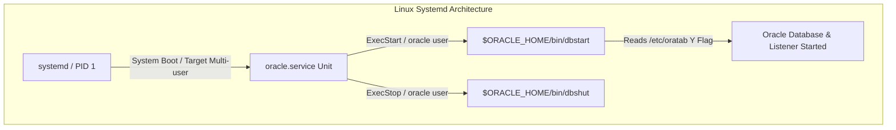

# CHAPTER 10. 서비스 자동 시작 및 운영 상태 검증

Oracle Database 19c 및 네트워크 리스너가 성공적으로 구축된 후에는 운영체제(OS) 재부팅이나 전원 차단 후 재시동 시 데이터베이스 인스턴스와 리스너가 관리자의 수동 개입 없이 자동으로 정상 구동되도록 서비스 자동 시작 체계를 구성해야 합니다 (출처: administrators-reference-linux-and-unix-based-operating-systems.pdf, 2019). 또한 구동된 인스턴스와 OS 시스템 환경이 오라클 최적 모범 사례 및 권장 기준에 부합하는지 종합적으로 검증해야 합니다 (출처: clusterware-administration-and-deployment-guide.pdf, 2019).

본 장에서는 `/etc/oratab` 파일 설정과 `dbora` 시작/종료 스크립트 작성, Oracle Linux 9의 최신 서비스 관리자인 **systemd 서비스 유닛 (`oracle.service`)** 등록 및 자동 시작 구성, 그리고 **CVU(Cluster Verification Utility)** 유틸리티를 활용한 시스템 및 오라클 구성 종합 검증 절차를 단계별로 다룹니다.

---

## 10.1 `/etc/oratab` 파일 설정 및 `dbora` 스크립트 작성

### `/etc/oratab` 파일 구조 및 자동 시작 플래그 설정

Linux 운영체제에서 오라클 자동 시작 스크립트인 `dbstart`와 종료 스크립트인 `dbshut`은 **`/etc/oratab`** 파일에 등록된 인스턴스 식별자(SID)와 오라클 홈 경로, 그리고 자동 시작 플래그를 참조하여 동작합니다 (출처: administrators-reference-linux-and-unix-based-operating-systems.pdf, 2019).

`/etc/oratab` 파일 내의 각 라인은 콜론(`:`)으로 구분된 3개의 필드로 구성됩니다 (출처: administrators-reference-linux-and-unix-based-operating-systems.pdf, 2019).

```text
# /etc/oratab 필드 구문 형식
$ORACLE_SID:$ORACLE_HOME:<N|Y|W>
```

#### 표 10-1. `/etc/oratab` 파일 필드 규격 및 자동 시작 플래그 의미

| 필드 순서 | 항목 | 설명 및 설정값 |
| :---: | :--- | :--- |
| **첫 번째** | **`$ORACLE_SID`** | 자동 시작/종료 대상 데이터베이스 인스턴스 식별자 (예: `orcl`) (출처: administrators-reference-linux-and-unix-based-operating-systems.pdf, 2019) |
| **두 번째** | **`$ORACLE_HOME`** | 해당 데이터베이스가 설치된 오라클 홈의 절대 경로 (출처: administrators-reference-linux-and-unix-based-operating-systems.pdf, 2019) |
| **세 번째** | **`Auto-start Flag`** | **`Y`**: `dbstart`/`dbshut` 실행 시 자동 시작 및 종료 대상 지정 <br>**`N`**: 자동 시작 및 종료 대상에서 제외 <br>**`W`**: Oracle Restart/ASM 인스턴스가 먼저 구동된 후 시작 대기 (출처: administrators-reference-linux-and-unix-based-operating-systems.pdf, 2019) |

#### `/etc/oratab` 파일 편집 및 `Y` 플래그 반영

데이터베이스 인스턴스가 `dbstart` 스크립트에 의해 자동 개시되도록 세 번째 필드를 `N`에서 **`Y`**로 변경합니다 (출처: administrators-reference-linux-and-unix-based-operating-systems.pdf, 2019).

```ini
# /etc/oratab 편집 예시
# <SID>:<ORACLE_HOME>:Y
orcl:/u01/app/oracle/product/19.0.0/dbhome_1:Y
```

---

### `dbora` Shell 스크립트 작성 및 권한 설정

OS 초기화 서비스가 오라클 계정으로 `dbstart` 및 `dbshut` 유틸리티를 비대화형으로 호출할 수 있도록 `/etc/init.d/dbora` (또는 사용자 정의 셸 스크립트) 환경을 작성합니다 (출처: administrators-reference-linux-and-unix-based-operating-systems.pdf, 2019).

```bash
# 1. /etc/init.d/dbora 스크립트 작성 (root 계정)
$ sudo vi /etc/init.d/dbora

#!/bin/sh
# description: Oracle Auto Start/Stop Script
# processname: oracle

ORA_HOME=/u01/app/oracle/product/19.0.0/dbhome_1
ORA_OWNER=oracle

if [ ! -f $ORA_HOME/bin/dbstart ]
then
    echo "Oracle startup file $ORA_HOME/bin/dbstart does not exist"
    exit 1
fi

case "$1" in
    'start')
        # Oracle Database & Listener 시작
        echo "Starting Oracle Database and Listener..."
        su - $ORA_OWNER -c "$ORA_HOME/bin/dbstart $ORA_HOME"
        touch /var/lock/subsys/dbora
        ;;
    'stop')
        # Oracle Database & Listener 종료
        echo "Stopping Oracle Database and Listener..."
        su - $ORA_OWNER -c "$ORA_HOME/bin/dbshut $ORA_HOME"
        rm -f /var/lock/subsys/dbora
        ;;
    'status')
        su - $ORA_OWNER -c "ps -ef | grep pmon"
        ;;
    *)
        echo "Usage: $0 {start|stop|status}"
        exit 1
        ;;
esac
exit 0
```

#### `dbora` 스크립트 실행 권한 및 소유권 변경

`dbora` 스크립트의 소유 그룹을 OSDBA 그룹(`dba`)으로 변경하고 execution 권한(`750`)을 부여합니다 (출처: administrators-reference-linux-and-unix-based-operating-systems.pdf, 2019).

```bash
# dbora 권한 및 소유그룹 설정
$ sudo chgrp dba /etc/init.d/dbora
$ sudo chmod 750 /etc/init.d/dbora
```

---

## 10.2 systemd 서비스 유닛 스크립트 (`oracle.service`) 등록 및 자동 시작

### Linux systemd 아키텍처와 전통적 init.d 방식의 차이

Oracle Linux 9 시스템은 기존 SysV init 방식 대신 **systemd** 프로세스를 통해 모든 데몬과 데몬 간 의존성 관계를 병렬 및 비동기로 제어합니다. 전통적인 `/etc/init.d/dbora` 심볼릭 링크 방식 대신 `/etc/systemd/system/oracle.service` 유닛 파일을 등록하는 것이 Oracle Linux 9 환경의 모범 사례입니다.



---

### `/etc/systemd/system/oracle.service` 유닛 파일 작성

`oracle.service` 유닛 파일을 생성하여 OS 부팅 프로세스 후반부에 네트워크 서비스가 준비된 후 `oracle` 계정 권한으로 `dbstart` 및 `dbshut`이 실행되도록 작성합니다.

```ini
# /etc/systemd/system/oracle.service
[Unit]
Description=Oracle Database 19c and Listener Service
After=network.target network-online.target remote-fs.target time-sync.target
Wants=network-online.target

[Service]
Type=forking
LimitNOFILE=65536
LimitNPROC=16384
LimitMEMLOCK=infinity
KillMode=none
SendSIGKILL=no
TimeoutSec=15min
User=oracle
Group=oinstall
Environment="ORACLE_HOME=/u01/app/oracle/product/19.0.0/dbhome_1"
Environment="ORACLE_BASE=/u01/app/oracle"
Environment="ORACLE_SID=orcl"
ExecStart=/u01/app/oracle/product/19.0.0/dbhome_1/bin/dbstart /u01/app/oracle/product/19.0.0/dbhome_1
ExecStop=/u01/app/oracle/product/19.0.0/dbhome_1/bin/dbshut /u01/app/oracle/product/19.0.0/dbhome_1
RemainAfterExit=yes

[Install]
WantedBy=multi-user.target
```

---

### systemd 데몬 데몬 재로드 및 자동 시작 등록

`systemctl` CLI 유틸리티를 사용하여 신규 작성된 `oracle.service` 유닛을 데몬에 등록하고 활성화합니다.

```bash
# 1. systemd 환경 구성 재로드
$ sudo systemctl daemon-reload

# 2. oracle.service 자동 시작 활성화 (부팅 시 자동 구동)
$ sudo systemctl enable oracle.service
Created symlink /etc/systemd/system/multi-user.target.wants/oracle.service → /etc/systemd/system/oracle.service.

# 3. oracle.service 수동 제어 및 시작 테스트
$ sudo systemctl start oracle.service

# 4. oracle.service 구동 상태 점검
$ sudo systemctl status oracle.service
● oracle.service - Oracle Database 19c and Listener Service
     Loaded: loaded (/etc/systemd/system/oracle.service; enabled; vendor preset: disabled)
     Active: active (running) since Wed 2026-09-30 11:30:00 KST; 1min 20s ago
    Process: 12450 ExecStart=/u01/app/oracle/product/19.0.0/dbhome_1/bin/dbstart ... (code=exited, status=0/SUCCESS)
   Main PID: 12450 (code=exited, status=0/SUCCESS)
      Tasks: 62 (limit: 48800)
     Memory: 4.8G
        CPU: 3.120s
     CGroup: /system.slice/oracle.service
             ├─12510 tnslsnr LISTENER -inherit
             ├─12550 ora_pmon_orcl
             └─12552 ora_clnt_orcl
```

---

## 10.3 CVU(Cluster Verification Utility) CLI 종합 검증

### CVU 유틸리티의 개요 및 두 가지 실행 스크립트

**Cluster Verification Utility (CVU)**는 시스템 요구사항, OS 커널 파라미터, 네트워크 정합성, 오라클 제품 구성 요소 및 권한 상태가 규격에 적합한지 검증하는 진단 유틸리티입니다 (출처: clusterware-administration-and-deployment-guide.pdf, 2019).

CVU는 실행 시점에 따라 두 가지 실행 형태를 제공합니다 (출처: clusterware-administration-and-deployment-guide.pdf, 2019).

1. **`runcluvfy.sh`**: 오라클 설치 미디어 스테이지 디렉토리에서 실행하는 스크립트로, 오라클 소프트웨어가 설치되기 전 시스템 사전 요구사항을 검증할 때 사용합니다 (출처: clusterware-administration-and-deployment-guide.pdf, 2019).
2. **`cluvfy`**: 오라클 홈 또는 Grid 홈(`$ORACLE_HOME/bin/cluvfy`)에 설치된 유틸리티로, 오라클 소프트웨어 및 데이터베이스 구축 완료 후 운영 상태 정합성을 검증할 때 사용합니다 (출처: clusterware-administration-and-deployment-guide.pdf, 2019).

#### 표 10-2. CVU CLI 구문 패턴 및 주요 컴포넌트 옵션

| 구분 | CLI 구문 형태 | 주요 검증 목적 |
| :--- | :--- | :--- |
| **시스템 종합 검증** | `cluvfy comp sys -p database` | OS 메모리, Swap, 커널 파라미터, 필수 패키지 충족 상태 검증 (출처: clusterware-administration-and-deployment-guide.pdf, 2019) |
| **관리 권한 검증** | `cluvfy comp admprv -o db_inst` | 오라클 계정 및 그룹 권한, 파일시스템 접근 권한 검증 (출처: clusterware-administration-and-deployment-guide.pdf, 2019) |
| **네트워크 연결 검증** | `cluvfy comp nodecon -n <node_list>` | 네트워크 인터페이스 및 노드 간 IP 연결성 상태 검증 (출처: clusterware-administration-and-deployment-guide.pdf, 2019) |
| **모범 사례 검증** | `cluvfy comp healthcheck -collect database` | 오라클 권장 구성 지침 및 헬스체크 종합 리포트 생성 (출처: clusterware-administration-and-deployment-guide.pdf, 2019) |

---

### `cluvfy comp sys`를 통한 OS 및 데이터베이스 설치 환경 검증

오라클 시스템 전반의 요구사항 준수 여부를 `cluvfy comp sys` 명령으로 정밀 진단합니다 (출처: clusterware-administration-and-deployment-guide.pdf, 2019).

```bash
# cluvfy comp sys 명령 구동 (oracle 계정)
$ cluvfy comp sys -p database -osdba dba -orainv oinstall -verbose

Verifying System Requirements
  Checking Operating System Version...
  Node Name: dbserver.example.com
  Operating System Version: 5.14.0-284.11.1.el9_2.x86_64 (Oracle Linux 9)
  Check: Operating System Version passed

  Checking Physical Memory...
  Node Name: dbserver.example.com
  Available Physical Memory: 31.8GB (33342464KB)
  Required Physical Memory: 1.0GB (1048576KB)
  Check: Physical Memory passed

  Checking Swap Space...
  Node Name: dbserver.example.com
  Available Swap Space: 16.0GB (16777212KB)
  Required Swap Space: 16.0GB (16777212KB)
  Check: Swap Space passed

  Checking Kernel Parameters...
  fs.file-max = 6815744 (PASSED)
  kernel.sem = 250 32000 100 128 (PASSED)
  kernel.shmmax = 34359738368 (PASSED)
  kernel.shmall = 8388608 (PASSED)
  Check: Kernel Parameters passed

Verification of system requirements was successful.
```

---

### `cluvfy comp healthcheck` 모범 사례 종합 리포트 생성

`cluvfy comp healthcheck` 명령을 구동하면 인프라 및 데이터베이스 시스템 환경을 점검하여 오라클 최적 가이드라인 준수 여부를 텍스트 및 HTML 리포트로 출력합니다 (출처: clusterware-administration-and-deployment-guide.pdf, 2019).

```bash
# 헬스체크 검증 및 리포트 생성
$ cluvfy comp healthcheck -collect database -bestpractice -save -savedir /u01/app/oracle/reports

Verifying Health Check
  Collecting Database Baseline Information...
  Checking Best Practice Compliance...
  Generating Health Check Validation Report...

Report saved in directory: /u01/app/oracle/reports/cvucheckreport_20260930_113500.txt
Verification of Health Check was successful.
```

---

### 💬 기획 편집자 노트 (Next Step)

Chapter 10에서는 `/etc/oratab` 설정과 `dbora` 스크립트 작성, Oracle Linux 9 systemd 유닛 등록(`oracle.service`)을 통한 자동 시작 구현, 그리고 `cluvfy` CLI 도구를 활용한 시스템 및 오라클 종합 환경 검증을 완성했습니다.

이어지는 **CHAPTER 11**에서는 ARCHIVELOG 모드 커맨드라인 전환, Fast Recovery Area(FRA) 관리, 그리고 RMAN 백업/복구 기초 정책 및 Shell 스크립트 작성을 정밀하게 다룰 예정입니다. CHAPTER 11 본문 집필을 계속 진행할까요?
