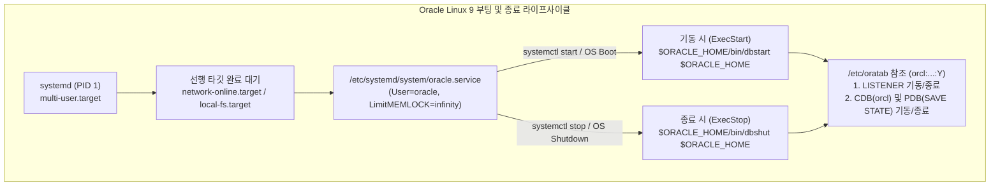

<!-- 
  [출판 조판 및 폰트 지정 명세 (Typography Specification)]
  - 본문(Body), 표(Table), 캡션(Caption), 영문 기술 용어: Noto Sans KR (Regular/Medium)
  - 장/절 제목(Headings H1~H4): Noto Sans KR Bold
  - 코드, 명령어, SQL 및 설정 블록(Code/SQL Blocks): DejaVu Sans Mono
-->

# CHAPTER 10. 서비스 자동 시작 및 운영 상태 검증

Oracle Database 19c 인스턴스와 네트워크 리스너가 성공적으로 구축되고 패치 및 메모리 튜닝까지 완료되었다면, 이제 운영체제(OS)가 정기 점검이나 예기치 못한 전원 장애로 재부팅될 때 관리자의 수동 개입 없이도 데이터베이스 서비스가 안전하게 종료되고 자동 기동되도록 **OS 서비스 자동화 체계**를 수립해야 합니다. 아울러 본격적인 실무 투입(Production Go-Live)에 앞서 서버 커널, 스토리지, 네트워크, 데이터베이스 설정이 오라클 공식 모범 사례(Best Practices)에 부합하는지 종합적으로 진단해야 합니다.

본 장에서는 `/etc/oratab` 파일의 구성과 `dbstart`·`dbshut` 유틸리티의 동작 원리를 살펴보고, Oracle Linux 9의 표준 서비스 관리자인 **`systemd` 서비스 유닛(`oracle.service`)**을 통해 HugePages(`LimitMEMLOCK`) 및 멀티테넌트 PDB까지 완벽하게 자동 기동하는 구성을 실습합니다. 이어서 **CVU(Cluster Verification Utility)**를 활용한 시스템 및 데이터베이스 종합 헬스체크 절차를 단계별로 다룹니다.

---

## 10.1 `/etc/oratab` 파일 설정 및 시작/종료 스크립트 구조

### 1. `/etc/oratab` 파일 구조와 자동 시작 플래그

Linux 및 UNIX 환경에서 오라클이 기본 제공하는 시작 스크립트(`$ORACLE_HOME/bin/dbstart`)와 종료 스크립트(`$ORACLE_HOME/bin/dbshut`)는 **`/etc/oratab`** 파일을 참조하여 어떤 인스턴스를 자동으로 기동하고 종료할지 결정합니다. 이 파일은 Chapter 05에서 `root.sh`를 실행할 때 생성되며, Chapter 07에서 DBCA로 데이터베이스를 생성할 때 인스턴스 정보가 자동으로 등록됩니다.

`/etc/oratab` 파일의 각 행은 주석(`#`)을 제외하고 콜론(`:`)으로 구분된 3개의 필드로 구성됩니다.

```text
# /etc/oratab 필드 구문 형식
$ORACLE_SID:$ORACLE_HOME:<N|Y|W>
```

| 필드 순서 | 항목명 | 설명 및 지정 가능한 값 |
| :---: | :--- | :--- |
| **첫 번째 필드** | **`$ORACLE_SID`** | 자동 시작 및 종료 대상 데이터베이스 인스턴스의 시스템 식별자 (예: `orcl`) |
| **두 번째 필드** | **`$ORACLE_HOME`** | 해당 인스턴스가 속한 오라클 홈의 절대 경로 (예: `/u01/app/oracle/product/19.0.0/dbhome_1`) |
| **세 번째 필드** | **`Auto-start Flag`** | • **`Y`**: `dbstart` 및 `dbshut` 실행 시 해당 인스턴스를 자동으로 기동 및 종료함<br/>• **`N`** (기본값): 자동 시작 및 종료 대상에서 제외함<br/>• **`W`**: Oracle Restart(ASM) 환경에서 ASM 인스턴스가 먼저 마운트될 때까지 대기(Wait)한 후 기동함 |

*표 10-1: `/etc/oratab` 파일 필드 규격 및 플래그 의미*

> 💡 **노트(Note): `dbstart`/`dbshut`의 Deprecated 지정과 대안**
> *Oracle Database Administrator's Reference for Linux and UNIX-Based Operating Systems 19c* 공식 문서에 따르면, 전통적인 `dbstart` 및 `dbshut` 스크립트는 향후 버전에서 지원이 중단될 수 있는 **Deprecated(중단 예고)** 기능으로 분류되어 있습니다. 오라클은 Grid Infrastructure(Oracle Restart 또는 SEHA) 환경에서는 **`srvctl`**(클러스터웨어 자동 관리)을 사용할 것을 권장하며, 단일 인스턴스(Standalone) 환경에서는 `dbstart`/`dbshut`을 활용하거나 `systemd` 유닛에서 직접 SQL*Plus 및 `lsnrctl` 스크립트를 호출하는 방식을 사용할 수 있습니다. 본 절에서는 현장에서 가장 널리 쓰이는 `dbstart`/`dbshut` 연동 방식과 주의사항을 함께 설명합니다.

### 2. `/etc/oratab` 파일의 자동 시작 플래그(`Y`) 활성화

DBCA는 데이터베이스를 생성할 때 보안을 위해 `/etc/oratab`의 세 번째 필드를 항상 기본값인 **`N`**으로 등록합니다. 텍스트 편집기나 `sed` 명령을 사용하여 `orcl` 인스턴스의 플래그를 **`Y`**로 변경합니다.

```bash
# 1. 현재 /etc/oratab에 등록된 orcl 항목 확인
$ grep -vE "^#|^$" /etc/oratab
orcl:/u01/app/oracle/product/19.0.0/dbhome_1:N

# 2. 세 번째 필드를 N에서 Y로 변경 (oracle 또는 root 계정)
$ sed -i 's/^\(orcl:.*:\)N$/\1Y/' /etc/oratab

# 3. 변경 결과 확인
$ grep -vE "^#|^$" /etc/oratab
orcl:/u01/app/oracle/product/19.0.0/dbhome_1:Y
```

```ini
# /etc/oratab 최종 설정 상태
orcl:/u01/app/oracle/product/19.0.0/dbhome_1:Y
```

> 💡 **노트(Note): CDB 자동 기동 시 PDB(`ORCLPDB1`)도 함께 열리는 이유**
> `dbstart` 스크립트는 내부적으로 루트 컨테이너(`CDB$ROOT`)에 대해 `STARTUP` 명령만 수행합니다. 만약 Chapter 07(7.3절)에서 **`ALTER PLUGGABLE DATABASE ALL SAVE STATE;`** 명령을 실행해 두지 않았다면, 서버 재부팅 후 CDB는 열리더라도 하위 PDB(`ORCLPDB1`)는 `MOUNTED` 상태에 머물러 애플리케이션 접속이 실패하게 됩니다. `/etc/oratab`의 `Y` 설정과 PDB의 `SAVE STATE` 설정은 반드시 한 쌍으로 구성되어야 합니다.

---

### 3. `dbstart`·`dbshut`의 동작 메커니즘과 전통적 `dbora` 스크립트

`$ORACLE_HOME/bin/dbstart`와 `$ORACLE_HOME/bin/dbshut`을 실행할 때는 반드시 첫 번째 인자로 **리스너 바이너리가 위치한 오라클 홈 경로(`$ORACLE_HOME_LISTNER`, 일반적으로 `$ORACLE_HOME`과 동일)**를 전달해야 합니다.

* **`$ORACLE_HOME/bin/dbstart $ORACLE_HOME` 실행 시**:
  1. 인자로 전달받은 경로의 `bin/lsnrctl start`를 호출하여 기본 리스너(`LISTENER`)를 먼저 기동합니다.
  2. `/etc/oratab` 파일을 스캔하여 세 번째 필드가 `Y`인 모든 인스턴스에 대해 순차적으로 `sqlplus / as sysdba` 접속 후 `STARTUP`을 수행합니다.
* **`$ORACLE_HOME/bin/dbshut $ORACLE_HOME` 실행 시**:
  1. 먼저 `bin/lsnrctl stop`을 호출하여 리스너를 정지합니다.
  2. `/etc/oratab`에서 플래그가 `Y`인 인스턴스들에 대해 `SHUTDOWN IMMEDIATE`를 수행하여 안전하게 체크포인트를 발생시키고 데이터베이스를 닫습니다.

과거 Oracle Linux 6 이하(SysVinit 환경)에서는 `/etc/init.d/dbora` 셸 스크립트를 작성하고 `chkconfig`로 등록했지만, **Oracle Linux 9 환경에서는 다음 10.2절에서 다룰 네이티브 `systemd` 유닛 파일(`/etc/systemd/system/oracle.service`)에서 직접 `dbstart`와 `dbshut`을 호출**하는 것이 가장 깔끔하고 표준에 부합합니다. 만약 사내 운영 표준상 별도의 래퍼(Wrapper) 스크립트인 `/etc/init.d/dbora`를 유지해야 하는 경우 아래와 같이 작성할 수 있습니다.

```bash
# [선택 사항] 레거시 호환용 /etc/init.d/dbora 스크립트 예시 (root 계정)
#!/bin/sh
# chkconfig: 345 99 10
# description: Oracle Auto Start-Stop Script

ORA_HOME=/u01/app/oracle/product/19.0.0/dbhome_1
ORA_OWNER=oracle

if [ ! -f $ORA_HOME/bin/dbstart ]; then
    echo "Oracle startup: cannot start ($ORA_HOME/bin/dbstart missing)"
    exit 1
fi

case "$1" in
    'start')
        su - $ORA_OWNER -c "$ORA_HOME/bin/dbstart $ORA_HOME"
        mkdir -p /var/lock/subsys
        touch /var/lock/subsys/dbora
        ;;
    'stop')
        su - $ORA_OWNER -c "$ORA_HOME/bin/dbshut $ORA_HOME"
        rm -f /var/lock/subsys/dbora
        ;;
    'status')
        ps -ef | grep -E "ora_pmon_|tnslsnr" | grep -v grep
        ;;
    *)
        echo "Usage: $0 {start|stop|status}"
        exit 1
        ;;
esac
exit 0
```

---

## 10.2 `systemd` 서비스 유닛(`oracle.service`) 등록 및 자동 시작

### 1. Oracle Linux 9 `systemd` 아키텍처와 PAM 리소스 제한 주의사항

Oracle Linux 9은 시스템의 첫 번째 프로세스(PID 1)인 **`systemd`**를 통해 모든 서비스의 기동 순서(의존성)와 리소스 제한(Control Groups 및 `ulimit`)을 관리합니다.


*그림 10-1: Oracle Linux 9 `systemd` 기반 오라클 서비스 자동 기동·종료 아키텍처*

> ⚠️ **주의(Caution): `systemd` 유닛 작성 시 `LimitMEMLOCK=infinity`를 빠뜨리면 DB가 기동되지 않습니다!**
> 관리자가 SSH로 로그인하여 `su - oracle`을 실행할 때는 PAM 모듈(`pam_limits.so`)이 작동하여 Chapter 04에서 설정한 `/etc/security/limits.d/oracle-database-preinstall-19c.conf` 파일의 리소스 제한(`memlock`, `nofile`, `nproc`, `stack`)을 읽어옵니다.
> 하지만 **부팅 시 `systemd`(PID 1)가 백그라운드에서 직접 기동하는 서비스 프로세스는 `/etc/security/limits.d/*.conf` 파일을 전혀 읽지 않고 `systemd` 자체 기본값을 적용**합니다! 따라서 `oracle.service` 유닛 파일의 `[Service]` 섹션 내부에 **`LimitMEMLOCK=infinity`**, **`LimitNOFILE=65536`**, **`LimitNPROC=16384`**, **`LimitSTACK=32768K`**를 명시적으로 선언해 주지 않으면, 부팅 시 오라클 인스턴스가 HugePages 메모리를 잠그지 못해 `ORA-27137: unable to allocate Large Pages` 에러를 내며 기동에 실패합니다.

---

### 2. `/etc/systemd/system/oracle.service` 유닛 파일 작성

`root` 계정으로 `/etc/systemd/system/oracle.service` 파일을 생성합니다. 네트워크와 로컬/원격 파일 시스템 마운트가 완전히 끝난 뒤에 기동되도록 `[Unit]` 의존성을 설정하고, OS 종료 시 체크포인트가 끝날 때까지 `systemd`가 오라클 백그라운드 프로세스를 강제 종료(`SIGKILL`)하지 않도록 `SendSIGKILL=no`와 충분한 `TimeoutStopSec`을 부여합니다.

```bash
# root 계정에서 /etc/systemd/system/oracle.service 생성
$ sudo tee /etc/systemd/system/oracle.service << 'EOF'
[Unit]
Description=Oracle Database 19c and Listener Service
After=syslog.target network-online.target local-fs.target remote-fs.target time-sync.target
Wants=network-online.target

[Service]
Type=forking
User=oracle
Group=oinstall

# Oracle 19c 필수 리소스 한도 (limits.d 설정과 동일하게 명시)
LimitNOFILE=65536
LimitNPROC=16384
LimitSTACK=32768K
LimitMEMLOCK=infinity

# 환경 변수 선언
Environment="ORACLE_BASE=/u01/app/oracle"
Environment="ORACLE_HOME=/u01/app/oracle/product/19.0.0/dbhome_1"
Environment="ORACLE_SID=orcl"

# 시작 및 종료 명령 (인자로 $ORACLE_HOME 전달 필수)
ExecStart=/u01/app/oracle/product/19.0.0/dbhome_1/bin/dbstart /u01/app/oracle/product/19.0.0/dbhome_1
ExecStop=/u01/app/oracle/product/19.0.0/dbhome_1/bin/dbshut /u01/app/oracle/product/19.0.0/dbhome_1

# 안전한 체크포인트 종료(SHUTDOWN IMMEDIATE)를 위한 타임아웃 및 시그널 보호
RemainAfterExit=yes
SendSIGKILL=no
TimeoutStartSec=10min
TimeoutStopSec=15min

[Install]
WantedBy=multi-user.target
EOF
```

---

### 3. `systemd` 데몬 리로드, 서비스 등록 및 재기동 검증

유닛 파일 작성이 완료되면 먼저 기존에 수동으로 띄워 두었던 DB 인스턴스와 리스너를 종료한 뒤, `systemctl` 명령으로 `oracle.service`가 리스너, CDB(`orcl`), 그리고 PDB(`ORCLPDB1`)를 한 번에 정상적으로 올리고 내리는지 테스트합니다.

```bash
# 1. 테스트를 위해 현재 수동으로 떠 있는 DB와 리스너를 oracle 계정에서 먼저 정지
$ su - oracle -c "sqlplus -S / as sysdba <<< 'SHUTDOWN IMMEDIATE;'"
$ su - oracle -c "lsnrctl stop LISTENER"

# 2. systemd 데몬 설정 리로드 및 부팅 시 자동 시작(enable) 등록
$ sudo systemctl daemon-reload
$ sudo systemctl enable oracle.service
Created symlink /etc/systemd/system/multi-user.target.wants/oracle.service → /etc/systemd/system/oracle.service.

# 3. systemctl을 통한 오라클 서비스 시작
$ sudo systemctl start oracle.service

# 4. 서비스 구동 상태 및 소속 프로세스(CGroup) 점검
$ sudo systemctl status oracle.service
● oracle.service - Oracle Database 19c and Listener Service
     Loaded: loaded (/etc/systemd/system/oracle.service; enabled; preset: disabled)
     Active: active (running) since Wed 2026-09-30 11:30:00 KST; 45s ago
    Process: 32450 ExecStart=/u01/app/oracle/product/19.0.0/dbhome_1/bin/dbstart /u01/app/oracle/product/19.0.0/dbhome_1 (code=exited, status=0/SUCCESS)
      Tasks: 78 (limit: 16384)
     Memory: 312.4M
        CPU: 4.210s
     CGroup: /system.slice/oracle.service
             ├─32510 /u01/app/oracle/product/19.0.0/dbhome_1/bin/tnslsnr LISTENER -inherit
             ├─32550 ora_pmon_orcl
             ├─32552 ora_psp0_orcl
             ├─32554 ora_vktm_orcl
             ├─32568 ora_dbw0_orcl
             ├─32570 ora_lgwr_orcl
             ├─32572 ora_ckpt_orcl
             ├─32574 ora_smon_orcl
             └─32588 ora_lreg_orcl
```

마지막으로 PDB(`ORCLPDB1`)까지 `READ WRITE` 모드로 정상 오픈되었는지 확인합니다.

```bash
$ su - oracle -c "sqlplus -S / as sysdba <<< 'SHOW PDBS;'"

    CON_ID CON_NAME                       OPEN MODE  RESTRICTED
---------- ------------------------------ ---------- ----------
         2 PDB$SEED                       READ ONLY  NO
         3 ORCLPDB1                       READ WRITE NO
```

---

## 10.3 사전 검증 도구 및 CVU(Cluster Verification Utility) 종합 검증

### 1. CVU(Cluster Verification Utility)와 내장 검증 도구의 이해

**Cluster Verification Utility(CVU)**는 OS 커널 파라미터, 필수 패키지, 스토리지 권한, 네트워크 인터페이스, 그리고 오라클 데이터베이스 구성이 오라클 공식 표준 요구사항과 모범 사례(Best Practices)를 충족하는지 정밀 진단하는 커맨드라인 도구입니다.

설치 환경에 따라 다음과 같이 두 가지 방식으로 환경 검증을 수행할 수 있습니다.

1. **단일 인스턴스(Standalone DB) 오라클 홈 내장 검증**:
   `$ORACLE_HOME/runInstaller -executePrereqs -silent` 명령을 실행하면 오라클 홈 내부(`$ORACLE_HOME/cv`)의 CVU 엔진이 현재 서버의 물리 메모리, 스왑, 커널 파라미터, OS 그룹 및 사용자 리소스 한도를 자동으로 검증합니다.
2. **`cluvfy` CLI 유틸리티 (Grid Infrastructure 홈 또는 단독 CVU 패키지)**:
   Oracle Grid Infrastructure(Oracle Restart 또는 SEHA)가 설치된 환경(`$GRID_HOME/bin/cluvfy`)이거나 My Oracle Support(Doc ID 2690848.1)에서 최신 Standalone CVU 패키지를 다운로드하여 압축 해제한 환경에서는 `cluvfy` 명령어를 직접 호출하여 세부 컴포넌트 점검 및 헬스체크 리포트를 생성할 수 있습니다.

| 검증 구분 | CVU CLI 명령어 구문 | 주요 진단 및 검증 범위 |
| :--- | :--- | :--- |
| **시스템 요구사항 검증** | `cluvfy comp sys -p database` | OS 버전, 물리 RAM, Swap, `/tmp` 여유 공간, 커널 파라미터, 리소스 한도(`ulimit`) 검증 |
| **관리자 권한 검증** | `cluvfy comp admprv -o db_inst` | `oracle` 계정, `oinstall`/`dba` 그룹 소속 여부 및 오라클 홈 디렉터리 권한 검증 |
| **네트워크 연결성 검증** | `cluvfy comp nodecon -n <호스트명>` | NIC 인터페이스, IP 주소, `/etc/hosts` 및 호스트명 해석 정합성 검증 |
| **모범 사례 헬스체크** | `cluvfy comp healthcheck -collect database` | 데이터베이스 파라미터, 메모리/Redo/아카이브 구성 등 오라클 모범 사례 준수 리포트 생성 |

*표 10-2: CVU(`cluvfy`) 주요 컴포넌트 검증 명령어*

---

### 2. `cluvfy comp sys`를 통한 OS 및 데이터베이스 시스템 환경 검증

`oracle` 계정에서 `cluvfy comp sys -p database` 명령을 실행하여 본서에서 구축한 Oracle Linux 9(UEK R7) 서버(`ora19se`)의 하드웨어 및 커널 설정이 완벽하게 통과(`PASSED`)하는지 확인합니다.

```bash
# oracle 계정에서 시스템 요구사항 종합 검증 실행
$ cluvfy comp sys -p database -osdba dba -orainv oinstall -verbose

Verifying System Requirements ...
  Verifying Physical Memory ...
    Node Name     Available                 Required                  Status
    ------------  ------------------------  ------------------------  ----------
    ora19se       31.8125GB (33357824.0KB)  1GB (1048576.0KB)         passed
  Verifying Physical Memory ...PASSED

  Verifying Available Physical Memory ...
    Node Name     Available                 Required                  Status
    ------------  ------------------------  ------------------------  ----------
    ora19se       17.4219GB (18268160.0KB)  50MB (51200.0KB)          passed
  Verifying Available Physical Memory ...PASSED

  Verifying Swap Size ...
    Node Name     Available                 Required                  Status
    ------------  ------------------------  ------------------------  ----------
    ora19se       16GB (16777212.0KB)       16GB (16777212.0KB)       passed
  Verifying Swap Size ...PASSED

  Verifying Kernel Version ...
    Node Name     Available                                 Status
    ------------  ----------------------------------------  ----------
    ora19se       5.15.0-205.149.5.1.el9uek.x86_64          passed
  Verifying Kernel Version ...PASSED

  Verifying Kernel Parameters ...
    Name                        Current           Configured        Status
    --------------------------  ----------------  ----------------  ----------
    fs.file-max                 6815744           6815744           passed
    fs.aio-max-nr               1048576           1048576           passed
    kernel.sem                  250 32000 100 128 250 32000 100 128 passed
    kernel.shmmax               34359738368       34359738368       passed
    kernel.shmall               8388608           8388608           passed
    kernel.shmmni               4096              4096              passed
    net.core.rmem_default       262144            262144            passed
    net.core.rmem_max           4194304           4194304           passed
    net.core.wmem_default       262144            262144            passed
    net.core.wmem_max           1048576           1048576           passed
    net.ipv4.ip_local_port_range 9000 65500       9000 65500        passed
  Verifying Kernel Parameters ...PASSED

Verification of system requirements was successful.

CVU operation performed:      system_requirement
Date:                         Sep 30, 2026 11:35:00 AM
CVU home:                     /u01/app/oracle/product/19.0.0/dbhome_1/
User:                         oracle
```

---

### 3. `cluvfy comp healthcheck`를 통한 모범 사례 종합 리포트 생성

구축이 완료된 데이터베이스의 초기화 파라미터, 스토리지 구조, 메모리 및 보안 설정이 오라클의 권장 모범 사례(Best Practices)를 준수하는지 감사(Audit)하고 결과 리포트를 파일로 보관하려면 `cluvfy comp healthcheck`를 활용합니다.

```bash
# 리포트 저장용 디렉터리 생성 후 데이터베이스 헬스체크 수행
$ mkdir -p /u01/app/oracle/reports
$ cluvfy comp healthcheck -collect database -db orcl -bestpractice -html -save -savedir /u01/app/oracle/reports

Verifying Health Check ...
  Collecting Database Baseline Information for "orcl" ...
  Checking Best Practice Compliance ...
  Generating Health Check Validation Report ...

Health check report saved in directory: /u01/app/oracle/reports/cvucheckreport_20260930_113800.html

Verification of Health Check was successful.
```

---

## 10.4 장 요약 (Chapter Summary)

이번 장에서는 오라클 데이터베이스 서비스를 리눅스 OS의 라이프사이클에 통합하여 무인 자동 기동·종료 체계를 완성하고, 전체 구성 상태를 검증했습니다.

1. **`/etc/oratab` 및 `dbstart`·`dbshut` 연동**: `/etc/oratab` 파일의 세 번째 필드를 `Y`로 설정하여 `dbstart` 및 `dbshut` 유틸리티가 리스너와 CDB(`orcl`), 그리고 `SAVE STATE`가 적용된 PDB(`ORCLPDB1`)를 일괄 기동·종료하도록 구성했습니다.
2. **Oracle Linux 9 `systemd` 유닛(`oracle.service`) 구현**: `systemd`가 `/etc/security/limits.d`를 우회하는 특성에 대비해 유닛 파일 내에 `LimitMEMLOCK=infinity`, `LimitNOFILE=65536`, `LimitNPROC=16384`를 명시하고, 안전한 체크포인트 종료를 위해 `SendSIGKILL=no`와 `TimeoutStopSec=15min`을 적용했습니다.
3. **CVU(`cluvfy`) 종합 검증**: `cluvfy comp sys`와 `cluvfy comp healthcheck`를 통해 UEK R7 커널, 메모리, 커널 파라미터 및 데이터베이스 모범 사례 준수 여부를 최종 진단했습니다.

다음 **Chapter 11**에서는 실무 운영의 가장 든든한 최후의 보루인 **ARCHIVELOG 모드 점검, Fast Recovery Area(FRA) 공간 모니터링, 그리고 RMAN(Recovery Manager) 백업 최적화 정책 및 `crontab` 연동 자동화 셸 스크립트 구축**을 다룹니다.

---

# References

[1] Oracle. 2024. *Database Administrator's Reference for Linux and UNIX-Based Operating Systems 19c (E96295): Chapter 2 Stopping and Starting Oracle Software*. Oracle America, Inc. Retrieved April 6, 2026 from https://docs.oracle.com/en/database/oracle/oracle-database/19/unxar/stopping-and-starting-oracle-software.html
[2] Oracle. 2024. *Oracle Clusterware Administration and Deployment Guide 19c (E96272): Chapter 13 Cluster Verification Utility Reference (cluvfy)*. Oracle America, Inc. Retrieved April 6, 2026 from https://docs.oracle.com/en/database/oracle/oracle-database/19/cwadd/cluster-verification-utility-reference.html
[3] Oracle. 2024. *Oracle Linux 9: Managing System Services With systemd (F51921)*. Oracle America, Inc. Retrieved April 6, 2026 from https://docs.oracle.com/en/operating-systems/oracle-linux/9/systemd/
[4] Oracle. 2024. *Oracle Database Installation Guide 19c for Linux (E96297): Postinstallation Tasks*. Oracle America, Inc. Retrieved April 6, 2026 from https://docs.oracle.com/en/database/oracle/oracle-database/19/ladbi/
