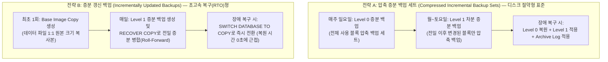

<!-- 
  [출판 조판 및 폰트 지정 명세 (Typography Specification)]
  - 본문(Body), 표(Table), 캡션(Caption), 영문 기술 용어: Noto Sans KR (Regular/Medium)
  - 장/절 제목(Headings H1~H4): Noto Sans KR Bold
  - 코드, 명령어, SQL 및 설정 블록(Code/SQL Blocks): DejaVu Sans Mono
-->

# CHAPTER 11. CLI 기반 RMAN 백업 스크립트 및 운영

데이터베이스 관리(DBA)의 최우선 사명은 스토리지 미디어 장애, 디스크 손상, 혹은 인적 오류(Human Error)가 발생하더라도 데이터의 무결성을 지켜내고 비즈니스 요구사항에 맞는 **목표 복구 시점(RPO, Recovery Point Objective)**과 **목표 복구 시간(RTO, Recovery Time Objective)**을 달성하는 것입니다. 오라클의 표준 백업·복구 엔진인 **RMAN(Recovery Manager)**은 데이터 블록 수준의 증분 백업, 실시간 블록 손상(Block Corruption) 검증, 그리고 멀티테넌트(CDB/PDB) 환경의 통합 복원 기능을 제공합니다.

본 장에서는 SQL*Plus 커맨드라인을 통한 `ARCHIVELOG` 모드 전환 절차와 Fast Recovery Area(FRA) 공간 관리 기법을 살펴보고, **Oracle Database 19c Standard Edition 2(SE2) 라이선스 규격에 부합하는 RMAN 영구 파라미터(`CONFIGURE`) 최적화**, 증분 백업 전략, 그리고 Linux `crontab`과 연동하는 무인 백업 자동화 셸 스크립트 구축을 단계별로 실습합니다.

---

## 11.1 ARCHIVELOG 모드 커맨드라인 전환 및 FRA 관리

### 1. ARCHIVELOG 모드의 동작 메커니즘과 필수성

오라클 데이터베이스의 리두 로그 운영 방식은 크게 **`NOARCHIVELOG` 모드**와 **`ARCHIVELOG` 모드**로 나뉩니다.

* **`NOARCHIVELOG` 모드 (기본값)**: 온라인 리두 로그(Online Redo Log) 그룹이 가득 차서 로그 스위치(Log Switch)가 발생하더라도 이전 로그를 별도로 보관하지 않고 다음 순환 주기에 그대로 덮어씁니다. 따라서 데이터베이스가 운영 중(`OPEN`)일 때는 일관성 있는 온라인 백업(Hot Backup)을 수행할 수 없으며, 디스크 장애 발생 시 마지막 오프라인 백업(Cold Backup) 이후의 모든 트랜잭션이 유실됩니다.
* **`ARCHIVELOG` 모드 (실무 운영 표준)**: 로그 스위치가 발생하는 즉시 백그라운드 프로세스인 **아카이버(`ARCn`, Archiver Processes)**가 채워진 온라인 리두 로그 파일을 읽어 지정된 아카이브 저장소(FRA 등)에 **아카이브 리두 로그(Archived Redo Log)** 파일로 복제·보존합니다. 해당 그룹의 아카이빙이 완료되기 전까지는 `LGWR` 프로세스가 그 온라인 리두 로그 그룹을 덮어쓸 수 없도록 보호하므로, 장애 발생 직전 시점(Point-in-Time Recovery)까지 **단 1건의 데이터 유실 없는 완전 복구(Complete Recovery)**와 **무중단 온라인 백업**이 가능해집니다.

```mermaid
flowchart LR
    subgraph Online["1. 온라인 리두 버퍼 및 로그"]
        LGWR["LGWR 프로세스"] -->|트랜잭션 기록| ORL1["Online Redo Group 1<br/>(/u03, /u04 다중화)"]
        ORL1 -->|Log Switch 발생| ORL2["Online Redo Group 2<br/>(/u03, /u04 다중화)"]
    end

    subgraph Archive["2. 아카이빙 및 백업 저장소"]
        ARCN["ARCn (Archiver)<br/>백그라운드 프로세스"]
        FRA["Fast Recovery Area (FRA)<br/>(/u05/fast_recovery_area)<br/>• Archived Redo Logs<br/>• RMAN Backup Sets / Image Copies<br/>• Control File Autobackup"]
    end

    ORL1 -->|읽기 및 복사| ARCN
    ARCN -->|아카이브 파일 생성 (.dbf/.arc)| FRA
```
*그림 11-1: `ARCHIVELOG` 모드의 리두 아카이빙 및 FRA 통합 저장 아키텍처*

| 비교 항목 | `NOARCHIVELOG` 모드 | `ARCHIVELOG` 모드 |
| :--- | :--- | :--- |
| **온라인 리두 로그 보존** | 순환 시 덮어씀 (아카이빙 미수행) | `ARCn` 프로세스가 아카이브 로그 파일로 영구 보존 |
| **운영 중 온라인 백업** | **불가** (`SHUTDOWN IMMEDIATE` 후 오프라인 백업만 가능) | **완벽 지원** (`OPEN` 상태에서 RMAN 온라인 백업 수행) |
| **장애 시 복구 가능 범위** | 마지막 백업 시점까지만 복원 가능 (이후 데이터 유실) | 장애 직전 커밋(Commit) 시점 및 특정 시점(PITR) 완벽 복구 |
| **적용 대상 워크로드** | 초기 마이그레이션 적재 또는 단순 개발/테스트 환경 | **모든 엔터프라이즈 실무 운영(Production) 데이터베이스** |

*표 11-1: `NOARCHIVELOG` 모드와 `ARCHIVELOG` 모드의 비교*

---

### 2. SQL*Plus CLI를 통한 `ARCHIVELOG` 모드 전환 절차

Chapter 07에서 우리는 `dbca` 실행 시 `-enableArchive true` 옵션을 부여하여 생성 시점부터 `ARCHIVELOG` 모드를 활성화했습니다. 하지만 실무에서는 초기 데이터 대량 이관(Data Migration) 속도를 높이기 위해 `NOARCHIVELOG` 모드로 DB를 먼저 구축한 뒤, 오픈 직전에 커맨드라인에서 `ARCHIVELOG` 모드로 전환하는 경우가 많습니다.

아카이브 모드 변경은 컨트롤 파일(Control File)의 데이터베이스 모드 비트를 갱신해야 하므로, 반드시 인스턴스를 정상 종료한 후 **`MOUNT` 상태**에서 수행해야 합니다.

```sql
$ sqlplus / as sysdba

-- 1. 현재 아카이브 로그 모드 및 아카이브 경로 확인
SQL> ARCHIVE LOG LIST;
Database log mode              No Archive Mode
Automatic archival             Disabled
Archive destination            USE_DB_RECOVERY_FILE_DEST
Oldest online log sequence     12
Current log sequence           14

-- 2. 데이터베이스 정상 종료 (SHUTDOWN ABORT 사용 금지!)
SQL> SHUTDOWN IMMEDIATE;
Database closed.
Database dismounted.
ORACLE instance shut down.

-- 3. 컨트롤 파일만 마운트하는 MOUNT 모드로 인스턴스 기동
SQL> STARTUP MOUNT;
ORACLE instance started.
... (중략) ...
Database mounted.

-- 4. ARCHIVELOG 모드로 전환 후 데이터베이스 오픈
SQL> ALTER DATABASE ARCHIVELOG;
Database altered.

SQL> ALTER DATABASE OPEN;
Database altered.

-- 5. 전환된 아카이브 로그 모드 및 아카이버(Enabled) 상태 확인
SQL> ARCHIVE LOG LIST;
Database log mode              Archive Mode
Automatic archival             Enabled
Archive destination            USE_DB_RECOVERY_FILE_DEST
Oldest online log sequence     12
Next log sequence to archive   14
Current log sequence           14

-- 6. 강제 로그 스위치를 발생시켜 FRA에 아카이브 로그가 정상 생성되는지 테스트
SQL> ALTER SYSTEM ARCHIVE LOG CURRENT;
System altered.
```

> ⚠️ **주의(Caution): `ARCHIVELOG` 모드 전환 직후에는 반드시 전체 백업을 수행하십시오**
> `NOARCHIVELOG` 모드에서 생성된 백업본은 리두 연속성이 없으므로 `ARCHIVELOG` 전환 이후의 미디어 복구에 사용할 수 없습니다. 따라서 `ALTER DATABASE ARCHIVELOG`를 수행한 직후에는 반드시 RMAN을 통해 전체 데이터베이스 백업(Full 또는 Level 0 Backup)을 즉시 확보해야 합니다.

---

### 3. Fast Recovery Area(FRA) 공간 모니터링 및 동적 증설

Fast Recovery Area(FRA, `/u05/fast_recovery_area`)는 아카이브 리두 로그, RMAN 백업 세트, 컨트롤 파일 자동 백업본이 통합 관리되는 디스크 영역입니다. 만약 백업 정책 미비나 대량 배치 작업으로 인해 **FRA의 사용률이 100%에 도달하면, `ARCn` 프로세스가 더 이상 아카이브 로그를 기록하지 못해 데이터베이스 전체의 DML 트랜잭션이 멈추는(Archiver Stuck / Hang) 심각한 장애**로 이어집니다.

따라서 DBA는 `V$RECOVERY_FILE_DEST`와 `V$RECOVERY_AREA_USAGE` 뷰를 상시 모니터링해야 합니다.

```sql
-- 1. FRA 전체 할당 용량, 현재 사용량, 자동 회수 가능(Reclaimable) 용량 조회
SQL> SET LINESIZE 150
SQL> COL name FORMAT A30
SQL> SELECT name,
            ROUND(space_limit / 1024 / 1024 / 1024, 2) AS limit_gb,
            ROUND(space_used / 1024 / 1024 / 1024, 2) AS used_gb,
            ROUND(space_reclaimable / 1024 / 1024 / 1024, 2) AS reclaim_gb,
            number_of_files
     FROM v$recovery_file_dest;

NAME                             LIMIT_GB    USED_GB RECLAIM_GB NUMBER_OF_FILES
------------------------------ ---------- ---------- ---------- ---------------
/u05/fast_recovery_area            200.00      24.50       6.12              38

-- 2. FRA 내부 파일 유형별 점유율(%) 상세 조회
SQL> COL file_type FORMAT A25
SQL> SELECT file_type,
            percent_space_used,
            percent_space_reclaimable,
            number_of_files
     FROM v$recovery_area_usage;

FILE_TYPE                 PERCENT_SPACE_USED PERCENT_SPACE_RECLAIMABLE NUMBER_OF_FILES
------------------------- ------------------ ------------------------- ---------------
CONTROL FILE                             .05                         0               1
REDO LOG                                1.50                         0               3
ARCHIVED LOG                            4.20                      1.06              24
BACKUP PIECE                            6.50                      2.00              10
IMAGE COPY                               .00                         0               0
FLASHBACK LOG                            .00                         0               0
FOREIGN ARCHIVED LOG                     .00                         0               0
AUXILIARY DATAFILE COPY                  .00                         0               0
```

> 💡 **노트(Note)**: `PERCENT_SPACE_RECLAIMABLE`(회수 가능 공간)은 RMAN 보존 정책(`RETENTION POLICY`)이 만료(Obsolete)되었거나 이미 백업이 완료되어 FRA 공간이 부족해질 때 오라클이 자동으로 삭제하여 재사용할 수 있는 안전한 여유 공간을 의미합니다.

만약 `/u05` 파일 시스템의 물리적 디스크 여유 공간이 충분한 상태에서 FRA 논리적 쿼터(`DB_RECOVERY_FILE_DEST_SIZE`)를 늘려야 한다면, 인스턴스 재기동 없이 온라인 상태에서 즉시 확장할 수 있습니다.

```sql
-- FRA 논리적 한도 용량을 200 GB에서 250 GB로 무중단 동적 확장
SQL> ALTER SYSTEM SET db_recovery_file_dest_size = 250G SCOPE=BOTH;

System altered.
```

---

## 11.2 RMAN 최적화 구성 및 자동 백업 셸 스크립트 구축

### 1. Oracle 19c SE2 라이선스 규격에 맞춘 RMAN 영구 파라미터(`CONFIGURE`) 설정

RMAN을 실행할 때마다 동일한 옵션을 반복해서 지정하지 않도록, `CONFIGURE` 명령을 사용하여 백업 정책을 컨트롤 파일 내부에 영구 저장합니다.

이때 **Oracle Database 19c Standard Edition 2(SE2)** 환경에서는 Enterprise Edition(EE)과 구분되는 **두 가지 핵심 라이선스 및 기능 제약 사항**을 반드시 준수해야 합니다.

> ⚠️ **주의(Caution): Oracle 19c SE2 환경의 RMAN 2대 필수 제약 사항**
> 1. **병렬 채널(`PARALLELISM`)은 반드시 `1`로 설정해야 합니다**:
>    Oracle 19c 공식 라이선스 매뉴얼(*Database Licensing Information User Manual 19c*)에 따라 **병렬 백업 및 복구(Parallel Backup and Recovery)는 Enterprise Edition 전용 기능**입니다. SE2 환경에서 `PARALLELISM 2` 이상을 설정하거나 `RUN` 블록에서 2개 이상의 채널(`ch1`, `ch2`)을 동시에 할당해 백업을 시도하면 `ORA-00439: feature not enabled: Parallel backup and recovery` 오류가 발생하거나 단일 채널로 강제 제한됩니다.
> 2. **백업 압축 알고리즘은 기본 제공되는 `'BASIC'`만 사용해야 합니다**:
>    RMAN의 기본 이진 압축 알고리즘인 **`BASIC`(BZIP2/ZLIB 기반 기본 압축)**은 SE2를 포함한 모든 에디션에서 추가 라이선스 없이 무료로 사용할 수 있습니다. 반면 `LOW`, `MEDIUM`, `HIGH` 압축 알고리즘은 유료 옵션인 *Oracle Advanced Compression* 대상이므로 SE2에서는 사용할 수 없습니다. 또한 증분 백업 시 변경 블록만 추적하는 **Block Change Tracking(BCT)** 기능 역시 EE 전용(`SE2: N`)이므로 활성화해서는 안 됩니다.

위 SE2 규격에 맞춰 RMAN에 접속한 후 최적의 영구 파라미터를 설정합니다.

```bash
# oracle 계정에서 OS 인증으로 RMAN 접속 (CDB$ROOT 대상)
$ rman target /

Recovery Manager: Release 19.0.0.0.0 - Production on Wed Sep 30 14:00:00 2026
Version 19.25.0.0.0

Copyright (c) 1982, 2019, Oracle and/or its affiliates.  All rights reserved.

connected to target database: ORCL (DBID=1689234512)

# 1. 컨트롤 파일 및 SPFILE 자동 백업 활성화 (데이터파일 1번 백업 및 DB 구조 변경 시 자동 수행)
RMAN> CONFIGURE CONTROLFILE AUTOBACKUP ON;

# 2. 백업 보존 정책 설정 (최근 7일 이내의 어느 시점으로든 복구 가능하도록 보장)
RMAN> CONFIGURE RETENTION POLICY TO RECOVERY WINDOW OF 7 DAYS;

# 3. 백업 최적화 활성화 (이미 백업된 동일한 아카이브 로그나 읽기 전용 파일 중복 백업 생략)
RMAN> CONFIGURE BACKUP OPTIMIZATION ON;

# 4. SE2 무료 지원 압축 알고리즘('BASIC') 확인 및 압축 백업 세트(PARALLELISM 1) 기본 지정
RMAN> CONFIGURE COMPRESSION ALGORITHM 'BASIC' AS OF RELEASE 'DEFAULT' OPTIMIZE FOR LOAD TRUE;
RMAN> CONFIGURE DEVICE TYPE DISK PARALLELISM 1 BACKUP TYPE TO COMPRESSED BACKUPSET;

# 5. 아카이브 로그 삭제 보호 정책 (최소 1회 이상 백업된 아카이브 로그만 삭제 허용)
RMAN> CONFIGURE ARCHIVELOG DELETION POLICY TO BACKED UP 1 TIMES TO DISK;

# 6. 설정된 RMAN 영구 파라미터 전체 확인
RMAN> SHOW ALL;
```

| RMAN `CONFIGURE` 항목 | SE2 권장 설정값 | 역할 및 실무적 기대 효과 |
| :--- | :--- | :--- |
| **`CONTROLFILE AUTOBACKUP`** | `ON` | 백업 종료 시 또는 테이블스페이스 추가 등 구조 변경 시 컨트롤 파일과 `SPFILE`을 FRA에 자동 백업 |
| **`RETENTION POLICY`** | `RECOVERY WINDOW OF 7 DAYS` | 최근 7일 내 임의 시점 복구(PITR)에 필요한 백업과 아카이브를 보존하고 초과분은 `OBSOLETE`로 분류 |
| **`BACKUP OPTIMIZATION`** | `ON` | 이미 백업된 아카이브 리두 로그나 `READ ONLY` 테이블스페이스의 중복 백업을 건너뛰어 I/O 절감 |
| **`COMPRESSION ALGORITHM`** | `'BASIC'` | SE2에서 기본 제공되는 무료 압축 알고리즘을 사용하여 백업 세트 크기를 약 60~75% 절감 |
| **`DEVICE TYPE DISK`** | `PARALLELISM 1 ... COMPRESSED BACKUPSET` | SE2 단일 채널 규격을 준수하면서 디스크 백업 시 기본적으로 압축 백업 세트를 생성 |
| **`ARCHIVELOG DELETION POLICY`** | `BACKED UP 1 TIMES TO DISK` | 백업되지 않은 아카이브 로그가 실수나 공간 부족으로 삭제되는 것을 방지 |

*표 11-2: Oracle 19c SE2 환경을 위한 RMAN 주요 영구 파라미터 설정*

---

### 2. RMAN 증분 백업(Incremental Backup) 2대 전략 비교

매일 전체 데이터 파일을 처음부터 끝까지 읽는 전체 백업(Full Backup)은 백업 시간과 저장 공간 소모가 큽니다. 실무에서는 환경의 디스크 여유 공간과 목표 복구 시간(RTO)에 따라 다음 두 가지 증분 전략 중 하나를 선택합니다.


*그림 11-2: RMAN 2대 증분 백업 아키텍처 비교 (압축 백업 세트 vs. 증분 갱신 이미지 카피)*

1. **전략 A — 압축 증분 백업 세트(Compressed Incremental Backup Set)**:
   주 1회(예: 일요일) 전체 블록을 포함하는 **Level 0 백업**을 수행하고, 평일(월~토)에는 변경된 블록만 추출하는 **Level 1 증분 백업**을 모두 `COMPRESSED BACKUPSET`으로 수행합니다. 백업본 용량이 원본 DB의 25~35% 수준으로 매우 작아 가장 널리 쓰입니다.
2. **전략 B — 증분 갱신 백업(Incrementally Updated Backup)**:
   FRA에 데이터 파일과 동일한 1:1 크기의 **이미지 카피(Image Copy)**를 하나 만들어 두고, 매일 `BACKUP INCREMENTAL LEVEL 1 FOR RECOVER OF COPY WITH TAG ...`와 `RECOVER COPY OF DATABASE WITH TAG ...`를 실행하여 이미지 카피본 자체를 최신 상태로 계속 롤포워드(Roll-forward)합니다. 압축이 되지 않아 FRA 용량이 최소 DB 크기의 1.5~2배 이상 필요하지만, 장애 시 데이터 파일 복원(`RESTORE`) 과정 없이 `SWITCH DATABASE TO COPY` 명령만으로 수분 내에 DB를 살려낼 수 있습니다.

---

### 3. 일일 RMAN 자동 백업 셸 스크립트 작성 (`rman_backup.sh`)

실무 현장에서 가장 범용성이 높고 FRA 디스크 효율이 뛰어난 **압축 증분 백업 세트(요일별 Level 0 / Level 1 자동 분기) 및 아카이브 로그 통합 백업 스크립트**를 작성해 보겠습니다. (주석에 증분 갱신 백업 구문도 함께 수록하여 환경에 따라 선택할 수 있도록 구성했습니다.)

> 💡 **노트(Note)**: 비대화형 셸(`crontab`)에서 RMAN을 실행할 때는 반드시 스크립트 상단에 **`export NLS_DATE_FORMAT='YYYY-MM-DD HH24:MI:SS'`**를 선언해야 합니다. 이 환경 변수가 빠지면 RMAN 로그 파일에 연-월-일만 찍히고 시·분·초 타임스탬프가 누락되어 백업 소요 시간 분석과 시점 복구(PITR) 추적에 큰 불편을 겪게 됩니다.

```bash
# 1. 스크립트 및 전용 로그 디렉터리 생성 (oracle 계정)
$ su - oracle
$ mkdir -p /u01/app/oracle/scripts
$ mkdir -p /u01/app/oracle/admin/orcl/rman_log

# 2. RMAN 일일 자동 백업 스크립트 작성
$ cat << 'EOF' > /u01/app/oracle/scripts/rman_backup.sh
#!/bin/bash
# ==============================================================================
# Script Name : rman_backup.sh
# Description : Oracle 19c SE2 CDB/PDB Automated RMAN Incremental Backup Script
# Environment : Oracle Linux 9 (UEK R7) / Single Channel (SE2 Compliant)
# ==============================================================================

# 1. Oracle 필수 환경 변수 및 날짜 포맷 선언 (crontab 실행 시 필수)
export ORACLE_BASE=/u01/app/oracle
export ORACLE_HOME=$ORACLE_BASE/product/19.0.0/dbhome_1
export ORACLE_SID=orcl
export NLS_DATE_FORMAT='YYYY-MM-DD HH24:MI:SS'
export PATH=$ORACLE_HOME/bin:/usr/local/bin:/usr/bin:/bin

# 2. 요일별 증분 백업 레벨 자동 결정 (일요일=0 -> Level 0, 월~토=1~6 -> Level 1)
DAY_OF_WEEK=$(date +%w)
if [ "$DAY_OF_WEEK" -eq 0 ]; then
    BACKUP_LEVEL=0
    BACKUP_TAG="WEEKLY_LVL0_$(date +%Y%m%d)"
else
    BACKUP_LEVEL=1
    BACKUP_TAG="DAILY_LVL1_$(date +%Y%m%d)"
fi

# 3. 백업 로그 파일 경로 정의
LOG_DIR=$ORACLE_BASE/admin/$ORACLE_SID/rman_log
DATE_STAMP=$(date +%Y%m%d_%H%M%S)
RMAN_LOG=$LOG_DIR/rman_bkup_${ORACLE_SID}_L${BACKUP_LEVEL}_${DATE_STAMP}.log

mkdir -p "$LOG_DIR"
echo "=== [START] Oracle 19c SE2 RMAN Level ${BACKUP_LEVEL} Backup at $(date) ===" > "$RMAN_LOG"

# 4. RMAN 비대화형 백업 실행 (SE2 규격에 맞춰 단일 채널 ch1 할당)
$ORACLE_HOME/bin/rman target / msglog "$RMAN_LOG" append << EOFRMAN
RUN {
    ALLOCATE CHANNEL ch1 DEVICE TYPE DISK;

    # 현재 온라인 리두 로그 아카이빙 강제 수행
    SQL 'ALTER SYSTEM ARCHIVE LOG CURRENT';

    # [전략 A] CDB 및 전체 PDB 통합 압축 증분 백업 (Level 0 또는 Level 1) + 아카이브 로그 백업
    BACKUP AS COMPRESSED BACKUPSET
        INCREMENTAL LEVEL ${BACKUP_LEVEL}
        TAG '${BACKUP_TAG}'
        DATABASE
        PLUS ARCHIVELOG DELETE ALL INPUT;

    # (참고: 전략 B 증분 갱신 이미지 카피 방식을 원할 경우 위 BACKUP 구문 대신 아래 2줄을 사용)
    # RECOVER COPY OF DATABASE WITH TAG 'ORA19_INCR_UPD';
    # BACKUP INCREMENTAL LEVEL 1 FOR RECOVER OF COPY WITH TAG 'ORA19_INCR_UPD' DATABASE PLUS ARCHIVELOG DELETE ALL INPUT;

    # 컨트롤 파일 및 SPFILE 명시적 백업
    BACKUP CURRENT CONTROLFILE TAG 'CTL_${BACKUP_TAG}';
    BACKUP SPFILE TAG 'SPF_${BACKUP_TAG}';

    # 백업 카탈로그 정합성 교차 검증 및 보존 주기(7일) 만료 백업 자동 정리
    CROSSCHECK BACKUP;
    CROSSCHECK ARCHIVELOG ALL;
    DELETE NOPROMPT OBSOLETE;
    DELETE NOPROMPT EXPIRED BACKUP;
    DELETE NOPROMPT EXPIRED ARCHIVELOG ALL;

    RELEASE CHANNEL ch1;
}
EXIT;
EOFRMAN

RMAN_RC=$?

# 5. 종료 코드 및 RMAN- 에러 패턴 유무 검증 후 30일 경과 오래된 텍스트 로그 정리
if [ $RMAN_RC -eq 0 ] && ! grep -q "RMAN-" "$RMAN_LOG"; then
    echo "=== [SUCCESS] RMAN Backup Completed Cleanly at $(date) ===" >> "$RMAN_LOG"
    find "$LOG_DIR" -name "rman_bkup_*.log" -mtime +30 -delete
else
    echo "=== [ERROR] RMAN Backup Failed (Exit Code: $RMAN_RC) at $(date) ===" >> "$RMAN_LOG"
fi

exit $RMAN_RC
EOF
```

---

### 4. 스크립트 권한 부여, 수동 실행 검증 및 `crontab` 등록

작성한 스크립트에 실행 권한(`750`)을 부여하고 수동으로 1회 실행하여 CDB(`ORCL`), 시드(`PDB$SEED`), 사용자 PDB(`ORCLPDB1`)의 모든 데이터 파일과 아카이브 로그가 정상 백업되는지 검증합니다.

```bash
# 1. 스크립트 실행 권한 부여 및 즉시 테스트 실행
$ chmod 750 /u01/app/oracle/scripts/rman_backup.sh
$ /u01/app/oracle/scripts/rman_backup.sh

# 2. 생성된 RMAN 백업 로그의 마지막 15줄 확인
$ tail -n 15 /u01/app/oracle/admin/orcl/rman_log/rman_bkup_orcl_*.log
released channel: ch1

Recovery Manager complete.
=== [SUCCESS] RMAN Backup Completed Cleanly at Wed Sep 30 14:12:45 KST 2026 ===
```

또한 SQL*Plus에서 `V$RMAN_BACKUP_JOB_DETAILS` 뷰를 조회하면 방금 수행된 백업 잡의 상태(`COMPLETED`), 압축 비율(`COMPRESSION_RATIO`), 소요 시간, 입출력 크기를 한눈에 확인할 수 있습니다.

```sql
$ sqlplus / as sysdba

SQL> SET LINESIZE 150
SQL> COL status FORMAT A12
SQL> COL input_type FORMAT A15
SQL> COL start_time FORMAT A20
SQL> COL time_taken_display FORMAT A12
SQL> COL output_bytes_display FORMAT A12

SQL> SELECT session_key,
            input_type,
            status,
            TO_CHAR(start_time, 'YYYY-MM-DD HH24:MI') AS start_time,
            time_taken_display,
            output_bytes_display,
            ROUND(compression_ratio, 2) AS comp_ratio
     FROM v$rman_backup_job_details
     ORDER BY session_key;

SESSION_KEY INPUT_TYPE      STATUS       START_TIME           TIME_TAKEN_D OUTPUT_BYTES COMP_RATIO
----------- --------------- ------------ -------------------- ------------ ------------ ----------
          1 DB INCR         COMPLETED    2026-09-30 14:08     00:04:15     412.50M            3.42
```

검증이 완료되었으면 매일 새벽 02시 00분에 백업 스크립트가 자동 실행되도록 `oracle` 계정의 `crontab`에 등록합니다.

```bash
# 1. oracle 계정의 crontab에 일일 새벽 2시 백업 스케줄 등록
$ (crontab -l 2>/dev/null; echo "00 02 * * * /u01/app/oracle/scripts/rman_backup.sh > /dev/null 2>&1") | crontab -

# 2. 등록된 crontab 스케줄 확인
$ crontab -l
00 02 * * * /u01/app/oracle/scripts/rman_backup.sh > /dev/null 2>&1
```

---

## 11.3 장 요약 (Chapter Summary)

이번 장에서는 예기치 못한 장애로부터 데이터베이스를 완벽하게 보호하기 위한 아카이브 구성과 RMAN 자동 백업 체계를 완성했습니다.

1. **`ARCHIVELOG` 모드 및 FRA 공간 관리**: 온라인 백업과 무손실 시점 복구(PITR)의 전제 조건인 `ARCHIVELOG` 모드 전환 절차를 익히고, `V$RECOVERY_FILE_DEST` 및 `V$RECOVERY_AREA_USAGE` 뷰를 통한 FRA(`/u05/fast_recovery_area`) 모니터링 및 동적 증설 방법을 실습했습니다.
2. **Oracle 19c SE2 맞춤형 RMAN 영구 설정**: SE2 라이선스 제약 사항인 **단일 채널(`PARALLELISM 1`)**과 무료 지원 **`BASIC` 압축 알고리즘**을 적용하여 컨트롤 파일 자동 백업(`CONTROLFILE AUTOBACKUP ON`) 및 7일 복구 윈도우 보존 정책을 구성했습니다.
3. **무인 백업 자동화 셸 스크립트 및 `crontab` 연동**: 요일별로 Level 0과 Level 1 증분 백업을 자동 분기하고 만료된(`OBSOLETE`) 백업본을 스스로 정리하는 `rman_backup.sh` 스크립트를 작성하여 `crontab` 스케줄러에 등록하고 `V$RMAN_BACKUP_JOB_DETAILS`로 결과를 검증했습니다.

다음 **Chapter 12**에서는 본서의 마지막 장으로, Headless Silent Mode 설치 및 운영 과정에서 마주칠 수 있는 **주요 에러 코드(`ORA-00119`, `ORA-04031`, `INS-` 사전 검증 실패, UEK R7 `io_uring` 권한 이슈 등)에 대한 로그 분석 위치와 실전 트러블슈팅 해법**을 총정리합니다.

---

# References

[1] Oracle. 2024. *Oracle Database Backup and Recovery User's Guide 19c (E96242): Configuring the RMAN Environment and Backing Up the Database*. Oracle America, Inc. Retrieved April 6, 2026 from https://docs.oracle.com/en/database/oracle/oracle-database/19/bradv/
[2] Oracle. 2024. *Oracle Database Backup and Recovery Reference 19c (E96202): CONFIGURE and BACKUP Commands*. Oracle America, Inc. Retrieved April 6, 2026 from https://docs.oracle.com/en/database/oracle/oracle-database/19/rcmrf/
[3] Oracle. 2024. *Oracle Database Licensing Information User Manual 19c (E96149): Backup and Recovery Feature Availability by Edition (SE2 vs. EE)*. Oracle America, Inc. Retrieved April 6, 2026 from https://docs.oracle.com/en/database/oracle/oracle-database/19/dblic/
[4] Oracle. 2024. *Oracle Database Administrator's Guide 19c (E96348): Chapter 12 Managing Archived Redo Log Files*. Oracle America, Inc. Retrieved April 6, 2026 from https://docs.oracle.com/en/database/oracle/oracle-database/19/admin/managing-archived-redo-log-files.html
