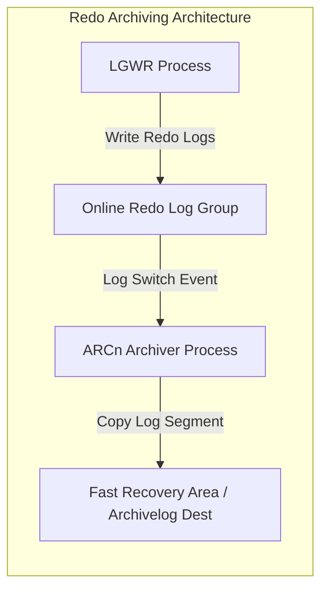
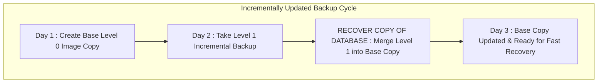

# CHAPTER 11. CLI 기반 RMAN 백업 스크립트 및 운영

데이터베이스 시스템의 최우선 과제는 미디어 장애, 디스크 손상, 또는 시스템 오류 상황에서도 데이터의 무결성을 유지하고 목표 복구 시점(RPO, Recovery Point Objective)과 목표 복구 시간(RTO, Recovery Time Objective)을 충족하는 것입니다 (출처: high-availability-overview-and-best-practices.pdf, 2026). 오라클 복구 관리자인 **RMAN(Recovery Manager)**은 블록 수준의 증분 백업 및 손상 검증, 자동화된 파일 복원 기능을 제공하는 오라클 표준 백업 유틸리티입니다 (출처: database-backup-and-recovery-reference.pdf, 2019; high-availability-overview-and-best-practices.pdf, 2026).

본 장에서는 SQL*Plus 커맨드라인을 통한 ARCHIVELOG 모드 전환 절차, Fast Recovery Area(FRA) 백업 저장소 관리, RMAN 영구 파라미터 최적화, 그리고 Linux `crontab`과 연동하는 백업 자동화 Shell 스크립트 작성법을 단계별로 다룹니다.

---

## 11.1 ARCHIVELOG 모드 커맨드라인 전환 및 FRA 관리

### ARCHIVELOG 모드의 메커니즘과 필요성

오라클 데이터베이스의 기본 작동 모드인 `NOARCHIVELOG` 모드에서는 온라인 리두 로그(Online Redo Log)가 덮어씌워질 때 이전 리두 기록이 보존되지 않습니다 (출처: 2-day-dba.pdf, 2019; database-administrators-guide.pdf, 2019). 이 모드에서는 데이터베이스가 정상 종료된 상태에서 실행한 일관된 백업(Consistent Backup / Cold Backup)만 복구에 사용할 수 있어, 데이터베이스 개시 중 발생한 미디어 장애 시 변경 사항이 모두 손실될 위험이 있습니다 (출처: 2-day-dba.pdf, 2019; database-administrators-guide.pdf, 2019).

반면 **`ARCHIVELOG` 모드**를 활성화하면 백그라운드 프로세스인 **ARCn (Archiver)**이 온라인 리두 로그 그룹이 로그 스위치(Log Switch)로 재사용되기 전 아카이브 리두 로그(Archived Redo Log) 파일로 지정된 저장소에 안전하게 복사 저장합니다 (출처: 2-day-dba.pdf, 2019; database-administrators-guide.pdf, 2019; database-concepts.pdf, 2019).



#### 표 11-1. NOARCHIVELOG 모드와 ARCHIVELOG 모드 비교

| 구분 | NOARCHIVELOG 모드 | ARCHIVELOG 모드 |
| :--- | :--- | :--- |
| **리두 로그 보존** | 덮어씌워짐 (아카이빙 안 됨) | ARCn 프로세스에 의해 아카이브 파일로 영구 보존 (출처: 2-day-dba.pdf, 2019) |
| **운영 중 백업** | 오픈 상태 백업 불가 (일관성 결여) | 데이터베이스 오픈 운영 중 온라인 백업(Hot Backup) 완벽 지원 (출처: 2-day-dba.pdf, 2019) |
| **복구 범위** | 백업 시점까지만 복구 가능 (데이터 손실 발생) | 장애 발생 직전 시점(PITR)까지 100% 무손실 복구 지원 (출처: database-administrators-guide.pdf, 2019) |
| **권장 워크로드** | 테스트 및 단순 읽기 전용 인스턴스 | 운영 엔터프라이즈 데이터베이스 시스템 필수 적용 |

---

### SQL*Plus CLI를 통한 ARCHIVELOG 모드 전환 절차

아카이브 모드 전환은 제어 파일(Control File) 업데이트를 수반하므로, 데이터베이스 인스턴스를 정상 종료한 후 `MOUNT` 상태에서 수행해야 합니다 (출처: data-guard-concepts-and-administration.pdf, 2019; database-administrators-guide.pdf, 2019).

#### 1. 현재 아카이브 모드 점검 (`ARCHIVE LOG LIST`)

SYSDBA 권한으로 SQL*Plus에 접속하여 현재 아카이빙 상태를 확인합니다 (출처: 2-day-dba.pdf, 2019; sqlplus-users-guide-and-reference.pdf, 2019).

```sql
SQL> ARCHIVE LOG LIST;
Database log mode              No Archive Mode
Automatic archival             Disabled
Archive destination            USE_DB_RECOVERY_FILE_DEST
Oldest online log sequence     12
Next log sequence to archive   14
Current log sequence           14
```

#### 2. 인스턴스 정지 및 MOUNT 모드 재구동

데이터베이스를 정상 종료(`SHUTDOWN IMMEDIATE`)한 후, 제어 파일만 읽어들이는 `STARTUP MOUNT` 상태로 구동합니다 (출처: data-guard-concepts-and-administration.pdf, 2019; database-administrators-guide.pdf, 2019).

```sql
SQL> SHUTDOWN IMMEDIATE;
Database closed.
Database dismounted.
ORACLE instance shut down.

SQL> STARTUP MOUNT;
ORACLE instance started.
Database mounted.
```

#### 3. ARCHIVELOG 모드 전환 및 데이터베이스 오픈

`ALTER DATABASE ARCHIVELOG` 명령으로 아카이빙 모드를 활성화하고 데이터베이스를 오픈합니다 (출처: data-guard-concepts-and-administration.pdf, 2019; database-administrators-guide.pdf, 2019).

```sql
-- 1. 아카이브로그 모드 변경
SQL> ALTER DATABASE ARCHIVELOG;
Database altered.

-- 2. 데이터베이스 정상 오픈
SQL> ALTER DATABASE OPEN;
Database altered.

-- 3. 전환 결과 재검증
SQL> ARCHIVE LOG LIST;
Database log mode              Archive Mode
Automatic archival             Enabled
Archive destination            USE_DB_RECOVERY_FILE_DEST
Oldest online log sequence     12
Next log sequence to archive   14
Current log sequence           14
```

> **⚠️ [주의] 아카이브 모드 전환 직후 백업 수행**
> NOARCHIVELOG 모드 시점에 생성된 기존 백업 파일은 ARCHIVELOG 모드 전환 이후의 시점 복구에 사용할 수 없습니다 (출처: 2-day-dba.pdf, 2019; database-administrators-guide.pdf, 2019). 따라서 ARCHIVELOG 모드로 전환한 직후에는 반드시 전체 데이터베이스 백업(Level 0 또는 Full Backup)을 새로 수행해야 합니다 (출처: 2-day-dba.pdf, 2019; database-administrators-guide.pdf, 2019).

---

### Fast Recovery Area (FRA) 스토리지 공간 모니터링 및 제어

Fast Recovery Area(FRA)는 아카이브 로그, RMAN 백업 세트, 컨트롤 파일 자동 백업 파일이 집적되는 집중 저장 공간입니다 (출처: oracle-ai-database-backup-and-recovery-users-guide.pdf, 2026). FRA 디스크 공간이 100%에 도달하면 데이터베이스가 리두 로그를 아카이빙하지 못해 트랜잭션이 일시 정지(Hang)될 수 있습니다 (출처: 2-day-dba.pdf, 2019).

#### 1. FRA 공간 할당 및 사용량 점검 뷰 (`V$RECOVERY_AREA_USAGE`)

```sql
-- FRA 공간 사용 현황 정밀 조회
SQL> SELECT file_type, 
            percent_space_used, 
            percent_space_reclaimable, 
            number_of_files 
     FROM v$recovery_area_usage;

FILE_TYPE            PERCENT_SPACE_USED PERCENT_SPACE_RECLAIMABLE NUMBER_OF_FILES
-------------------- ------------------ ------------------------- ---------------
CONTROLFILE                        .12                         0               1
REDO LOG                          2.15                         0               3
ARCHIVED LOG                     18.40                      5.20              24
BACKUPPIECE                      32.50                     10.10              12
IMAGECOPY                         0.00                         0               0
FLASHBACK LOG                     0.00                         0               0

-- FRA 용량 요약 조회 (V$RECOVERY_FILE_DEST)
SQL> SELECT name, 
            space_limit/1024/1024/1024 AS limit_gb, 
            space_used/1024/1024/1024 AS used_gb, 
            space_reclaimable/1024/1024/1024 AS reclaim_gb 
     FROM v$recovery_file_dest;

NAME                    LIMIT_GB    USED_GB RECLAIM_GB
--------------------- ---------- ---------- ----------
/u05/fast_recovery_area     20.00      10.63       3.06
```

#### 2. FRA 동적 용량 확장 (`DB_RECOVERY_FILE_DEST_SIZE`)

FRA 공간 부족 징후가 포착될 경우 SQL*Plus에서 `DB_RECOVERY_FILE_DEST_SIZE` 파라미터 용량을 동적으로 확장합니다 (출처: 2-day-dba.pdf, 2019).

```sql
-- FRA 한계 용량을 50GB로 확장 설정
SQL> ALTER SYSTEM SET DB_RECOVERY_FILE_DEST_SIZE = 50G SCOPE = BOTH;
System altered.
```

---

## 11.2 Shell & RMAN 자동 백업 스크립트 작성

### RMAN 기본 영구 파라미터 최적 설정 (`CONFIGURE`)

RMAN 세션에서 백업 작업 시 매번 동일한 환경 옵션을 입력하지 않도록 **`CONFIGURE`** 명령을 통해 영구 기본 파라미터를 오라클 제어 파일에 사전 등록합니다 (출처: database-backup-and-recovery-reference.pdf, 2019; oracle-ai-database-backup-and-recovery-users-guide.pdf, 2026).

```bash
# RMAN 접속 및 기본 파라미터 설정 (oracle 계정)
$ rman target /

# 1. 제어 파일 및 SPFILE 자동 백업 활성화
RMAN> CONFIGURE CONTROLFILE AUTOBACKUP ON;

# 2. 백업 보관 정책 설정 (보존 주기: 7일 Window)
RMAN> CONFIGURE RETENTION POLICY TO RECOVERY WINDOW OF 7 DAYS;

# 3. 백업 최적화 활성화 (동일 파일 중복 백업 건너뛰기)
RMAN> CONFIGURE BACKUP OPTIMIZATION ON;

# 4. 백업 압축 알고리즘 및 디바이스 지정
RMAN> CONFIGURE DEVICE TYPE DISK PARALLELISM 2 BACKUP TYPE TO COMPRESSED BACKUPSET;

# 5. 아카이브 로그 삭제 정책 설정 (1회 이상 백업 후 삭제 가능)
RMAN> CONFIGURE ARCHIVELOG DELETION POLICY TO BACKED UP 1 TIMES TO DISK;
```

#### 표 11-2. RMAN 주요 `CONFIGURE` 파라미터 설정 해설

| 파라미터 항목 | 권장 설정값 | 기능 및 설정을 통한 이점 |
| :--- | :--- | :--- |
| **`CONTROLFILE AUTOBACKUP`** | `ON` | 백업 실행 및 DB 구조 변경 시 Control File과 SPFILE을 자동 백업 (출처: 2-day-dba.pdf, 2019; database-backup-and-recovery-reference.pdf, 2019) |
| **`RETENTION POLICY`** | `RECOVERY WINDOW OF 7 DAYS` | 최근 7일 이내의 임의 시점으로 복구 가능한 백업본만 유지하고 이전 백업은 Obsolete 처리 (출처: database-backup-and-recovery-reference.pdf, 2019; oracle-ai-database-backup-and-recovery-users-guide.pdf, 2026) |
| **`BACKUP OPTIMIZATION`** | `ON` | 이미 백업된 변경 없는 데이터파일/아카이브 로그의 중복 백업을 자동으로 건너뜀 (출처: 2-day-dba.pdf, 2019; oracle-ai-database-backup-and-recovery-users-guide.pdf, 2026) |
| **`ARCHIVELOG DELETION POLICY`** | `BACKED UP 1 TIMES TO DISK` | 디스크에 최소 1회 이상 백업 완료된 아카이브 로그만 삭제 가능하도록 제한 (출처: database-backup-and-recovery-reference.pdf, 2019; oracle-ai-database-backup-and-recovery-users-guide.pdf, 2026) |

---

### Incrementally Updated Backup (증분 갱신 백업) 전략

매번 데이터베이스 전체를 백업하는 풀 백업(Full Backup)은 I/O 오버헤드와 디스크 용량 부담이 큽니다. 오라클이 권장하는 **Incrementally Updated Backup** 전략은 베이스 데이터파일 복사본(Level 0 Image Copy)을 생성한 후, 매일 차분 증분 백업(Level 1 Differential Incremental)을 적용하여 복사본을 최신 시점으로 지속 롤포워드(Roll-forward)하는 기법입니다 (출처: 2-day-dba.pdf, 2019; oracle-ai-database-backup-and-recovery-users-guide.pdf, 2026).



#### Incrementally Updated Backup 스크립트 실행 메커니즘

1. **`RECOVER COPY OF DATABASE WITH TAG 'incr_update'`**: 동일한 태그를 가진 이전 Level 1 증분 백업 세트를 가져와 Base Image Copy 파일에 병합 반영합니다 (출처: database-backup-and-recovery-reference.pdf, 2019; oracle-ai-database-backup-and-recovery-users-guide.pdf, 2026).
2. **`BACKUP INCREMENTAL LEVEL 1 FOR RECOVER OF COPY WITH TAG 'incr_update' DATABASE`**: 만약 Base Image Copy가 존재하지 않으면 자동으로 Level 0 복사본을 생성하고, 존재하는 경우 당일 변경 블록만 포함하는 Level 1 증분 백업을 생성합니다 (출처: database-backup-and-recovery-reference.pdf, 2019; oracle-ai-database-backup-and-recovery-users-guide.pdf, 2026).

---

### 백업 자동화 Shell 스크립트 작성 (`/u01/app/oracle/scripts/rman_backup.sh`)

`oracle` 계정 권한으로 비대화형 실행이 가능하도록 환경 변수를 로드하고, RMAN 명령과 아카이브 로그 정리를 통합 수행하는 완전한 Shell 스크립트를 생성합니다.

```bash
#!/bin/bash
################------------------------------------------------######
# Script Name : rman_backup.sh
# Description : Oracle 19c Daily RMAN Backup Automation Script
# Author      : Senior Database Administrator
################------------------------------------------------######

# 1. Oracle 환경 변수 로드
export ORACLE_BASE=/u01/app/oracle
export ORACLE_HOME=$ORACLE_BASE/product/19.0.0/dbhome_1
export ORACLE_SID=orcl
export PATH=$ORACLE_HOME/bin:$PATH

# 2. 백업 디렉토리 및 디버그 로그 설정
LOG_DIR=$ORACLE_BASE/admin/$ORACLE_SID/dpdump/log
DATE_STAMP=$(date +%Y%m%d_%H%M%S)
RMAN_LOG=$LOG_DIR/rman_backup_${ORACLE_SID}_${DATE_STAMP}.log

mkdir -p $LOG_DIR

echo "=== Oracle RMAN Backup Started at $(date) ===" > $RMAN_LOG

# 3. RMAN 비대화형 백업 구동 (EOF 블록)
$ORACLE_HOME/bin/rman target / msglog $RMAN_LOG append <<EOF
RUN {
    # 채널 병렬 할당
    ALLOCATE CHANNEL ch1 DEVICE TYPE DISK;
    ALLOCATE CHANNEL ch2 DEVICE TYPE DISK;

    # 이전 증분 백업을 베이스 이미지 카피본에 병합
    RECOVER COPY OF DATABASE WITH TAG 'daily_updated_bkup';

    # 차분 증분 백업 수행 및 아카이브 로그 포함
    BACKUP INCREMENTAL LEVEL 1 
        FOR RECOVER OF COPY 
        WITH TAG 'daily_updated_bkup' 
        DATABASE 
        PLUS ARCHIVELOG DELETE INPUT;

    # 보관 주기 초과 백업본 및 아카이브 청소
    CROSSCHECK BACKUP;
    CROSSCHECK ARCHIVELOG ALL;
    DELETE NOPROMPT OBSOLETE;
    DELETE NOPROMPT EXPIRED BACKUP;
    DELETE NOPROMPT EXPIRED ARCHIVELOG ALL;

    RELEASE CHANNEL ch1;
    RELEASE CHANNEL ch2;
}
EXIT;
EOF

# 4. 백업 수행 결과 검증
RMAN_STATUS=$?

if [ $RMAN_STATUS -eq 0 ]; then
    echo "=== Oracle RMAN Backup Successfully Completed at $(date) ===" >> $RMAN_LOG
else
    echo "=== ERROR: Oracle RMAN Backup Failed with Exit Code $RMAN_STATUS at $(date) ===" >> $RMAN_LOG
    # 필요 시 운영자 SMS/Email 알림 발송 로직 추가 파트
fi

exit $RMAN_STATUS
```

#### 스크립트 실행 권한 부여 및 수동 테스트

```bash
# 1. 실행 권한 부여
$ chmod +x /u01/app/oracle/scripts/rman_backup.sh

# 2. 수동 실행 테스트 및 로그 모니터링
$ /u01/app/oracle/scripts/rman_backup.sh
$ cat /u01/app/oracle/admin/orcl/dpdump/log/rman_backup_orcl_*.log
```

---

### Linux `crontab` 스케줄러 등록 및 자동화 모니터링

작성된 RMAN 백업 스크립트가 매일 새벽 2시 00분에 자동으로 구동되도록 `oracle` 계정의 `crontab`에 등록합니다 (출처: 2-day-dba.pdf, 2019).

```bash
# oracle 계정 crontab 편집
$ crontab -e

# 매일 새벽 02:00 RMAN 자동 백업 실행
00 02 * * * /u01/app/oracle/scripts/rman_backup.sh > /dev/null 2>&1
```

```bash
# crontab 등록 내용 검증
$ crontab -l
00 02 * * * /u01/app/oracle/scripts/rman_backup.sh > /dev/null 2>&1
```

---

### 💬 기획 편집자 노트 (Next Step)

Chapter 11에서는 SQL*Plus를 활용한 ARCHIVELOG 모드 전환, Fast Recovery Area(FRA) 모니터링, RMAN 영구 파라미터 설정, Incrementally Updated Backup 전략, 그리고 `crontab` 연동 자동화 Shell 스크립트 구축까지 완벽하게 집필을 마쳤습니다.

이어지는 **CHAPTER 12**에서는 Silent Mode 설치 중 발생할 수 있는 주요 에러 패턴 분석, Prerequisite Check 실패 조치, `io_uring` 및 AMM/HugePages 충돌 트러블슈팅을 다루어 본 도서의 실무 완결성을 완성할 예정입니다. 계속해서 CHAPTER 12 집필을 진행할까요?
