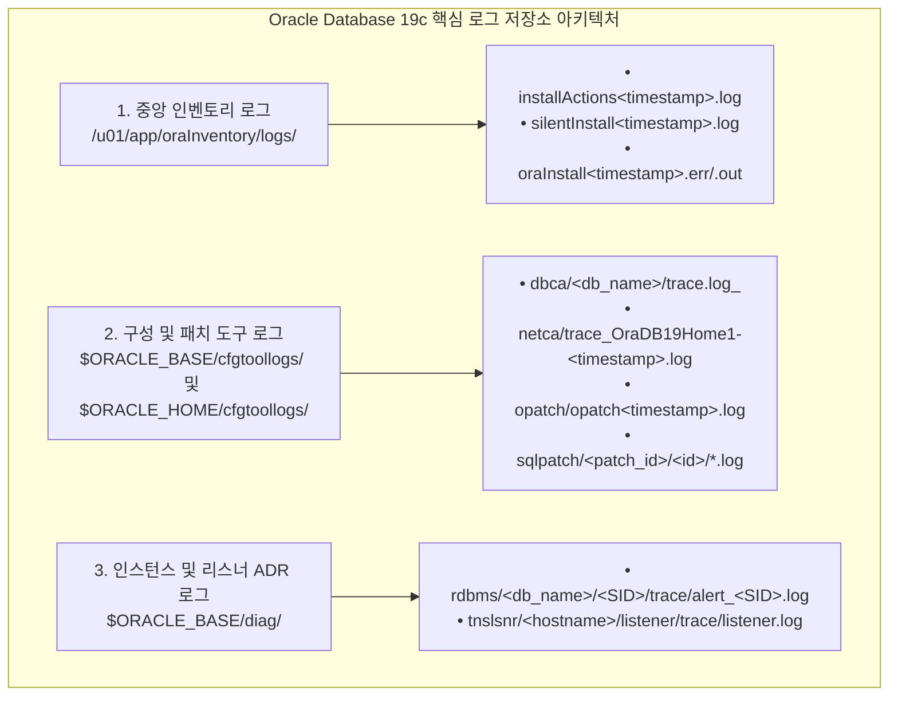
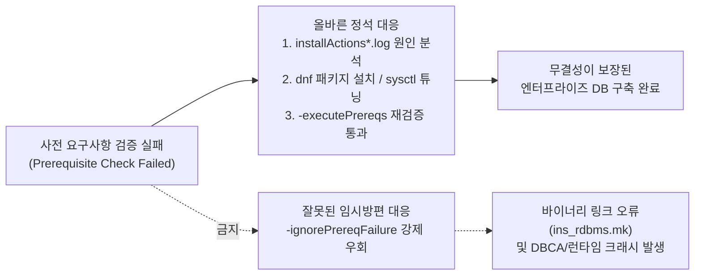

<!-- 
  [출판 조판 및 폰트 지정 명세 (Typography Specification)]
  - 본문(Body), 표(Table), 캡션(Caption), 영문 기술 용어: Noto Sans KR (Regular/Medium)
  - 장/절 제목(Headings H1~H4): Noto Sans KR Bold
  - 코드, 명령어, SQL 및 설정 블록(Code/SQL Blocks): DejaVu Sans Mono
-->

# CHAPTER 12. Silent Mode 설치 트러블슈팅 및 로그 분석

그래픽 사용자 인터페이스(GUI)를 완전히 배제한 Headless(Non-GUI) CLI 환경에서 `runInstaller -silent`, `netca -silent`, `dbca -silent`, `opatch apply -silent` 명령어로 데이터베이스를 구축할 때는 대화형 경고 팝업 창이 뜨지 않습니다. 따라서 설치 중단이나 인스턴스 기동 실패가 발생했을 때, 각 유틸리티가 남기는 로그 파일의 정확한 위치를 찾아내고 에러 코드의 근본 원인을 분석해 해결하는 **트러블슈팅(Troubleshooting) 역량**이 실무 성패를 좌우합니다.

본 장에서는 오라클 Silent Mode 구축 및 운영 단계별 핵심 로그 아키텍처와 `adrci` 진단 기법을 살펴보고, 사전 환경 검증 우회 옵션(`-ignorePrereqFailure`)의 위험성과 올바른 대응 프로세스를 다룹니다. 이어서 현장에서 가장 빈번하게 마주치는 리스너 바인딩 오류(`ORA-00119`/`ORA-00132`), 공유 메모리 및 HugePages 할당 오류(`ORA-04031`/`ORA-27137`), 그리고 Oracle Linux 9 UEK R7 커널의 `io_uring` 권한 오류에 대한 명쾌한 해결 절차를 정리합니다.

---

## 12.1 Silent Mode 설치 및 운영 로그 아키텍처와 분석 기법

### 1. 오라클 인벤토리 및 유틸리티별 로그 디렉터리 구조

오라클의 설치 및 구성 도구들은 작업 성격에 따라 **① 중앙 인벤토리 로그 디렉터리(`oraInventory/logs`)**, **② 구성 도구 로그 디렉터리(`cfgtoollogs`)**, **③ 자동 진단 저장소(`ADR, Automatic Diagnostic Repository`)**의 세 곳에 실행 이력과 상세 스택 트레이스(Stack Trace)를 기록합니다.


*그림 12-1: Oracle 19c Silent Mode 구축 및 운영 단계별 핵심 로그 디렉터리 구조*

| 작업 단계 구분 | 핵심 로그 파일 절대 경로 | 기록 내용 및 주요 진단 목적 |
| :--- | :--- | :--- |
| **OUI 엔진 설치 (`runInstaller`)** | `/u01/app/oraInventory/logs/installActions<timestamp>.log` | 사전 요구사항 검증 결과, 패키지 압축 해제, C 바이너리 링크(`make`) 상세 로그 |
| **OUI Silent 요약** | `/u01/app/oraInventory/logs/silentInstall<timestamp>.log` | `-silent` 모드 실행 시 발생한 핵심 경고 및 실패 사유 요약본 |
| **NETCA 리스너 구성** | `$ORACLE_BASE/cfgtoollogs/netca/trace_OraDB19Home1-<timestamp>.log` | 리스너 포트(`1521`) 충돌, 호스트명 풀이 실패, `listener.ora` 생성 오류 기록 |
| **DBCA DB 생성** | `$ORACLE_BASE/cfgtoollogs/dbca/<gdbName>/trace.log_<timestamp>` | DBCA 파라미터 검증, 메모리/파일 생성, 카탈로그 생성 SQL 오류 기록 |
| **OPatch 바이너리 패치** | `$ORACLE_HOME/cfgtoollogs/opatch/opatch<timestamp>.log` | RU/MRP 패치 충돌 검증, 파일 백업, 바이너리 재링크 오류 기록 |
| **`datapatch` SQL 패치** | `$ORACLE_BASE/cfgtoollogs/sqlpatch/sqlpatch_<pid>_<timestamp>/` | 멀티테넌트(`CDB$ROOT`, `PDB$SEED`, `ORCLPDB1`) 데이터 딕셔너리 패치 결과 |
| **DB 인스턴스 기동/운영** | `$ORACLE_BASE/diag/rdbms/orcl/orcl/trace/alert_orcl.log` | 인스턴스 기동 파라미터, HugePages 할당표, `ORA-` 에러 및 백그라운드 트레이스 |

*표 12-1: Silent Mode 구축 및 운영 단계별 핵심 로그 파일 명세*

---

### 2. CLI 기반 실시간 로그 모니터링 및 `adrci` 활용법

Silent 설치나 DB 생성이 진행되는 동안 별도의 SSH 터미널 세션을 열어 실시간으로 로그를 추적(`tail -f`)하거나, 오라클 공식 진단 유틸리티인 **`adrci`**를 활용하면 문제 발생 즉시 원인을 포착할 수 있습니다.

```bash
# 1. 가장 최근에 생성된 OUI 설치 로그 파일을 실시간으로 추적
$ tail -f $(ls -t /u01/app/oraInventory/logs/installActions*.log | head -n 1)

# 2. DBCA 데이터베이스 생성 로그에서 심각한 에러(SEVERE / FATAL / ORA-)만 필터링
$ grep -E "SEVERE|FATAL|ORA-" $ORACLE_BASE/cfgtoollogs/dbca/orcl/trace.log*

# 3. 데이터베이스 Alert Log에서 최근 발생한 ORA- 에러 및 전후 문맥(위아래 3줄) 확인
$ grep -C 3 "ORA-" $ORACLE_BASE/diag/rdbms/orcl/orcl/trace/alert_orcl.log

# 4. 오라클 공식 ADRCI 유틸리티를 활용한 실시간 Alert Log 모니터링 및 인시던트(Incident) 조회
$ adrci exec="set homepath diag/rdbms/orcl/orcl; show alert -tail -f"
$ adrci exec="set homepath diag/rdbms/orcl/orcl; show problem"
```

---

## 12.2 사전 검증 우회 옵션(`-ignorePrereqFailure`)의 위험성과 올바른 대응

### 1. `-ignorePrereqFailure` 옵션의 역할과 남용 시 발생하는 치명적 문제

`$ORACLE_HOME/runInstaller -silent` 또는 `dbca -silent` 실행 시 **`-ignorePrereqFailure`** 옵션을 부여하면, OS 커널 파라미터 미달, 필수 RPM 패키지 누락, 스왑 공간 부족 등 사전 요구사항 검증(Prerequisite Checks) 단계에서 실패(`FAILED`)가 발견되더라도 이를 강제로 무시하고 다음 단계로 넘어갑니다.

> ⚠️ **주의(Caution): 실무 운영 서버에서 `-ignorePrereqFailure`를 무분별하게 사용하면 안 되는 이유**
> 원인을 해결하지 않은 채 `-ignorePrereqFailure`로 경고를 덮어버리면 설치 자체는 끝나는 것처럼 보이지만, 다음과 같은 치명적인 후유증이 발생합니다.
> * **바이너리 컴파일 및 링크 실패 (`Error in invoking target ... of makefile ins_rdbms.mk`)**: `libaio-devel`, `glibc-devel`, `libnsl` 등 핵심 라이브러리가 누락된 상태에서 강제 설치하면 `$ORACLE_HOME/bin/oracle` 실행 파일 링크 단계에서 오류가 발생하여 엔진이 정상 작동하지 않습니다.
> * **DBCA 인스턴스 생성 중단 및 런타임 패닉**: 커널 공유 메모리(`shmmax`, `shmall`), 비동기 I/O(`fs.aio-max-nr`), 혹은 사용자 리소스 한도(`memlock`, `nofile`)가 부족한 상태에서 DB를 생성하면 기동 도중 `ORA-27102: out of memory` 또는 `ORA-27090: Unable to reserve kernel resources for asynchronous disk I/O` 에러가 발생하며 중단됩니다.


*그림 12-2: 사전 요구사항 검증 실패 시의 정석 대응과 강제 우회 비교*

---

### 2. 사전 검증 독립 실행(`-executePrereqs`) 및 바이너리 재링크(`relink all`) 절차

실제 설치를 시작하기 전에 사전 요구사항만 단독으로 점검하려면 **`-executePrereqs`** 옵션을 사용합니다.

```bash
# 1. Oracle Linux 9 호환 환경 변수 선언 후 사전 검증만 단독 실행 (-executePrereqs)
$ export CV_ASSUME_DISTID=OL8
$ cd $ORACLE_HOME
$ ./runInstaller -executePrereqs -silent -responseFile /u01/stage/db_install.rsp

# 2. 만약 검증 실패 항목이 보고되면 로그에서 정확한 누락 패키지/파라미터 확인
$ grep -B 2 -A 4 "FAILED" $(ls -t /u01/app/oraInventory/logs/installActions*.log | head -n 1)

# 3. 누락된 OS 패키지 보완 설치 및 커널 파라미터 반영 후 재실행
$ sudo dnf install -y libnsl libaio-devel
$ sudo sysctl --system
```

> 💡 **노트(Note): OS 패키지 누락을 뒤늦게 해결한 후 오라클 바이너리를 재컴파일(`relink all`)하는 방법**
> 만약 필수 OS 라이브러리(`libnsl` 등)가 빠진 상태에서 이미 `runInstaller`를 실행해 링크 경고가 발생했다면, 부족한 RPM 패키지를 `dnf install`로 설치한 뒤 모든 오라클 프로세스를 내리고 아래 명령을 실행하면 `$ORACLE_HOME`의 전체 바이너리를 깨끗하게 재링크(Relink)할 수 있습니다.
> ```bash
> $ cd $ORACLE_HOME/bin
> $ ./relink all
> ```

---

## 12.3 주요 CUI 설치 및 구동 에러 완벽 해결

### 1. `ORA-00119` & `ORA-00132`: `LOCAL_LISTENER` 네트워크 이름 풀이 오류

DBCA 생성 직후 또는 서버 환경 변경 후 `STARTUP`을 실행할 때 가장 흔히 마주치는 네트워크 파라미터 에러입니다.

```text
SQL> STARTUP;
ORA-00119: invalid specification for system parameter LOCAL_LISTENER
ORA-00132: syntax error or unresolved network name 'LISTENER_ORCL'
```

#### ① 발생 원인
데이터베이스 초기화 파라미터 `LOCAL_LISTENER`에 별칭(예: `LISTENER_ORCL`)이 지정되어 있으나, 정작 `$ORACLE_HOME/network/admin/tnsnames.ora` 파일에 `LISTENER_ORCL` 항목이 빠져 있거나 오타(괄호 불일치, 잘못된 호스트명 등)가 있어 인스턴스가 리스너 주소를 해석(Name Resolution)하지 못할 때 발생합니다.

#### ② 해결 방법 (상황별 2가지 정석 해법)

> ⚠️ **주의(Caution)**: `ORA-00119`/`ORA-00132` 에러는 인스턴스가 `NOMOUNT` 단계조차 진입하기 전에 발생합니다. 따라서 인스턴스가 내려가 있는(`Connected to an idle instance`) 상태에서 곧바로 `ALTER SYSTEM SET local_listener=... SCOPE=BOTH;`를 실행하면 `ORA-01034: ORACLE not available` 에러가 발생하며 실행되지 않습니다! 반드시 아래 두 가지 방법 중 하나로 조치해야 합니다.

* **해법 A (`tnsnames.ora`에 별칭 추가 — 가장 빠르고 간편한 권장 방법)**:
  `$ORACLE_HOME/network/admin/tnsnames.ora` 파일을 열어 에러 메시지가 찾고 있는 `LISTENER_ORCL` 별칭 블록을 정확히 추가한 뒤 곧바로 `STARTUP`을 실행합니다.

```ini
# 1. $ORACLE_HOME/network/admin/tnsnames.ora 파일에 LISTENER_ORCL 블록 추가
LISTENER_ORCL =
  (ADDRESS = (PROTOCOL = TCP)(HOST = 192.168.56.10)(PORT = 1521))
```

```sql
-- 2. SPFILE 수정 없이 즉시 인스턴스 정상 기동 가능
$ sqlplus / as sysdba
SQL> STARTUP;
ORACLE instance started.
... (중략) ...
Database mounted.
Database opened.
```

* **해법 B (`PFILE`을 거쳐 `SPFILE` 내부의 `LOCAL_LISTENER` 값 자체를 수정하는 방법)**:
  만약 `SPFILE` 안에 잘못 입력된 `LOCAL_LISTENER` 값을 직접 고치고 싶다면, `PFILE`로 추출하여 수정한 후 `SPFILE`을 재생성하거나, 일단 `PFILE`로 인스턴스를 기동한 뒤 `ALTER SYSTEM`으로 `SPFILE`을 갱신합니다.

```sql
-- 1. SPFILE로부터 텍스트 PFILE 추출
$ sqlplus / as sysdba
SQL> CREATE PFILE='/tmp/initorcl.ora' FROM SPFILE;
```

`/tmp/initorcl.ora` 파일에서 `*.local_listener` 줄을 아래와 같이 명시적 주소 문자열로 수정한 뒤 저장합니다.
```ini
*.local_listener='(ADDRESS=(PROTOCOL=TCP)(HOST=192.168.56.10)(PORT=1521))'
```

```sql
-- 2. 수정된 PFILE로 SPFILE을 덮어쓴 뒤 인스턴스 기동
SQL> CREATE SPFILE FROM PFILE='/tmp/initorcl.ora';
SQL> STARTUP;
```

---

### 2. `ORA-04031`(Shared Pool 고갈) 및 `ORA-27137`(HugePages 할당 실패)

메모리 구성과 관련하여 운영 중 발생하는 대표적인 에러는 런타임 공유 풀 단편화 에러인 **`ORA-04031`**과 인스턴스 기동 시 HugePages 부족 에러인 **`ORA-27137`**입니다.

```text
-- [사례 A] 운영 또는 패치(datapatch) 중 Shared Pool/Large Pool 메모리 단편화 및 고갈
ORA-04031: unable to allocate 4192 bytes of shared memory ("shared pool","unknown object","sga heap(1,0)","library cache")

-- [사례 B] USE_LARGE_PAGES=ONLY 설정 상태에서 인스턴스 기동 시 OS HugePages 부족
ORA-27137: unable to allocate Large Pages to create a shared memory segment
Linux-x86_64 Error: 12: Cannot allocate memory
```

| 에러 코드 | 주요 발생 원인 | 핵심 해결 조치 |
| :--- | :--- | :--- |
| **`ORA-04031`** | • `SGA_TARGET` 전체 크기 부족 또는 버퍼 캐시 쏠림으로 인한 `Shared Pool`/`Large Pool` 축소<br/>• 바인드 변수 미사용(Hard Parsing 과다)으로 인한 Shared Pool 단편화 | • ASMM 환경에서 `SHARED_POOL_SIZE` 및 `LARGE_POOL_SIZE`의 **최소 보장 하한선(Minimum Floor)** 설정<br/>• 필요시 `SGA_TARGET` 증설 및 `ALTER SYSTEM FLUSH SHARED_POOL` (임시 조치) |
| **`ORA-27137`** | • `USE_LARGE_PAGES = ONLY` 설정 시 OS의 가용 HugePages(`HugePages_Free`)가 `SGA_MAX_SIZE`보다 부족함<br/>• `limits.d` 또는 `oracle.service`의 `memlock` 한도 미달 | • `/etc/sysctl.d/99-oracle-database-preinstall-19c-sysctl.conf`의 `vm.nr_hugepages` 수치를 늘린 후 `sysctl --system` 적용<br/>• `ulimit -l` 및 `systemd`의 `LimitMEMLOCK=infinity` 확인 |

*표 12-2: 오라클 핵심 메모리 에러(`ORA-04031`, `ORA-27137`) 원인 및 해결 요약*

#### ① `ORA-04031` 해결을 위한 ASMM 최소 하한선(Floor) 고정
ASMM(`SGA_TARGET`)을 사용하더라도 갑작스러운 버퍼 캐시 요구로 인해 Shared Pool이나 Large Pool이 지나치게 줄어들지 않도록 최소 보장 크기를 지정해 두는 것이 엔터프라이즈 모범 사례입니다.

```sql
-- SGA_TARGET(11520M) 내에서 Shared Pool 최소 2G, Large Pool 최소 256M 하한선 보장
SQL> ALTER SYSTEM SET shared_pool_size = 2G SCOPE=BOTH;
SQL> ALTER SYSTEM SET large_pool_size = 256M SCOPE=BOTH;
```

#### ② `ORA-27137` 해결을 위한 OS HugePages 즉시 증설
SGA를 증설했다가 `ORA-27137`로 기동이 거부된 경우, `root` 계정에서 필요한 2 MB 페이지 수(`SGA_MAX_SIZE(MB) / 2 + 여유분`)를 계산하여 커널에 즉시 반영합니다.

```bash
# 예: SGA_MAX_SIZE를 16 GB(16,384 MB)로 늘린 경우 -> 최소 8192 + 여유분 = 8300 페이지 할당
$ sudo sed -i 's/^vm.nr_hugepages.*/vm.nr_hugepages = 8300/' /etc/sysctl.d/99-oracle-database-preinstall-19c-sysctl.conf
$ sudo sysctl --system

# HugePages_Free가 8300개로 확보되었는지 확인 후 DB STARTUP 수행
$ grep -E "HugePages_Total|HugePages_Free" /proc/meminfo
```

---

### 3. Oracle Linux 9 UEK R7 커널의 `io_uring` 및 ASMLib v3 권한 오류

Oracle Linux 9의 기본 커널인 **UEK R7(Unbreakable Enterprise Kernel Release 7, `5.15.0`)** 환경에서 ASMLib v3(`oracleasm`)를 초기화하거나 디스크를 스캔할 때 다음과 같은 권한 거부 오류가 발생할 수 있습니다.

```text
$ sudo oracleasm status
Checking if the oracleasm kernel module is loaded: no (Not required with kernel 5.15.0)
Checking if /dev/oracleasm is mounted: no (Not required with kernel 5.15.0)
Checking which I/O Interface is in use: io_uring (KABI_V3)
Checking if io_uring is enabled: yes
Checking if io_uring is accessible to the configured DB user: no
```

#### ① 발생 원인
Chapter 04(4.5절)에서 살펴보았듯, ASMLib v3는 과거의 `kmod-oracleasm` 커널 드라이버 대신 UEK R7 커널의 **`io_uring`(`KABI_V3`)** 비동기 I/O 인터페이스를 사용합니다. 이때 리눅스 커널 보안 파라미터인 `kernel.io_uring_disabled`가 `2`(전면 비활성화)로 되어 있거나, `1`(특정 그룹만 허용)로 설정되어 있으면서 `kernel.io_uring_group`에 지정된 GID가 `oracleasm configure`에 설정된 그룹(예: `dba` 그룹 `54322`)과 일치하지 않으면 `oracle` 계정의 `io_uring` 접근이 차단됩니다.

#### ② 해결 절차

`oracleasm configure`에 등록된 그룹의 GID를 확인하고, `/etc/sysctl.d/io_uring.conf` 파일의 `kernel.io_uring_group` 값을 정확히 일치시킨 뒤 반영합니다.

```bash
# 1. 현재 oracleasm에 설정된 소유자 및 그룹 확인 (예: oracle / dba)
$ sudo oracleasm configure
ORACLEASM_ENABLED=true
ORACLEASM_UID=oracle
ORACLEASM_GID=dba
ORACLEASM_SCANBOOT=true
ORACLEASM_SCANORDER=""
ORACLEASM_SCANEXCLUDE=""
ORACLEASM_SCAN_DIRECTORIES=""
ORACLEASM_USE_LOGICAL_BLOCK_SIZE="false"
ORACLEASM_IOFILTER="true"

# 2. 해당 그룹(dba)의 정확한 GID 번호 확인
$ getent group dba
dba:x:54322:oracle

# 3. /etc/sysctl.d/io_uring.conf에 io_uring 활성화 및 허용 GID(54322) 등록
$ sudo tee /etc/sysctl.d/io_uring.conf << 'EOF'
kernel.io_uring_disabled = 1
kernel.io_uring_group = 54322
EOF

# 4. 커널 파라미터 즉시 동기화 및 oracleasm 재초기화
$ sudo sysctl -p /etc/sysctl.d/io_uring.conf
$ sudo oracleasm init

# 5. io_uring 접근 권한이 'yes'로 정상 전환되었는지 최종 검증
$ sudo oracleasm status
Checking if the oracleasm kernel module is loaded: no (Not required with kernel 5.15.0)
Checking if /dev/oracleasm is mounted: no (Not required with kernel 5.15.0)
Checking which I/O Interface is in use: io_uring (KABI_V3)
Checking if io_uring is enabled: yes
Checking if io_uring is accessible to the configured DB user: yes
```

---

## 12.4 장 요약 및 전체 과정 마무리 (Chapter Summary & Conclusion)

이번 마지막 장에서는 Headless CUI 환경에서 발생할 수 있는 각종 설치 및 운영 이슈를 스스로 진단하고 해결하기 위한 실전 트러블슈팅 가이드를 정리했습니다.

1. **통합 로그 분석 체계**: `oraInventory/logs`, `$ORACLE_BASE/cfgtoollogs`, 그리고 ADR(`alert_orcl.log` 및 `adrci`)로 이어지는 3대 로그 저장소의 역할과 실시간 필터링 기법을 익혔습니다.
2. **사전 검증의 정석 대응**: `-ignorePrereqFailure`의 무분별한 남용을 피하고, `-executePrereqs`와 `CV_ASSUME_DISTID=OL8` 및 `./relink all`을 통해 바이너리 무결성을 지키는 절차를 확인했습니다.
3. **핵심 에러 3종 해결**: 네트워크 주소 해석 오류(`ORA-00119`/`ORA-00132`), 공유 메모리 및 HugePages 부족 오류(`ORA-04031`/`ORA-27137`), 그리고 UEK R7 커널의 `io_uring` 그룹 권한 불일치 이슈의 원리와 해결책을 마스터했습니다.

이로써 **Oracle Linux 9(UEK R7) 기반 Oracle Database 19c Standard Edition 2(SE2)의 아키텍처 설계, OS 설치, 커널 및 HugePages 튜닝, 무대화형(Silent) 엔진 설치 및 패치 적용, 리스너 및 멀티테넌트 CDB/PDB 구축, `systemd` 서비스 자동화, RMAN 백업 스크립트 구현, 그리고 실전 트러블슈팅**에 이르는 전 과정을 모두 완주했습니다. 본서의 표준 절차와 스크립트가 독자 여러분의 엔터프라이즈 데이터베이스 현장에서 흔들림 없는 기술적 나침반이 되기를 바랍니다.

---

# References

[1] Oracle. 2024. *Oracle Database Installation Guide 19c for Linux (E96297): Troubleshooting the Oracle Database Installation*. Oracle America, Inc. Retrieved April 6, 2026 from https://docs.oracle.com/en/database/oracle/oracle-database/19/ladbi/troubleshooting-the-oracle-database-installation.html
[2] Oracle. 2024. *Oracle Database Error Messages 19c (E96227): ORA-00119, ORA-00132, ORA-04031, and ORA-27137*. Oracle America, Inc. Retrieved April 6, 2026 from https://docs.oracle.com/en/database/oracle/oracle-database/19/errmg/
[3] Oracle. 2024. *Oracle Database Administrator's Guide 19c (E96348): Chapter 9 Managing Diagnostic Data (ADR and ADRCI)*. Oracle America, Inc. Retrieved April 6, 2026 from https://docs.oracle.com/en/database/oracle/oracle-database/19/admin/managing-diagnostic-data.html
[4] Oracle. 2024. *Oracle Linux 9: Installing and Configuring Oracle ASMLib v3 (io_uring and eBPF I/O Filter)*. Oracle America, Inc. Retrieved April 6, 2026 from https://docs.oracle.com/en/operating-systems/oracle-linux/asmlib/
